*********************************************************
Universal Verification Methodology (UVM) 1.2 User’s Guide
*********************************************************

**March 23, 2020**

Mandatory copyrights::

    *Copyright © 2011 - 2015 Accellera. All rights reserved.*

    Copyright © 2011 - 2015 Accellera Systems Initiative
    (Accellera). All rights reserved.

    Accellera Systems Initiative, 8698 Elk Grove Bldv Suite 1, #114, Elk
    Grove, CA 95624, USA

    Copyright © 2013 - 2015 Advanced Micro Devices, Inc. All
    rights reserved.

    Advanced Micro Devices (AMD), 7171 Southwest Parkway, Austin, TX
    78735

    Copyright © 2011 - 2015 Cadence Design Systems,
    Inc. (Cadence). All rights reserved.

    Cadence Design Systems, Inc., 2655 Seely Ave., San Jose, CA 95134,
    USA.

    Copyright © 2011 - 2015 Mentor Graphics, Corp. (Mentor). All
    rights reserved.

    Mentor Graphics, Corp., 8005 SW Boeckman Rd., Wilsonville, OR 97070,
    USA

    Copyright © 2013 - 2015 NVIDIA CORPORATION. All rights
    reserved.

    NVIDIA Corporation, 2701 San Tomas Expy, Santa Clara, CA 95050

    Copyright © 2011 - 2015 Synopsys, Inc. (Synopsys). All rights
    reserved.

    Synopsys, Inc., 690 E. Middlefield Rd, Mountain View, CA 94043

    Copyright © 2019 - 2020 Tuomas Poikela. All rights reserved.

This product is licensed under the Apache Software Foundation’s
Apache License, Version 2.0, January 2004. The full license is
available at: http://www.apache.org/licenses/.

.. WARNING:: This is semi-manual translation from the original SystemVerilog
    `UVM 1.2 User's Guide <http://www.accellera.org/images//downloads/standards/uvm/uvm_users_guide_1.2.pdf>`
    to uvm-python. It is work-in-progress. It's a work-in-progress and contains
    still a lot of errors and references to SystemVerilog facilities. This will
    be gradually fixed over time. Feel free to contribute to this userguide
    with a pull request. Even small fixes will help in making it better!

**Notices**

While this guide offers a set of instructions to perform one or more
specific verification tasks, it should be supplemented by education,
experience, and professional judgment. Not all aspects of this guide
may be applicable in all circumstances. The UVM 1.2 User’s Guide does
not necessarily represent the standard of care by which the adequacy
of a given professional service must be judged nor should this
document be applied without consideration of a project’s unique
aspects. The original SystemVerilog version of this guide has been
approved through the Accellera consensus
process and serves to increase the awareness of information and
approaches in verification methodology. This guide may have several
recommendations to accomplish the same thing and may require some
judgment to determine the best course of action.

The `uvm_1.2_class_reference` represents the foundation
used to create the UVM 1.2 User’s Guide. This guide is a way to apply the UVM
1.2 Class Reference, but is not the only way.
Standards are an important ingredient to foster innovation and
continues to encourage industry innovation based on its standards.

.. contents:: Table of Contents
    :depth: 3

1. Overview
===========

This chapter provides a quick overview of UVM by going through the
typical testbench architecture and introducing the terminology used
throughout this User’s Guide. Then, it also touches upon the UVM Base
Class Library (BCL) developed by Accellera.

1.1 The Typical UVM Testbench Architecture
##########################################

The UVM Class Library provides generic utilities, such as component
hierarchy, transaction library model (TLM), configuration database,
etc., which enable the user to create virtually any structure he/she
wants for the testbench. This section provides some broad guidelines
for a type of recommended testbench architecture by using one
viewpoint of this architecture in an effort to introduce the
terminology used throughout this User’s Guide, as shown in Figure 1.

**NB**: This particular representation is not intended to represent
all possible testbench architectures or every type use of UVM in the
electronic design automation (EDA) industry.

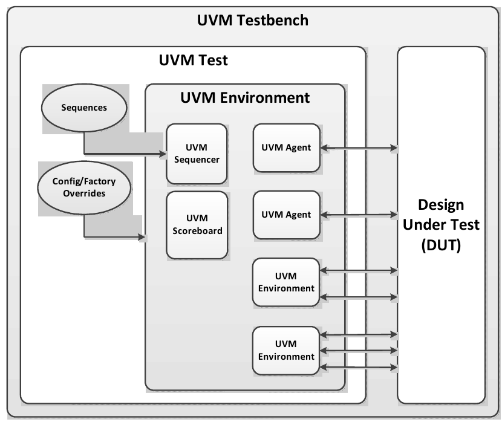

    Typical UVM Testbench Architecture

1.1.1 UVM Testbench
-------------------

The UVM Testbench is simply a Python function decorated with
@cocotb.test. The Design under Test
(DUT) module is passed to the testbench as an object, and no
explicit signal connections have to be made by the user.
The UVM Test class can be declared in a separate file and then
imported into the testbench.
If the verification collaterals include module-based
components, they are should be instantiated in a wrapper HDL module
outside Python code.
The UVM Test is dynamically instantiated at run-time, allowing the
an HDL DUT to be compiled/elaborated once, and run with many different
tests.

Note that in some architectures, the Testbench term is used to
refer to a special module that encapsulates verification collaterals
only, which in turn are integrated up with the DUT.

1.1.2 UVM Test
--------------

The `UVMTest` is the top-level UVM Component in the UVM Testbench.
The UVM Test typically performs three main functions: Instantiates
the top-level environment, configures the environment (via configuration
objects, factory overrides or the configuration database), and applies
stimulus by invoking UVM Sequences through the environment to the DUT.

Typically, there is one base UVM Test with the UVM Environment
instantiation and other common items. Then, other individual tests
will extend this base test and configure the environment differently
or select different sequences to run.

1.1.3 UVM Environment
---------------------

The UVM *Environment* is a hierarchical component that groups
together other verification components that are interrelated. Typical
components that are usually instantiated inside the UVM Environment
are UVM Agents, UVM Scoreboards, or even other UVM Environments. The
top-level UVM Environment encapsulates all the verification
components targeting the DUT.

For example: In a typical system on a chip (SoC) UVM Environment, you
will find one UVM Environment per IP (e.g., PCIe Environment, USB
Environment, Memory Controller Environment, etc.). Sometimes, those
IP Environments are grouped together into *Cluster Environments* or
subsystem environments
(e.g., IO Environment, Processor Environment, etc.) that are grouped
together eventually in the top-level SoC Environment.

1.1.4 UVM Scoreboard
--------------------

The UVM *Scoreboard*\’s main function is to check the behavior of a
certain DUT. The UVM Scoreboard usually receives transactions
carrying inputs and outputs of the DUT through UVM Agent analysis
ports (connections are not depicted in Figure 1), runs the input
transactions through some kind of a reference model (also known as
the *predictor*) to produce expected transactions, and then compares
the expected output versus the actual output.

There are different methodologies on how to implement the scoreboard,
the nature of the reference model, and how to communicate between the
scoreboard and the rest of the testbench.

1.1.5 UVM Agent
---------------

The UVM *Agent* is a hierarchical component that groups together
other verification components that are dealing with a specific DUT
interface (see Figure 2). A typical UVM Agent includes a UVM
Sequencer to manage stimulus flow, a UVM Driver to apply stimulus on
the DUT interface, and a UVM Monitor to
monitor the DUT interface. UVM Agents might include other components,
like coverage collectors, protocol checkers, a TLM model, etc.

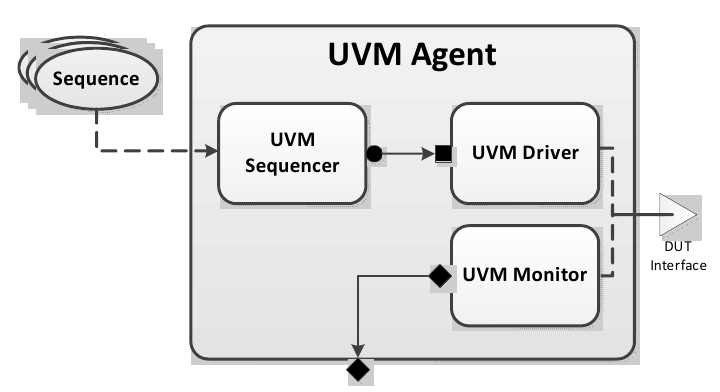

    UVM Agent

The UVM Agent needs to operate both in an active mode (where it is
capable of generating stimulus) and a passive mode (where it only
monitors the interface without controlling it).

1.1.6 UVM Sequencer
-------------------

The UVM *Sequencer* serves as an arbiter for controlling transaction
flow from multiple stimulus sequences. More specifically, the UVM
Sequencer controls the flow of UVM Sequence Items transactions generated
by one or more UVM Sequences.

1.1.7 UVM Sequence
------------------

A UVM *Sequence* is an object that contains a behavior for generating
stimulus. UVM Sequences are not part of the component hierarchy. UVM
Sequences can be transient or persistent. A UVM Sequence instance can
come into existence for a single transaction, it may drive stimulus for
the duration of the simulation, or anywhere in-between. UVM Sequences
can operate hierarchically with one sequence, called a *parent
sequence*, invoking another sequence, called a *child sequence*.

To operate, each UVM Sequence is eventually bound to a UVM Sequencer. In
practice this means that `UVMSequence.start` receives the sequencer as
an argument. Multiple UVM Sequence instances can be bound to the same
UVM Sequencer. Top-level sequences do not have to run on a sequencer,
and can start other sequences instead.

1.1.8 UVM Driver
----------------

The UVM *Driver* receives individual UVM Sequence Item transactions from
the UVM Sequencer and applies (drives) it on the DUT Interface. Thus, a
UVM Driver spans abstraction levels by converting transaction-level
stimulus into pin-level stimulus. It also has a TLM port to receive
transactions from the Sequencer and access to the DUT interface in order
to drive the signals.

1.1.9 UVM Monitor
-----------------

The UVM *Monitor* samples the DUT interface and captures the
information there in transactions that are sent out to the rest of
the UVM Testbench for further analysis. Thus, similar to the UVM
Driver, it spans abstraction levels by converting pin-level activity
to transactions. In order to achieve that, the UVM Monitor typically
has access to the DUT interface and also has a TLM analysis port to
broadcast the created transactions through.

The UVM Monitor can perform internally some processing on the
transactions produced (such as coverage collection, checking,
logging, recording, etc.) or can delegate that to dedicated
components connected to the monitor's analysis port.

1.2 The UVM Class Library
#########################

The UVM Class Library provides all the building blocks you need to
quickly develop well-constructed, reusable, verification components
and test environments. The library consists of base classes,
utilities, and macros. Figure 3 shows a subset of those classes.

Components may be encapsulated and instantiated hierarchically and
are controlled through an extendable set of phases to initialize,
run, and complete each test. These phases are defined in the base
class library, but can be extended to meet specific project needs.
See the UVM *1.2 Class Reference* for more information.

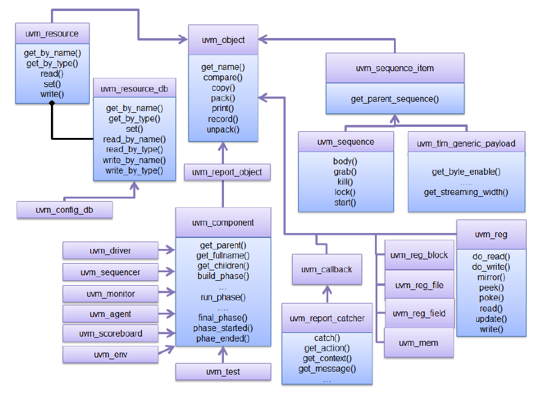

    UVM Class Diagram

The advantages of using the UVM Class Library include:

a) A robust set of built-in features—The UVM Class Library provides many
features that are required for verification, including complete
implementation of printing, copying, test phases, factory methods, and
more. b) Correctly-implemented UVM concepts—Each component in the block
diagram in Figure 1 and Figure 2 can be derived from a corresponding UVM
Class Library component. Using these baseclass elements increases the
readability of your code since each component’s role is predetermined by
its parent class.

The UVM Class Library also provides various utilities to simplify the
development and use of verification environments. These utilities
support configurability by providing a standard resource sharing
database. They support debugging by providing a user-controllable
messaging utility for failure reporting and general reporting
purposes. They support testbench construction by providing a standard
communication infrastructure between verification components (TLM)
and flexible verification environment construction (UVM factory).
Finally, they also provide mixins for allowing more compact coding
styles. These mixins offer similar capabilities as macros in the
SystemVerilog (SV) version.

This User’s Guide will touch on most of these utilities; for the
complete list, see the UVM *1.2 Class Reference*.

2. Transaction-Level Modeling (TLM)
===================================

2.1 Overview
############

One of the keys to verification productivity is to think about the
problem at a level of abstraction that makes sense. When verifying a
DUT that handles packets flowing back and forth, or processes
instructions, or performs other types of functionality, you must
create a verification environment that supports the appropriate
abstraction level. While the actual interface to the DUT ultimately
is represented by signal-level activity, experience has shown that it
is necessary to manage most of the verification tasks, such as
generating stimulus and collecting coverage data, at the transaction
level, which is the natural way engineers tend to think of the
activity of a system.

UVM provides a set of transaction-level communication interfaces and
channels that you can use to connect components at the transaction
level. The use of TLM interfaces isolates each component from changes
in other components throughout the environment. When coupled with the
phased, flexible build infrastructure in UVM, TLM promotes reuse by
allowing any component to be swapped for another, as long as they
have the same interfaces. This concept also allows UVM verification
environments to be assembled with a transaction-level model of the
DUT, and the environment to be reused as the design is refined to
RTL. All that is required is to replace the transaction-level model
with a thin layer of compatible components to convert between the
transaction-level activity and the pin-level activity at the DUT.

The well-defined semantics of TLM interfaces between components also
provide the ideal platform for implementing mixed-language
verification environments. In addition, TLM provides the basis for
easily encapsulating components into reusable components, called
*verification components*, to maximize reuse and minimize the time
and effort required to build a verification environment.

This chapter discusses the essential elements of transaction-level
communication in UVM, and illustrates the mechanics of how to
assemble transaction-level components into a verification
environment. Later in this document we will discuss additional
concerns in order to address a wider set of verification issues. For
now, it is important to understand these foundational concepts first.

2.2 TLM, TLM-1, and TLM-2.0
###########################

TLM, transaction-level modeling, is a modeling style for building
highly abstract models of components and systems. It relies on
transactions (see Section 2.3.1.1), objects that contain arbitrary,
protocol-specific data to abstractly represent lower-level activity.
In practice, TLM refers to a family of abstraction levels beginning
with cycle-accurate modeling, the most abstract level, and extending
upwards in abstraction as far as the eye can see. Common
transaction-level abstractions today include: cycle-accurate,
approximately-timed, loosely-timed, untimed, and token-level.

The acronym TLM also refers to a system of code elements used to
create transaction-level models. TLM-1 and TLM-2.0 are two TLM
modeling systems which have been developed as industry standards for
building transaction-level models. Both were built in SystemC and
standardized within the TLM Working Group of the Open SystemC
Initiative (OSCI). TLM-1 achieved standardization in 2005 and TLM-2.0
became a standard in 2009. OSCI merged with Accellera in 2013 and the
current SystemC standard used for reference is IEEE 1666-2011.

TLM-1 and TLM-2.0 share a common heritage and many of the same people
who developed TLM-1 also worked on TLM-2.0. Otherwise, they are quite
different things. TLM-1 is a message passing system. Interfaces are
either untimed or rely on the target for timing. None of the
interfaces provide for explicit timing annotations. TLM-2.0, while
still enabling transfer of data and synchronization between
independent
processes, is mainly designed for high performance modeling of
memory-mapped bus-based systems. A subset of both these facilities
has been implemented in uvm-python and is available as part of
UVM.

2.3 TLM-1 Implementation
########################

The following subsections specify how TLM-1 is to be implemented in
uvm-python.

.. contents::
    :local:

2.3.1 Basics
------------

Before you can fully understand how to model verification at the
transaction level, you must understand what a transaction is.

2.3.1.1 Transactions
--------------------

In UVM, a transaction is a class object that includes whatever
information is needed to model a unit of communication between two
components. In the most basic example, a simple bus protocol
transaction to transfer information would be modeled as follows::

    class simple_trans(UVMSequenceItem);
        def __init__(self, name):
            super().__init__(name)
            data = 0
            self.rand('data')
            self.addr = 0x0
            self.rand('addr')
            self.kind = WRITE
            self.rand('kind', [WRITE, READ])
            # constraint c1 { addr < 16’h2000; } ...

The transaction object includes variables, constraints, and other
fields and methods necessary for generating and operating on the
transaction. Obviously, there is often more than just this
information that is required to fully specify a bus transaction. The
amount and detail of the information encapsulated in a transaction is
an indication of the abstraction level of the model. For example, the
simple_trans transaction above could be extended to include more
information, such as the number of wait states to inject, the size of
the transfer, or any number of other properties. The transaction
could also be extended to include additional constraints. It is also
possible to define higher-level transactions that include some number
of lower-level transactions. Transactions can thus be composed,
decomposed, extended, layered, and otherwise manipulated to model
whatever communication is necessary at any level of abstraction.

2.3.1.2 Transaction-Level Communication
---------------------------------------

Transaction-level interfaces define a set of methods that use
transaction objects as arguments. A TLM *port* defines the set of
methods (the application programming interface (API)) to be used for
a particular connection, while a TLM *export* supplies the
implementation of those methods. Connecting a port to an export
allows the implementation to be executed when the port method is
called.

2.3.1.3 Basic TLM Communication
-------------------------------

The most basic transaction-level operation allows one component to
*put* a transaction to another. Consider Figure 4.

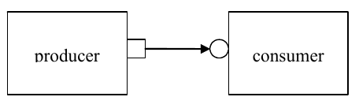

    Single Producer/Consumer

The square box on the producer indicates a port and the circle on the
consumer indicates the export. The producer generates transactions
and sends them out its put_port::

    class producer (UVMComponent);

        def __init__(self, name, parent):
            super().__init__(name, parent)
            self.put_port = UVMBlockingPutPort(“put_port”, self)
            ...

        async def run(self):
            for _ in range(N):
                t = simple_trans()
                # Generate t.
                await self.put_port.put(t);

NOTE—The uvm_*_port is parameterized by the transaction type that
will be communicated. This may either be specified directly or it may
be a parameter of the parent component.

The actual implementation of the put() call is supplied by the
consumer::

    class consumer(UVMComponent):

        def __init__(self, name, parent):
            super().__init__(name, parent)
            self.put_export = UVMBlockingPutImp(“put_export”, self)

        # 2 parameters ...
        async def put(self, t):
            if t.kind == READ:
                # Do read.
            elif t.kind == WRITE:
                # Do write.

NOTE—The UVM*Imp takes two parameters: the type of the transaction
and the type of the object that declares the method implementation.

NOTE—The semantics of the put operation are defined by TLM. In this
case, the put() call in the producer will block until the consumer’s
put implementation is complete. Other than that, the operation of
producer is completely independent of the put implementation
(`UVMPutImp`). In fact, consumer could be replaced by another
component that also implements put and producer will continue to work
in exactly the same way. The modularity provided by TLM fosters an
environment in which components may be easily reused since the
interfaces are well defined.

The converse operation to put is *get*. Consider Figure 5.

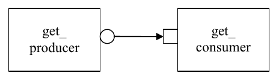

    Consumer gets from Producer

In this case, the consumer requests transactions from the producer
via its get port::

    class get_consumer (UVMComponent):
        def __init__(self, name, parent):
            super().__init__(name, parent)
            self.get_port = UVMBlockingGetPort(“get_port”, self)
            ...

        async def run_phase(self, phase):
            for _ in range(N):
                # Generate t.
                t = simple_trans()
                await self.get_port.get(t);

The get() implementation is supplied by the producer::

    class get_producer (UVMComponent):

        def __init__(self, name, parent):
            super().__init__(name, parent)
            self.get_export = UVMBlockingGetImp("get_export", self)

        async def get(self, t):
            tmp = simple_trans()
            // Assign values to tmp.
            t.copy(tmp)

As with put() above, the get_consumer’s get() call will block until
the get_producer’s method completes. In TLM terms, put() and get()
are *blocking* methods.

**NOTE** — In both these examples, there is a single process running, with
control passing from the port to the export and back again. The
direction of data flow (from producer to consumer) is the same in
both examples.

2.3.1.4 Communicating between Processes
---------------------------------------

In the basic put example above, the consumer will be active only when
its put() method is called. In many cases, it may be necessary for
components to operate independently, where the producer is creating
transactions in one process while the consumer needs to operate on
those transactions in another. UVM provides the `UVMTLMFIFO` channel
to facilitate such communication. The `UVMTLMFIFO` implements all of
the TLM interface methods, so the producer puts the transaction into
the `UVMTLMFIFO`, while the consumer independently gets the
transaction from the fifo, as shown in Figure 6.

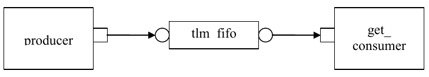

    Using a uvm_tlm_fifo

When the producer puts a transaction into the fifo, it will block if the
fifo is full, otherwise it will put the object into the fifo and return
immediately. The get operation will return immediately if a transaction
is available (and will then be removed from the fifo), otherwise it will
block until a transaction is available. Thus, two consecutive get()
calls will yield different transactions to the consumer. The related
peek() method returns a copy of the available transaction without
removing it. Two consecutive peek() calls will return copies of the same
transaction.

2.3.1.5 Blocking versus Nonblocking
-----------------------------------

The interfaces that we have looked at so far are blocking—the tasks
block execution until they complete; they are not allowed to fail. There
is no mechanism for any blocking call to terminate abnormally or
otherwise alter the flow of control. They simply wait until the request
is satisfied. In a timed system, this means that time may pass between
the time the call was initiated and the time it returns.

In contrast, a *nonblocking* call returns immediately. The semantics
of a nonblocking call guarantee that the call returns in the same delta
cycle in which it was issued, that is, without consuming any time, not
even a single delta cycle. In UVM, nonblocking calls are modeled as
functions::

    class consumer (UVMComponent):

        uvm_get_port #(simple_trans) get_port;

        task run;
            ...
            for(int i=0; i<10; i++)
                if(get_port.try_get(t)) //Do something with t.
                ...
         endtask
     endclass

If a transaction exists, it will be returned in the argument and the
function call itself will return TRUE. If no transaction exists, the
function will return FALSE. Similarly, with try_peek(). The try_put()
method returns TRUE if the transaction is sent.

2.3.1.6 Connecting Transaction-Level Components
-----------------------------------------------

With ports and exports defined for transaction-level components, the
actual connection between them is accomplished via the connect() method
in the parent (component or env), with an argument that is the object
(port or export) to which it will be connected. In a verification
environment, the series of connect() calls between ports and exports
establishes a netlist of peer-to-peer and hierarchical connections,
ultimately terminating at an implementation of the agreed-upon
interface. The resolution of these connections causes the collapsing of
the netlist, which results in the initiator’s port being assigned to the
target’s implementation. Thus, when a component calls::

    put_port.put(t)

the connection means that it actually calls::

    target.put_export.put(t)

where target is the connected component.

2.3.1.7 Peer-to-Peer connections
--------------------------------

When connecting components at the same level of hierarchy, ports are
always connected to exports. All connect() calls between components
are done in the parent’s connect() method::

    class my_env(UVMEnv):

        ...
        def connect_phase(self, phase);
            # component.port.connect(target.export);
            self.producer.blocking_put_port.connect(fifo.put_export);
            self.get_consumer.get_port.connect(fifo.get_export);
            ...
        endfunction
    endclass

2.3.1.8 Port/Export Compatibility
---------------------------------

Another advantage of TLM communication in UVM is that all TLM
connections are checked for compatibility before the test runs. In
order for a connection to be valid, the export must provide
implementations for *at least* the set of methods defined by the port
and the transaction type parameter for the two must be identical. For
example, a blocking_put_port, which requires an implementation of
put() may be connected to either a blocking_put_export or a
put_export. Both exports supply an implementation of put(), although
the put_export also supplies implementations of try_put() and
can_put().

2.3.2 Encapsulation and Hierarchy
---------------------------------

The use of TLM interfaces isolates each component in a verification
environment from the others. The environment instantiates a component
and connects its ports/exports to its neighbor(s), independent of any
further knowledge of the specific implementation. Smaller components
may be grouped hierarchically to form larger components. Access to
child components is achieved by making their interfaces visible at
the parent level. At this level, the parent simply looks like a
single component with a set of interfaces on it, regardless of its
internal implementation.

2.3.2.1 Hierarchical Connections
--------------------------------

Making connections across hierarchical boundaries involves some
additional issues, which are discussed in this section. Consider the
hierarchical design shown in Figure 7.

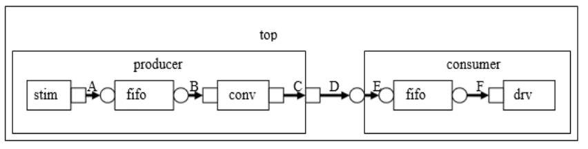

    Hierarchy in TLM

The hierarchy of this design contains two components, producer and
consumer. producer contains three components, stim, fifo, and conv.
consumer contains two components, fifo and drv. Notice that, from the
perspective of top, the producer and consumer appear identical to
those in Figure 4, in which the producer’s put_port is connected to
the consumer’s put_export. The two fifos are both unique instances of
the same `UVMTLMFIFO` component.

In Figure 7, connections A, B, D, and F are standard peer-to-peer
connections as discussed above. As an example, connection A would be
coded in the producer’s connect() method as::

    gen.put_port.connect(fifo.put_export);

Connections C and E are of a different sort than what have been
shown. Connection C is a port-to-port connection, and connection E is
an export-to-export connection. These two kinds of connections are
necessary to complete hierarchical connections. Connection C
*imports* a port from the outer component to the inner component.
Connection E *exports* an export upwards in the hierarchy from the
inner component to the outer one. Ultimately, every transaction-level
connection must resolve so that a port is connected to an export.
However, the port and export terminals do not need to be at the same
place in the hierarchy. We use port-to-port and export-to-export
connections to bring connectors to a hierarchical boundary to be
accessed at the next-higher level of hierarchy.

For connection E, the implementation resides in the fifo and is
exported up to the interface of consumer. All export-to-export
connections in a parent component are of the form::

    export.connect(subcomponent.export)

so connection E would be coded as::

    class consumer(UVMComponent)

        uvm_put_export #(trans) put_export;
        uvm_tlm_fifo #(trans) fifo;
        ...
        function void connect_phase(uvm_phase phase);
            put_export.connect(fifo.put_export); // E
            bfm.get_port.connect(fifo.get_export); // F
        endfunction
        ...
    endclass

Conversely, port-to-port connections are of the form::

    subcomponent.port.connect(port);

so connection C would be coded as::

    class producer (UVMComponent);

        uvm_put_port #(trans) put_port;
        conv c;
        ...
        function void connect_phase(uvm_phase phase);
            c.put_port.connect(put_port);
            ...
        endfunction

2.3.2.2 Connection Types
------------------------

Table 1 summarizes connection types and elaboration functions.

**Table 1—TLM Connection Types**

.. csv-table:: Connection type connect form

    port-to-export, comp1.port.connect(comp2.export);
    port-to-port, subcomponent.port.connect(port);
    export-to-export, export.connect(subcomponent.export);

NOTE—The argument to the port.connect() method may be either an
export or a port, depending on the nature of the connection (that is,
peer-to-peer or hierarchical). The argument to export.connect() is
always an export of a child component.

2.3.3 Analysis Communication
----------------------------

The put/get communication as described above allows verification
components to be created that model the “operational” behavior of a
system. Each component is responsible for communicating through its
TLM interface(s) with other components in the system in order to
stimulate activity in the DUT and/or respond its behavior. In any
reasonably complex verification environment, however, particularly
where randomization is applied, a collected transaction should be
distributed to the rest of the environment for end-to-end checking
(scoreboard), or additional coverage collection.

The key distinction between the two types of TLM communication is
that the put/get ports typically require a corresponding export to
supply the implementation. For analysis, however, the emphasis is on
a particular component, such as a monitor, being able to produce a
stream of transactions, regardless of whether there is a target
actually connected to it. Modular analysis components are then
connected to the analysis_port, each of which processes the
transaction stream in a particular way.

2.3.3.1 Analysis Ports
----------------------

The `UVMAnalysisPort` (represented as a diamond on the monitor in
Figure 8) is a specialized TLM port whose interface consists of a
single function, write(). The analysis port contains a list of
analysis_exports that are connected to it. When the component calls
analysis_port.write(), the analysis_port cycles through the list and
calls the write() method of each connected export. If nothing is
connected, the write() call simply returns. Thus, an analysis port
may be connected to zero, one, or many analysis exports, but the
operation of the component that writes to the analysis port does not
depend on the number of exports connected. Because write() is a void
function, the call will always
complete in the same delta cycle, regardless of how many components
(for example, scoreboards, coverage collectors, and so on) are
connected.

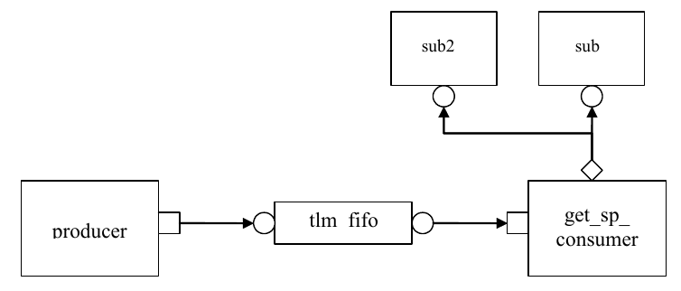

    Analysis Communication

Code example::

    class get_consumer_with_ap(get_consumer):

        def __init__(self, name, parent):
            super().__init__(name, parent)
            self.ap = UVMAnalysisPort(“analysis_port”, self)
            ...

        async def run_phase(self, phase);
            ...
            for i in range(10):
                if self.get_port.get(t):
                    # Do something with t.
                    ap.write(t) # Write transaction.

In the parent environment, the analysis port gets connected to the
analysis export of the desired components, such as coverage
collectors and scoreboards.

2.3.3.2 Analysis Exports
------------------------

As with other TLM connections, it is up to each component connected
to an analysis port to provide an implementation of write() via an
analysis_export. The UVMSubscriber base component can be used to
simplify this operation, so a typical analysis component would extend
UVMSubscriber as::

    class sub1(UVMSubscriber):

        my_env env;

        function void write(T t);
            # Call desired functionality in parent.
        endfunction
    endclass

As with put() and get() described above, the TLM connection between
an analysis port and export, allows the export to supply the
implementation of write(). If multiple exports are connected to an
analysis port, the port will call the write() of each export, in
order. Since all implementations of write() must be functions, the
analysis port’s write() function completes immediately, regardless of
how many exports are connected to it::

    class my_env(UVMEnv):

        get_component_with_ap g;
        sub1 s1; sub2 s2;

        function new(string name, uvm_component parent):
            super.new(name,parent);
            s1 = new("s1");
            s1.env = this ;
            s2 = new("s2");
            s2.env = this;
        endfunction

        function void connect_phase(uvm_phase phase);
            g.ap.connect(s1.analysis_export);
            // to illustrate analysis port can be connected to multiple
            // subscribers; usually the subscribers are in separate components
            g.ap.connect(s2.analysis_export);
            ...
        endfunction

    endclass

When multiple subscribers are connected to an analysis_port, each is
passed a pointer to the same transaction object, the argument to the
write() call. Each write() implementation must make a local copy of
the transaction and then operate on the copy to avoid corrupting the
transaction contents for any other subscriber that may have received
the same pointer.

UVM also includes an analysis_fifo, which is a uvm_tlm_fifo that also
includes an analysis export, to allow blocking components access to
the analysis transaction stream. The analysis_fifo is unbounded, so
the monitor’s write() call is guaranteed to succeed immediately. The
analysis component may then get the transactions from the
analysis_fifo at its leisure.

2.4 TLM-2.0 Implementation
##########################

.. WARNING:: TLM-2.0 interaction/integration with SystemC is untested at this
    point of development. This depends heavily on the simulation support as
    well.

The following subsections specify how TLM-2.0 is to be implemented in
Python.

.. contents::
    :local:

2.4.1 Generic Payload
---------------------

TLM-2.0 defines a base object, called the *generic payload*, for
moving data between components. In SystemC, this is the primary
transaction vehicle. In `uvm-python`, this is the default
transaction type, but it is not the only type that can be used (as
will be explained more fully in Section 2.4.2).

2.4.1.1 Attributes
------------------

Each attribute in the SystemC version has a corresponding member in
the `uvm-python` generic payload::

    int m_address;
    uvm_tlm_command_e m_command;
    int m_data[];
    int unsigned m_length;
    uvm_tlm_response_status_e m_response_status;
    bool m_dmi;
    int m_byte_enable[];
    int unsigned m_byte_enable_length;
    int m_streaming_width;

The data types of most members translate directly into `uvm-python`.
Unsigned int in SystemC become int in
Python. m_data and m_byte_enable, which are defined as type
char\* in SystemC, are defined as dynamic arrays of ints.
uvm_tlm_command_e and uvm_tlm_response_status_e are enumerated types.
They are defined as::

    class uvm_tlm_command_e(Enum):
        UVM_TLM_READ_COMMAND = auto()
        UVM_TLM_WRITE_COMMAND = auto()
        UVM_TLM_IGNORE_COMMAND = auto()

    class uvm_tlm_response_status_e(IntEnum):
        OK_RESPONSE = 1
        INCOMPLETE_RESPONSE = 0
        GENERIC_ERROR_RESPONSE = -1
        ADDRESS_ERROR_RESPONSE = -2
        COMMAND_ERROR_RESPONSE = -3
        BURST_ERROR_RESPONSE = -4
        BYTE_ENABLE_ERROR_RESPONSE = -5

All of the members of the generic payload can be randomized.
This enables instances of the generic payload to be randomized.
SystemVerilog allows arrays, including dynamic arrays to be
randomized. 

2.4.1.2 Accessors
-----------------

In SystemC, all of the attributes are private and are accessed
through accessor methods. In Python, this restriction is
removed. The following access methods are implemented::

    def uvm_tlm_command_e get_command();
    def void set_command(uvm_tlm_command_e command);
    def bit is_read();
    def void set_read();
    def bit is_write();
    def void set_write();
    def void set_address(bit [63:0] addr);
    def bit[63:0] get_address();
    def void get_data (output byte p []);
    def void set_data_ptr(ref byte p []);

    def int unsigned get_data_length();
    def void set_data_length(int unsigned length);
    def int unsigned get_streaming_width();
    def void set_streaming_width(int unsigned width);
    def void get_byte_enable(output byte p[]);
    def void set_byte_enable(ref byte p[]);
    def int unsigned get_byte_enable_length();
    def void set_byte_enable_length(int unsigned length);
    def void set_dmi_allowed(bit dmi);
    def bit is_dmi_allowed();
    def uvm_tlm_response_status_e get_response_status();
    def void set_response_status(uvm_tlm_response_status_e status);
    def bit is_response_ok();
    def bit is_response_error();
    def string get_response_string();

The accessor functions let you set and get each of the members of the
generic payload. This
implies a slightly different use model for the generic payload than
in SystemC. The way the generic payload is defined in SystemC does
not encourage you to create new transaction types derived from
uvm_tlm_generic_payload. Instead, you would use the extensions
mechanism (see Section 2.4.1.3). Thus, in SystemC, none of the
accessors are virtual.

In `uvm-python`, an important use model is to add randomization
constraints to a transaction type. This is most often done with
inheritance—take a derived object and add constraints to a base
class. These constraints can further be modified or extended by
deriving a new class, and so on. To support this use model, the
accessor functions are virtual, and the members are protected and not
local.

2.4.1.3 Extensions
------------------

The generic payload extension mechanism is very similar to the one
used in SystemC; minor differences exist simply due to the lack of
function templates in Python. Extensions are used to attach
additional application-specific or bus-specific information to the
generic bus transaction described in the generic payload.

An *extension* is an instance of a user-defined container class based
on the uvm_tlm_extension class. The set of extensions for any
particular generic payload object are stored in that generic payload
object instance. A generic payload object may have only one extension
of a specific extension container type.

Each extension container type is derived from the uvm_tlm_extension
class and contains any additional information required by the user::

    class gp_Xs_ext(uvm_tlm_extension):

        def __init__(string name = ""):
            super().__init__(name)
            self.Xmask = []

    uvm_object_utils_begin(gp_Xs_ext)
    uvm_field_int_array('Xmask', UVM_ALL_ON)
    uvm_object_utils_end(gp_Xs_ext)

To add an extension to a generic payload object, allocate an instance
of the extension container class and attach it to the generic payload
object using the set_extension() method::

    Xs = gp_Xs_ext()
    gp.set_extension(Xs)

The static function ID() in the user-defined extension container
class can be used as an argument to the function get_extension method
to retrieve the extension (if any) of the corresponding container
type— if it is attached to the generic payload object::

    Xs = gp.get_extension(gp_Xs_ext.ID)

The following methods are also available in the generic payload for
managing extensions::

    get_num_extensions()
    clear_extension()
    clear_extensions()

clear_extension() removes any extension of a specified type.
clear_extensions() removes all extension containers from the generic
payload.

2.4.2 Core Interfaces and Ports
-------------------------------

In the `uvm-python` implementation of TLM-2.0, we have provided only
the basic transport interfaces. They are defined in the uvm_tlm_if#()
class::

    class uvm_tlm_if():

The interface class is parameterized with the type of the transaction
object that will be transported across the interface and the type of
the phase enum. The default transaction type is the generic payload.
The default phase enum is::

    typedef enum {
        UNINITIALIZED_PHASE, BEGIN_REQ, END_REQ, BEGIN_RESP, END_RESP
    } uvm_tlm_phase_e;

Each of the interface methods take a handle to the transaction to be
transported and a handle to a timescale- independent time value
object. In addition, the nonblocking interfaces take a reference
argument for the phase::

    virtual function uvm_tlm_sync_e nb_transport_fw(
        T t, ref P p, input uvm_tlm_time delay
    );
    virtual function uvm_tlm_sync_e nb_transport_bw(
        T t, ref P p, input uvm_tlm_time delay
    );
    virtual task b_transport(T t, uvm_tlm_time delay);

In SystemC, the transaction argument is of type T&. Passing a handle
to a class in SystemVerilog most closely represents the semantics of
T& in SystemC. One implication in SystemVerilog is transaction types
cannot be scalars. If the transaction argument was qualified with
ref, indicating it was a reference argument, then it would be
possible to use scalar types for transactions. However, that would
also mean downstream components could change the handle to a
transaction. This violates the required semantics in TLM-2.0 as
stated in rule 4.1.2.5-b of the TLM-2.0 LRM, which is quoted here.

“If there are multiple calls to nb_transport associated with a given
transaction instance, one and the same transaction object shall be
passed as an argument to every such call. In other words, a given
transaction instance shall be represented by a single transaction
object.”

The phase and delay arguments may change value. These are also
references in SystemC; e.g., P& and sc_time&. However, phase is a
scalar, not a class, so the best translation is to use the ref
qualifier to ensure the same object is used throughout the call
sequence.

The uvm_tlm_time argument, which is present on all the interfaces,
represents time. In the SystemC TLM-2.0 specification, this argument
is reference to an sc_time variable, which lets the value change on
either side. This was translated to a class object in SystemVerilog
in order to manage timescales in different processes. Times passed
through function calls are not automatically scaled. See Section
2.4.6 for more details.

An important difference between TLM-1 and TLM-2.0 is the TLM-2.0
interfaces pass transactions by reference and not by value. In
SystemC, transactions in TLM-1 were passed as const references and in
TLM-2.0 just as references. This allows the transaction object to be
modified without copying the entire transaction. The result is much
higher performance characteristics as a lot of copying is avoided.
Another result is any object that has a handle to a transaction may
modify it. However, to adhere to the semantics of the TLM-2.0
interfaces, these modifications must be made within certain rules and
in concert with notifications made via the return enum in the nb_\*
interfaces and the phase argument.

2.4.3 Blocking Transport
------------------------

The blocking transport is implemented as follows::

    task b_transport(T t, uvm_tlm_time delay);

The b_transport task transports a transaction from the initiator to
the target in a blocking fashion. The call to b_transport by the
initiator marks the first timing point in the execution of the
transaction. That first timing point may be offset from the current
simulation by the delay value specified in the delay argument. The
return from b_transport by the target marks the final timing point in
the execution of the transaction. That last timing point may be
offset from the current simulation time by the delay value specified
in the delay argument. Once the task returns, the transaction has
been completed by the target. Any indication of success or failure
must be annotated in the transaction object by the target.

The initiator may read or modify the transaction object before the
call to b_transport and after its return, but not while the call to
b_transport is still active. The target may modify the transaction
object only while the b_transport call is active and must not keep a
reference to it after the task return. The initiator is responsible
for allocating the transaction object before the call to b_transport.
The same transaction object may be reused across b_transport calls.

2.4.4 Nonblocking Transport
---------------------------

The blocking transport is implemented using two interfaces::

    function uvm_tlm_sync_e nb_transport_fw(T t, ref P p, input
        uvm_tlm_time delay);
    function uvm_tlm_sync_e nb_transport_bw(T t, ref P p, input
        uvm_tlm_time delay);

nb_transport_fw transports a transaction in the forward direction,
that is from the initiator to the target (the forward path).
nb_transport_bw does the reverse, it transports a transaction from
the target back to the initiator (the backward path). An initiator
and target will use the forward and backward paths to update each
other on the progress of the transaction execution. Typically,
nb_transport_fw is called by the initiator whenever the protocol
state machine in the initiator changes state and nb_transport_bw is
called by the target whenever the protocol state machine in the
target changes state.

The nb_\* interfaces each return an enum uvm_tlm_sync_e. The possible
enum values and their meanings are shown in Table 2.

**Table 2—uvm_tlm_sync_e enum Description**

.. csv-table:: uvm_tlm_sync_e enum Description
    :widths: 30, 70

    **Enum value**, **Interpretation**
    UVM_TLM_ACCEPTED:, "Transaction has been accepted. Neither the transaction object, the phase nor the delay arguments have been modified."
    UVM_TLM_UPDATED:, "Transaction has been modified. The transac tion object, the phase or the delay arguments may have been modified."
    UVM_TLM_COMPLETED:, "Transaction execution has completed. The transaction object, the phase or
    the delay arguments may have been modified. There will be no further
    transport calls associated with this transaction."

The P argument of nb_transport_fw and nb_transport_bw represents the
transaction phase. This can be a user-defined type that is specific
to a particular protocol. The default type is uvm_tlm_phase_e, whose
values are shown in Table 3. These can be used to implement the *Base
Protocol*.

**Table 3—uvm_tlm_phase_e Description**

.. csv-table:: uvm_tlm_phase_e Description

    **Enum value**, **Interpretation**
    UNITIALIZED_PHASE, Phase has not yet begun
    BEGIN_REQ, Request has begun
    END_REQ, Request has completed
    BEGIN_RESP, Response has begun
    END_RESP, Response has terminated

The first call to nb_transport_fw by the initiator marks the first
timing point in the transaction execution. Subsequent calls to
nb_transport_fw and nb_transport_bw mark additional timing points in
the transaction execution. The last timing point is marked by a
return from nb_transport_fw or nb_transport_bw with
UVM_TLM_COMPLETED. All timing points may be offset from the current
simulation time by the delay value specified in the delay argument.
An nb_transport_fw call on the forward path shall under no
circumstances directly or indirectly make a call to nb_transport_bw
on the backward path, and vice versa.

The value of the phase argument represents the current state of the
protocol state machine. Any change in the value of the transaction
object should be accompanied by a change in the value of phase. When
using the Base Protocol, successive calls to nb_transport_fw or
nb_transport_bw with the same phase value are not permitted.

The initiator may modify the transaction object, the phase and the
delay arguments immediately before calls to nb_transport_fw and
before it returns from nb_transport_bw only. The target may modify
the transaction object, the phase and the delay arguments immediately
before calls to nb_transport_bw and before it returns from
nb_transport_fw only. The transaction object, phase and delay
arguments may not be otherwise modified by the initiator or target.

The initiator is responsible for allocating the transaction object
before the first call to nb_transport_fw. The same transaction object
is used by all of the forward and backward calls during its
execution. That transaction object is alive for the entire duration
of the transaction until the final timing point. The same transaction
object may be reused across different transaction execution that do
not overlap in time.

2.4.5 Sockets
-------------

In TLM-1, the primary means of making a connection between two
processes is through ports and exports, whereas in TLM-2.0 this done
through sockets. A *socket* is like a port or export; in fact, it is
derived from the same base class as ports and export, namely
uvm_port_base. However, unlike a port or export a socket provides
both a forward and backward path. Thus, you can enable asynchronous
(pipelined) bi-directional communication by connecting sockets
together. To enable this, a socket contains both a port and an
export.

Components that initiate transactions are called initiators and
components that receive transactions sent by an initiator are called
targets. Initiators have initiator sockets and targets have target
sockets. Initiator sockets can only connect to target sockets; target
sockets can only connect to initiator sockets.

Figure 9 shows the diagramming of socket connections. The socket
symbol is a box with an isosceles triangle with its point indicating
the data and control flow direction of the forward path. The backward
path is indicated by an arrow connecting the target socket back to
the initiator socket. Section 3.4 of the TLM-2.0 LRM fully explains
sockets, initiators, targets, and interconnect components.

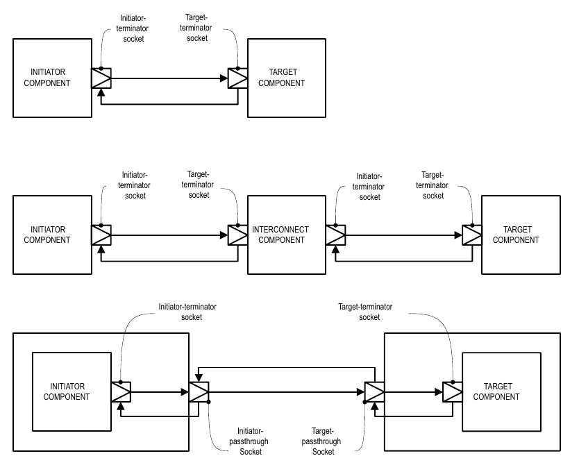

    Socket Connections

Sockets come in several flavors: Each socket is an initiator or a
target, a passthrough, or a terminator. Furthermore, any particular
socket implements either blocking interfaces or nonblocking interfaces.
Terminator sockets are used on initiators and targets as well as
interconnect components as shown in Figure 9. Passthrough sockets are
used to enable connections to cross hierarchical boundaries.

The cross product of {initiator, target} X {terminator, passthrough} X
{blocking, nonblocking} yields eight different kinds of sockets. The
class definitions for these sockets are as follows::

    class uvm_tlm_nb_passthrough_initiator_socket #(type T=uvm_tlm_generic_payload,
    type P=uvm_tlm_phase_e) extends
    uvm_tlm_nb_passthrough_initiator_socket_base #(T,P);

    class uvm_tlm_nb_passthrough_target_socket#(
        type T=uvm_tlm_generic_payload,
        type P=uvm_tlm_phase_e
    ) extends uvm_tlm_nb_passthrough_target_socket_base #(T,P);

    class uvm_tlm_b_passthrough_initiator_socket #(
        type T=uvm_tlm_generic_payload
    ) extends
    uvm_tlm_b_passthrough_initiator_socket_base #(T);

    class uvm_tlm_b_passthrough_target_socket #(
        type T=uvm_tlm_generic_payload
    )
    extends uvm_tlm_b_passthrough_target_socket_base #(T);

Target- terminator socket

Initiator- passthrough Socket

Initiator- terminator socket

INTERCONNECT COMPONENT

TARGET COMPONENT

INITIATOR COMPONENT

Initiator-terminator

socket

Target-terminator

socket

TARGET COMPONENT

Target- passthrough Socket

class uvm_tlm_b_target_socket #(type T=uvm_tlm_generic_payload,

type IMP=int) extends uvm_tlm_b_target_socket_base #(T);

class uvm_tlm_b_initiator_socket #(type T=uvm_tlm_generic_payload)

extends uvm_tlm_b_initiator_socket_base #(T);

class uvm_tlm_nb_target_socket #(type T=uvm_tlm_generic_payload,

type P=uvm_tlm_phase_e, type IMP=int) extends
uvm_tlm_nb_target_socket_base #(T,P);

class uvm_tlm_nb_initiator_socket #(type T=uvm_tlm_generic_payload,

type P=uvm_tlm_phase_e, type IMP=int) extends
uvm_tlm_nb_initiator_socket_base #(T,P);

Table 4 shows the different kinds of sockets and how they are
constructed.

**Table 4—Socket Construction**

**Socket Blocking Nonblocking**

initiator IS-A forward port IS-A forward port; HAS-A backward imp

target IS-A forward imp IS-A forward imp; HAS-A backward port

passthrough initiator IS-A forward port IS-A forward port; HAS-A
backward export

passthrough target IS-A forward export IS-A forward port; HAS-A backward
export

IS-A and HAS-A are types of object relationships. IS-A refers to the
inheritance relationship and HAS-A refers to the ownership
relationship. For example, if you say D is a B, it means D is derived
from base B. If you say object A HAS-A B, it means B is a member of
A.

Each <socket_type>::connect() calls super.connect(), which performs
all the connection mechanics. For the nonblocking sockets which have
a secondary port/export for the backward path, connect() is called on
the secondary port/export to form a backward connection.

Each socket type provides an implementation of the connect() method.
Connection is defined polymorphically using the base class type as
the argument::

    function void connect(this_type provider);

where this_type is defined in uvm_port_base as::

    uvm_port_base #(IF) this_type;

Further, IF is defined by uvm_tlm_if#(T,P). Thus, compile-time
interface type checking is achieved. However, this is not sufficient
type checking. Additionally, each implementation of connect() in each
socket type does run-time type checking to ensure it is connected to
allowable socket types. For example, an initiator socket can connect
to an initiator passthrough socket, a target passthrough socket, or a
target socket. It cannot connect to another initiator socket. These
kinds of checks are performed for each socket type.

2.4.6 Time
----------

Integers are not sufficient on their own to represent time without
any ambiguity; you need to know the scale of that integer value,
which is conveyed outside of the integer. In SystemVerilog, this is
based on the timescale that was active when the code was compiled.
SystemVerilog properly scales time literals, but not integer values
because it does not know the difference between an integer that
carries an integer value and an integer that carries a time value.
time variables are simply 64-bit integers, they are not scaled back
and forth to the underlying precision. Here is a short example that
illustrates part of the problem::

    \`timescale 1ns/1ps
    module m();

        time t;

        initial begin
            #1.5;
            $write("T=%f ns (Now should be 1.5)\n", $realtime());
            t = 1.5;
            #t; // 1.5 will be rounded to 2
            $write("T=%f ns (Now should be 3.0)\n", $realtime());
            #10ps;
            $write("T=%f ns (Now should be 3.010)\n", $realtime());
            t = 10ps; // 0.010 will be converted to int (0)
            #t;
            $write("T=%f ns (Now should be 3.020)\n", $realtime());
        end

    endmodule

yields::

    T=1.500000 ns (Now should be 1.5)
    T=3.500000 ns (Now should be 3.0)
    T=3.510000 ns (Now should be 3.010)
    T=3.510000 ns (Now should be 3.020)

Within SystemVerilog, we have to worry about different time scales
and precision. Because each endpoint in a socket could be coded in
different packages and, thus, be executing under different timescale
directives, a simple integer cannot be used to exchange time
information across a socket.

For example::

    \`timescale 1ns/1ps

    package a_pkg; class a;

    function void f(inout time t);
        t += 10ns;
    endfunction endclass

    endpackage

    \`timescale 1ps/1ps

    program p;
    import a_pkg::*;

    time t = 0;

    initial begin
        a A = new;
        A.f(t);
        #t;
        $write("T=%0d ps (Should be 10,000)\n", $time());
    end

    endprogram

yields::

    T=10 ps (Should be 10,000)

Scaling is needed every time you make a procedural call to code that
may interpret a time value in a different timescale. Using the
uvm_tlm_time type::

    `timescale 1ns/1ps

    package a_pkg;

        import uvm_pkg::*;

        class a;

        function void f(uvm_tlm_time t);
            t.incr(10ns, 1ns);
        endfunction

        endclass

    endpackage

    `timescale 1ps/1ps

    program p;

        import uvm_pkg::*;
        import a_pkg::*;

        uvm_tlm_time t = new;

        initial begin
            a A = new;
            A.f(t);
            #(t.get_realtime(1ns));
            $write("T=%0d ps (Should be 10,000)\n", $time());
        end
    endprogram

yields::

    T=10000 ps (Should be 10,000)

To solve these problems, the uvm_tlm_time class contains the scaling
information so that as time information is passed between processes,
which may be executing under different time scales, the time can be
scaled properly in each environment.

2.4.7 Use Models
----------------

Since sockets are derived from uvm_port_base, they are created and
connected in the same way as port and exports. You can create them in
the build phase and connect them in the connect phase by calling
connect(). Initiator and target termination sockets are the end
points of any connection. There can be an arbitrary number of
passthrough sockets in the path between the initiator and target.

Some socket types must be bound to imps—implementations of the
transport tasks and functions. Blocking terminator sockets must be
bound to an implementation of b_transport(), for example. Nonblocking
initiator sockets must be bound to an implementation of
nb_transport_bw and nonblocking target sockets must be bound to an
implementation of nb_transport_fw. Typically, the task or function is
implemented in the component where the socket is instantiated and the
component type and instance are provided to complete the binding.

Consider, for example, a consumer component with a blocking target
socket::

    class consumer (UVMComponent);

        uvm_tlm_b_target_socket #(trans, consumer) target_socket;

        function new(string name, uvm_component parent);
            super.new(name, parent);
        endfunction

        function void build_phase(uvm_phase phase);
            target_socket = new("target_socket", this, this);
        endfunction

        task b_transport(ref trans t, ref time delay);
            #5;
            ’uvm_info("consumer", t.convert2string(),UVM_LOW);
        endtask
    endclass

The interface task b_transport is implemented in the consumer
component. The consumer component type is used in the declaration of
the target socket, which informs the socket object of the type of the
object containing the interface task, in this case b_transport().
When the socket is instantiated this is passed in twice, once as the
parent, just like any other component instantiation, and again to
identify the object that holds the implementation of b_transport().
Finally, in order to complete the binding, an implementation of
b_transport() must be present in the consumer component.

Any component that has a blocking termination socket, nonblocking
initiator socket, or nonblocking termination socket must provide
implementations of the relevant components. This includes initiator
and target components, as well as interconnect components that have
these kinds of sockets. Components with passthrough sockets do not
need to provide implementations of any sort. Of course, they must
ultimately be connected to sockets that do provide the necessary
implementations.

3. Developing Reusable Verification Components
==============================================

This chapter describes the basic concepts and components that make up
a typical verification environment. It also shows how to combine
these components using a proven hierarchical architecture to create
reusable verification components. The sections in this chapter follow
the same order you should follow when developing a verification
component:

.. contents::
    :local:

— *Modeling Data Items for Generation*
— *Transaction-Level Components*
— *Creating the Driver*
— *Creating the Sequencer*
— *Creating the Monitor*
— *Instantiating Components*
— *Creating the Agent*
— *Creating the Environment*
— *Enabling Scenario Creation*
— *Managing End of Test*
— *Implementing Checks and Coverage*

NOTE—This chapter builds upon concepts described in Chapter 1 and
Chapter 2.

3.1 Modeling Data Items for Generation
######################################

Data items:

— Are transaction objects used as stimulus to the device under test
(DUT). — Represent transactions that are processed by the verification
environment. — Are instances of classes that you define (“user-defined”
classes). — Capture and measure transaction-level coverage and checking.

NOTE—The UVM Class Library provides the UVMSequenceItem base class.
Every user-defined data item should be derived directly or indirectly
from this base class.

To create a user-defined data item:

a) Review your DUT's transaction specification and identify the
application-specific properties, constraints, tasks, and functions.
b) Derive a data item class from the
UVMSequenceItem base class (or a derivative of it).
c) Define a constructor for the data item.
d) Add control fields (“knobs”) for the
items identified in Step (a) to enable easier test writing.
e) Use UVM field macros to enable printing, copying, comparing, and so on.
f) Define do_\* functions for use in creation, comparison, printing,
packing, and unpacking of transaction data as needed (see Section 6.7).

UVM has built-in automation for many service routines that a data
item needs. For example, you can use::

    — print() to print a data item.
    — copy() to copy the contents of a data item.
    — compare() to compare two similar objects.

UVM allows you to specify the automation needed for each field and to
use a built-in, mature, and consistent implementation of these
routines.

To assist in debugging and tracking transactions, the uvm_transaction
base class provides access to a unique transaction number via the
get_transaction_id() member function. In addition, the
UVMSequenceItem base class (extended from uvm_transaction) also
includes a get_transaction_id() member function, allowing sequence
items to be correlated to the sequence that generated them
originally.

The class simple_item in this example defines several random
variables and class constraints. The UVM macros implement various
utilities that operate on this class, such as copy, compare, print,
and so on. In particular, the \`uvm_object_utils macro registers the
class type with the common factory::

    1 class simple_item extends UVMSequenceItem;
    2 rand int unsigned addr;
    3 rand int unsigned data;
    4 rand int unsigned delay;
    5 constraint c1 { addr < 16'h2000; }
    6 constraint c2 { data < 16'h1000; }
    7 // UVM automation macros for general objects
    8 \`uvm_object_utils_begin(simple_item)
    9 \`uvm_field_int(addr, UVM_ALL_ON)
    10 \`uvm_field_int(data, UVM_ALL_ON)
    11 \`uvm_field_int(delay, UVM_ALL_ON)
    12 \`uvm_object_utils_end
    13 // Constructor
    14 function new (string name = "simple_item");
    15 super.new(name);
    16 endfunction : new
    17 endclass : simple_item

Line 1 Derives data items from `UVMSequenceItem` so they can be
generated in a procedural sequence. See Section 3.10.2 for more
information.

Line 5 and Line 6

Add constraints to a data item definition in order to:

Reflect specification rules. In this example, the address must be less
than 16'h2000. Specify the default distribution for generated traffic.
For example, in a typical test most transactions should be legal.

Line 7-Line 12 Use the UVM macros to automatically implement
functions such as copy(), compare(), print(), pack(), and so on.
Refer to “Macros” in the UVM *1.2 Class Reference* for information on
the \`uvm_object_utils_begin, \`uvm_object_utils_end, \`uvm_field_*,
and their associated macros.

3.1.1 Inheritance and Constraint Layering
-----------------------------------------

In order to meet verification goals, the verification component user
might need to adjust the data-item generation by adding more
constraints to a class definition. In SystemVerilog, this is done
using inheritance. The following example shows a derived data item,
word_aligned_item, which includes an additional constraint to select
only word-aligned addresses::

    class word_aligned_item extends simple_item;

        constraint word_aligned_addr { addr[1:0] == 2'b00; }
        `uvm_object_utils(word_aligned_item)

        // Constructor
        function new (string name = "word_aligned_item");
            super.new(name);
        endfunction : new

    endclass : word_aligned_item

To enable this type of extensibility:

— The base class for the data item (simple_item in this chapter) should
use virtual methods to allow derived classes to override functionality.
— Make sure constraint blocks
are organized so that they are able to override or disable constraints
for a random variable without having to rewrite a large block. — Note that
fields can be declared with the protected or local keyword to restrict
access to properties. This, however, will limit the ability to constrain
them with an inline constraint.

3.1.2 Defining Control Fields (“Knobs”)
---------------------------------------

The generation of all values of the input space is often impossible
and usually not required. However, it is important to be able to
generate a few samples from ranges or categories of values. In the
simple_item example in Section 3.1, the delay property could be
randomized to anything between zero and the maximum unsigned integer.
It is not necessary (nor practical) to cover the entire legal space,
but it is important to try back-to-back items along with short,
medium, and large delays between the items, and combinations of all
of these. To do this, define control fields (often called “knobs”) to
enable the test writer to control these variables. These same control
knobs can also be used for coverage collection. For readability, use
enumerated types to represent various generated categories.

Knobs Example::

    typedef enum {ZERO, SHORT, MEDIUM, LARGE, MAX} simple_item_delay_e;

    class simple_item extends UVMSequenceItem;

        rand int unsigned addr;
        rand int unsigned data;
        rand int unsigned delay;
        rand simple_item_delay_e delay_kind; // Control field
        // UVM automation macros for general objects
        `uvm_object_utils_begin(simple_item)
        `uvm_field_int(addr, UVM_ALL_ON)
        `uvm_field_enum(simple_item_delay_e, delay_kind, UVM_ALL_ON)
        `uvm_object_utils_end

        constraint delay_order_c { solve delay_kind before delay; }

        constraint delay_c {(delay_kind == ZERO) -> delay == 0;
            (delay_kind == SHORT) -> delay inside { [1:10] };
            (delay_kind == MEDIUM) -> delay inside { [11:99] };
            (delay_kind == LARGE) -> delay inside { [100:999] };
            (delay_kind == MAX ) -> delay == 1000;
            delay >=0; delay <= 1000;
        }
    endclass : simple_item

Using this method allows you to create more abstract tests. For
example, you can specify distribution as::

    constraint delay_kind_d {
        delay_kind dist {ZERO:=2, SHORT:=1, MEDIUM:=1, LONG:=1, MAX:=2};
    }

When creating data items, keep in mind what range of values are often
used or which categories are of interest to that data item. Then add
knobs to the data items to simplify control and coverage of these
data item categories.

3.2 Transaction-Level Components
################################

As discussed in Chapter 2, TLM interfaces in UVM provide a consistent
set of communication methods for sending and receiving transactions
between components. The components themselves are instantiated and
connected in the testbench, to perform the different operations required
to verify a design. A simplified testbench is shown in Figure 10 (for
simplicity, typical containers like environment and agents are not shown
here).

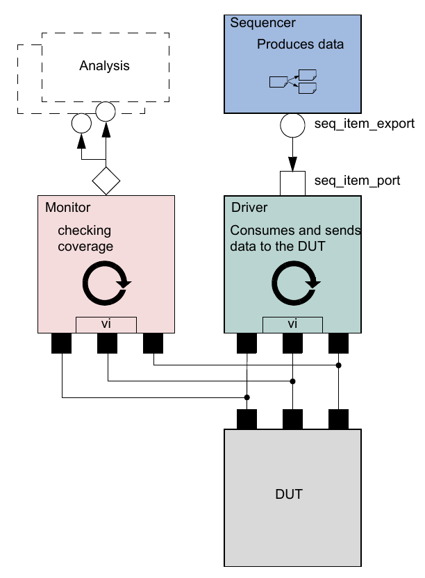

    Simplified Transaction-Level Testbench

The basic components of a simple transaction-level verification
environment are:

a) A stimulus generator (sequencer) to create transaction-level traffic
to the DUT. b) A driver to convert these transactions to signal-level
stimulus at the DUT interface. c) A monitor to recognize signal-level
activity on the DUT interface and convert it into transactions. d) An
analysis component, such as a coverage collector or scoreboard, to
analyze transactions.

As we shall see, the consistency and modularity of the TLM interfaces in
UVM allow components to be reused as other components are replaced
and/or encapsulated. Every component is characterized by its interfaces,
regardless of its internal implementation (see Figure 11). This chapter
discusses how to encapsulate these types of components into a proven
architecture, a verification component, to improve reuse even further.

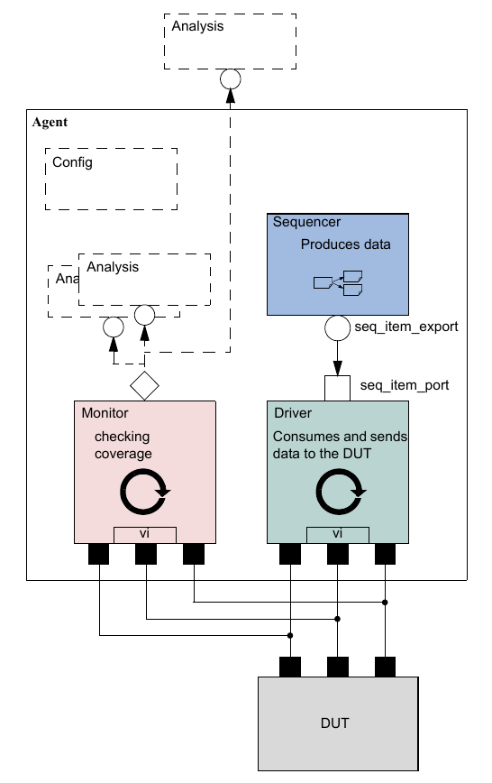

    Highly Reusable Verification Component Agent

Figure 11 shows the recommended grouping of individual components
into a reusable interface-level verification component agent. Instead
of reusing the low-level classes individually, the developer creates
a component that encapsulates it’s sub-classes in a consistent way.
Promoting a consistent architecture makes these components easier to
learn, adopt, and configure.

3.3 Creating the Driver
#######################

The driver’s role is to drive data items to the bus following the
interface protocol. The driver obtains data items from the sequencer
for execution. The UVM Class Library provides the uvm_driver base
class, from which all driver classes should be extended, either
directly or indirectly. The driver has a TLM port through which it
communicates with the sequencer (see the example below). The driver
may also implement one or more of the run-time phases (run and
pre_reset - post_shutdown) to refine its operation.

To create a driver:

a) Derive from the uvm_driver base class.
b) If desired, add UVM
    infrastructure macros for class properties to implement utilities for
    printing, copying, comparing, and so on.
c) Obtain the next data item from the
    sequencer and execute it as outlined above.
d) Declare a virtual
    interface in the driver to connect the driver to the DUT.

Refer to Section 3.10.2 for a description of how a sequencer, driver,
and sequences synchronize with each other to generate constrained
random data.

The class simple_driver in the example below defines a driver class.
The example derives simple_driver from uvm_driver (parameterized to
use the simple_item transaction type) and uses the methods in the
seq_item_port object to communicate with the sequencer. As always,
include a constructor and the `uvm_component_utils` mixin to register
the driver type with the common factory.

.. code-block:: python
    :linenos:

    class simple_driver(UVMDriver):
        simple_item s_item;
        virtual dut_if vif;

        # Constructor
        def __init__(self, name="simple_driver", parent):
            super().__init__(name, parent);

        def build_phase(self, phase):
            inst_name = ""
            super().build_phase(phase);
            if(!UVMConfigDb#(virtual dut_if)::get(this, "","vif",vif))
                uvm_fatal("NOVIF", {"virtual interface must be set for: ",
                    get_full_name(),".vif"});

        async def run_phase(self, phase):
            while True:
                # Get the next data item from sequencer (may block).
                seq_item_port.get_next_item(s_item);
                # Execute the item.
                drive_item(s_item);
                seq_item_port.item_done(); // Consume the request.

        async def drive_item(self, item):
            ... # Add your logic here.

    uvm_component_utils(simple_driver)

Line 1 Derive the driver.

Line 5 Add UVM infrastructure macro.

Line 13 Get the resource that defines the virtual interface

Line 22 Call get_next_item() to get the next data item for execution
from the sequencer.

Line 25 Signal the sequencer that the execution of the current data
item is done.

Line 30 Add your application-specific logic here to execute the data
item.

More flexibility exists on connecting the drivers and the sequencer.
See Section 3.5.

3.4 Creating the Sequencer
##########################

The sequencer generates stimulus data and passes it to a driver for
execution. The UVM Class Library provides the `UVMSequencer` base
class, which is parameterized by the request and response item types.
The `UVMSequencer` base class contains all of the base functionality
required to allow a sequence to communicate with a driver. The
uvm_sequencer gets instantiated directly, with appropriate
parameterization as shown in Section 3.8.1, Line 3. In the class
definition, by default, the response type is the same as the request
type. If a different response type is desired, the optional second
parameter must be specified for the uvm_sequencer base type::

    uvm_sequencer #(simple_item, simple_rsp) sequencer;

Refer to Section 3.10.2 for a description of how a sequencer, driver,
and sequences synchronize with each other to generate
constrained-random data.

3.5 Connecting the Driver and Sequencer
#######################################

The driver and the sequencer are connected via TLM, with the driver’s
seq_item_port connected to the sequencer’s seq_item_export (see
Figure 12). The sequencer produces data items to provide via the
export. The driver consumes data items through its seq_item_port and,
optionally, provides responses. The component that contains the
instances of the driver and sequencer makes the connection between
them. See Section 3.8.

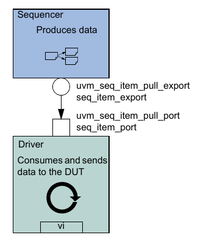

    Sequencer-Driver Interaction

The seq_item_port in `UVMDriver` defines the set of methods used by
the driver to obtain the next item in the sequence. An important part
of this interaction is the driver’s ability to synchronize to the
bus, and to interact with the sequencer to generate data items at the
appropriate time. The sequencer implements the set of methods that
allows flexible and modular interaction between the driver and the
sequencer.

3.5.1 Basic Sequencer and Driver Interaction
--------------------------------------------

Basic interaction between the driver and the sequencer is done using
the tasks get_next_item() and item_done(). As demonstrated in the
example in Section 3.3, the driver uses get_next_item() to fetch the
next randomized item to be sent. After sending it to the DUT, the
driver signals the sequencer that the item was processed using
item_done().Typically, the main loop within a driver resembles the
following pseudo code::

    forever begin
        get_next_item(req); // Send item following the protocol. item_done();
    end

NOTE—get_next_item() is blocking until an item is provided by the
sequences running on that sequencer.

3.5.2 Querying for the Randomized Item
--------------------------------------

In addition to the get_next_item() task, the uvm_seq_item_pull_port
class provides another task, try_next_item(). This task will return
in the same simulation step if no data items are available for
execution. You can use this task to have the driver execute some idle
transactions, such as when the DUT has to be stimulated when there
are no meaningful data to transmit. The following example shows a
revised
implementation of the run_phase() task in the previous example (in
Section 3.3), this time using try_next_item() to drive idle
transactions as long as there is no real data item to execute::

    task run_phase(uvm_phase phase);
    forever begin

        // Try the next data item from sequencer (does not block).
        seq_item_port.try_next_item(s_item);
        if (s_item == null) begin
            // No data item to execute, send an idle transaction. ...
        end
        else begin
            // Got a valid item from the sequencer, execute it. ...
            // Signal the sequencer; we are done.
            seq_item_port.item_done();
        end
    end
    endtask:run

3.5.3 Fetching Consecutive Randomized Items
-------------------------------------------

In some protocols, such as pipelined protocols, the driver may
operate on several transactions at the same time. The
sequencer-driver connection, however, is a single item handshake
which shall be completed before the next item is retrieved from the
sequencer. In such a scenario, the driver can complete the handshake
by calling item_done() without a response and provide the response by
a subsequent call to put_response(r) with the real response data.

3.5.4 Sending Processed Data back to the Sequencer
--------------------------------------------------

In some sequences, a generated value depends on the response to
previously generated data. By default, the data items between the
driver and the sequencer are copied by reference, which means that
changes the driver makes to the data item will be visible inside the
sequencer. In cases where the data item between the driver and the
sequencer is copied by value, the driver needs to return the
processed response back to the sequencer. Do this using the optional
argument to item_done()::

    seq_item_port.item_done(rsp);

or using the put_response() method::

    seq_item_port.put_response(rsp);

or using the built-in analysis port in uvm_driver::

    rsp_port.write(rsp);

NOTE—Before providing the response, the response’s sequence and
transaction id must be set to correspond to the request transaction
using rsp.set_id_info(req).

NOTE—put_response() is a blocking method, so the sequence must do a
corresponding get_response(rsp).

With the basic functionality of driver-sequencer communication
outlined above, the steps required to create a driver are
straightforward.

3.5.5 Using TLM-Based Drivers
-----------------------------

The seq_item_port, which is built into uvm_driver, is a bidirectional
port. It also includes the standard TLM methods get() and peek() for
requesting an item from the sequencer, and put() to provide a
response. Thus, other components, which may not necessarily be
derived from uvm_driver, may still connect to and communicate with
the sequencer. As with the seq_item_port, the methods to use depend
on the interaction desired::

    // Pause sequencer operation while the driver operates on the transaction.
    peek(req); // Process req operation.
    get(req); // Allow sequencer to proceed immediately upon driver receiving transaction.

    get(req); // Process req operation.

The following also apply.

— peek() is a blocking method, so the driver may block waiting for an
item to be returned. — The get() operation notifies the sequencer to
proceed to the next transaction. It returns the same
transaction as the peek(), so the transaction may be ignored.

To provide a response using the blocking_slave_port, the driver would
call::

    seq_item_port.put(rsp);

The response may also be sent back using an analysis_port as well.

3.6 Creating the Monitor
########################

The monitor is responsible for extracting signal information from the
bus and translating it into events, data, and status information.
This information is available to other components and to the test
writer via standard TLM interfaces and channels. The monitor should
never rely on state information collected by other components, such
as a driver, but it may need to rely on request-specific id
information in order to properly set the sequence and transaction id
information for the response.

The monitor functionality should be limited to basic monitoring that
is always required. This can include protocol checking—which should
be configurable so it can be enabled or disabled—and coverage
collection. Additional high-level functionality, such as scoreboards,
should be implemented separately on top of the monitor.

If you want to verify an abstract model or accelerate the pin-level
functionality, you should separate the signal-level extraction,
coverage, checking, and the transaction-level activities. An analysis
port should allow communication between the sub-monitor components
(see the UVM *1.2 Class Reference*).

*Monitor Example*

The following example shows a simple monitor which has the following
functions:

— The monitor collects bus information through a virtual interface
(xmi). — The collected data is used in coverage collection and checking.
— The collected data is exported on an analysis port
(item_collected_port).

Actual code for collection is not shown in this example. A complete
example can be found in the UBus example in ubus_master_monitor.py::

    class master_monitor extends UVMMonitor;

        virtual bus_if xmi; // SystemVerilog virtual interface bit
        checks_enable = 1; // Control checking in monitor and interface. bit
        coverage_enable = 1; // Control coverage in monitor and interface.
        uvm_analysis_port #(simple_item) item_collected_port;

        event cov_transaction; // Events needed to trigger covergroups
        protected simple_item trans_collected;
        `uvm_component_utils_begin(master_monitor)
        `uvm_field_int(checks_enable, UVM_ALL_ON)
        `uvm_field_int(coverage_enable, UVM_ALL_ON)
        `uvm_component_utils_end

        covergroup cov_trans @cov_transaction;
            option.per_instance = 1;
            ... // Coverage bins definition
        endgroup : cov_trans

        function new (string name, uvm_component parent);
            super.new(name, parent);
            cov_trans = new();
            cov_trans.set_inst_name({get_full_name(), ".cov_trans"});
            trans_collected = new();
            item_collected_port = new("item_collected_port", this);
        endfunction : new

        virtual task run_phase(uvm_phase phase);
            collect_transactions(); // collector task.
        endtask : run virtual

        protected task collect_transactions();
            forever begin
                @(posedge xmi.sig_clock);
                ...// Collect the data from the bus into trans_collected.
                if (checks_enable)
                    perform_transfer_checks();
                if (coverage_enable)
                    perform_transfer_coverage();
                item_collected_port.write(trans_collected);
            end
        endtask : collect_transactions

        virtual protected function void perform_transfer_coverage();
            -> cov_transaction;
        endfunction : perform_transfer_coverage virtual

        protected function void perform_transfer_checks();
            ... // Perform data checks on trans_collected.
        endfunction : perform_transfer_checks
    endclass : master_monitor

The collection is done in a task (collect_transactions) which is
spawned at the beginning of the run() phase. It runs in an endless
loop and collects the data as soon as the signals indicate that the
data is available on the bus.

As soon as the data is available, it is sent to the analysis port
(item_collected_port) for other components waiting for the
information.

Coverage collection and checking are conditional because they can
affect simulation run-time performance. If not needed, they can be
turned off by setting coverage_enable or checks_enable to 0, using
the configuration mechanism. For example::

    UVMConfigDb.set(this,“*.master0.monitor”, “checks_enable”, 0)

If checking is enabled, the task calls the perform_transfer_checks
function, which performs the necessary checks on the collected data
(trans_collected). If coverage collection is enabled, the task emits
the coverage sampling event (cov_transaction) which results in
collecting the current values.

NOTE—SystemVerilog does not allow concurrent assertions in classes,
so protocol checking can also be done using assertions in a
SystemVerilog interface.

3.7 Instantiating Components
############################

The isolation provided by object-oriented practices and TLM
interfaces between components facilitate reuse in UVM enabling a
great deal of flexibility in building environments. Because each
component is independent of the others, a given component can be
replaced by a new component with the same interfaces without having
to change the parent’s connect() method. This flexibility is
accomplished through the use of the *factory* in UVM.

When instantiating components in UVM, rather than calling its
constructor (in bold below)::

    class my_component (UVMComponent);

    my_driver driver;
    ...
    virtual function void build_phase(uvm_phase phase);
        super.build_phase(phase);
        **driver = new(“driver”,this)**;
        ...
        endfunction
    endclass

components should be instantiated using the create() method::

    class my_component (UVMComponent);

        my_driver driver;
        ...
        virtual function void build_phase(uvm_phase phase);
            super.build_phase(phase);
            **driver = my_driver.type_id.create("driver",this);**
            ...
        endfunction
        endclass

The factory operation is explained in Section 6.2. The
type_id::create() method is a type-specific static method that
returns an instance of the desired type (in this case, my_driver)
from the factory. The arguments to create() are the same as the
standard constructor arguments, a string name and the parent
component. The use of the factory allows the developer to derive a
new class extended from my_driver and cause the factory to return the
extended type in place of my_driver. Thus, the parent component can
use the new type without modifying the parent class.

For example, for a specific test, an environment user may want to
change the driver. To change the driver for a specific test:

a) Declare a new driver extended from the base component and add or
modify functionality as desired::

    class new_driver extends my_driver;

    ... // Add more functionality here.
    endclass: new_driver

b) In your test, environment, or testbench, override the type to be returned
by the factory::

    def build_phase(self,  phase):
        self.set_type_override_by_type(my_driver.get_type(),
            new_driver.get_type())
        super().build_phase(phase)

The factory also allows a new type to be returned for the creation of a
specific instance as well. In either case, because new_driver is an
extension of my_driver and the TLM interfaces are the same, the
connections defined in the parent remain unchanged.

3.8 Creating the Agent
######################

An agent (see Figure 13) instantiates and connects together a driver,
monitor, and sequencer using TLM connections as described in the
preceding sections. To provide greater flexibility, the agent also
contains configuration information and other parameters. As discussed in
Section 1.1.5, UVM recommends that the verification component developer
create an agent that provides protocol-specific stimuli creation,
checking, and coverage for a device. In a bus-based environment, an
agent usually models a master, a slave, or an arbiter component.

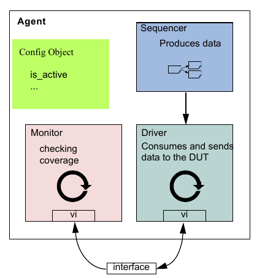

    Agent

3.8.1 Operating Modes
---------------------

An agent has two basic operating modes:

— Active mode, where the agent emulates a device in the system and
drives DUT signals. This mode requires that the agent instantiate a
driver and sequencer. A monitor also is instantiated for checking and
coverage.

— Passive mode, where the agent does not instantiate a driver or
sequencer and operates passively. Only the monitor is instantiated and
configured. Use this mode when only checking and coverage collection is
desired.

The class simple_agent in the example below instantiates a sequencer,
a driver, and a monitor in the recommended way. Instead of using the
constructor, the UVM build phase is used to configure and construct
the subcomponents of the agent. Unlike constructors, this virtual
function can be overridden without any limitations. Also, instead of
hard coding, the allocation type_id::create() is used to instantiate
the subcomponents. The example in “To change the driver for a
specific test:” in Section 3.8 illustrates how you can override
existing behavior using extends::

    1 class simple_agent extends uvm_agent;
    2 ... // Constructor and UVM automation macros
    3 uvm_sequencer #(simple_item) sequencer;
    4 simple_driver driver;
    5 simple_monitor monitor;
    6 // Use build_phase to create agents's subcomponents.
    7 virtual function void build_phase(uvm_phase phase);
    8 super.build_phase(phase)
    9 monitor = simple_monitor.type_id.create("monitor",this);
    10 if (is_active == UVM_ACTIVE) begin
    11 // Build the sequencer and driver.
    12 sequencer =
    13 uvm_sequencer#(simple_item).type_id.create("sequencer",this);
    14 driver = simple_driver.type_id.create("driver",this);
    15 end
    16 endfunction : build_phase
    17 virtual function void connect_phase(uvm_phase phase);
    18 if(is_active == UVM_ACTIVE) begin
    19 driver.seq_item_port.connect(sequencer.seq_item_export);
    20 end
    21 endfunction : connect_phase
    22 endclass : simple_agent

NOTE—Invoking super.build_phase() (see Line 8) enables the automatic
configuration for UVM fields declared via the uvm_field_\* macros
during the build phase.

Line 9 The monitor is created using create().

Line 10 - Line 15 The if condition tests the is_active property to
determine whether the driver and sequencer are created in this agent.
If the agent is set to active (is_active = UVM_ACTIVE), the driver
and sequencer are created using additional create() calls.

Both the sequencer and the driver follow the same creation pattern as
the monitor.

This example shows the is_active flag as a configuration property for
the agent. You can define any control flags that determine the
component's topology. At the environment level, this could be a
num_masters integer, a num_slaves integer, or a has_bus_monitor flag.
See Chapter 7 for a complete interface verification component example
that uses all the control fields previously mentioned.

NOTE—create() should always be called from the build_phase() method
to create any multi-hierarchical com- ponent.

Line 18 - Line 20 The if condition should be checked to see if the
agent is active and, if so, the connection between the sequencer and
driver is made using connect_phase().

3.8.2 Connecting Components
---------------------------

The connect_phase() phase, which happens after the build phase is
complete, should be used to connect the components inside the agent. See
Line 18 - Line 20 in the example in Section 3.8.1.

3.9 Creating the Environment
############################

Having covered the basic operation of transaction-level verification
components in a typical environment above, this section describes how to
assemble these components into a reusable environment (see Figure 14).
By following the guidelines here, you can ensure that your environment
will be architecturally correct, consistent with other verification
components, and reusable. The following sections describe how to create
and connect environment sub-components.

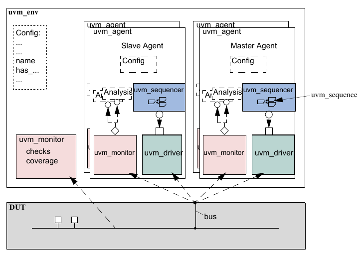

    Typical UVM Environment Architecture

3.9.1 The Environment Class
---------------------------

The environment class is the top container of reusable components. It
instantiates and configures all of its subcomponents. Most verification
reuse occurs at the environment level where the user instantiates an
environment class and configures it and its agents for specific
verification tasks. For example, a user might need to change the number
of masters and slaves in a new environment as shown below::

    class ahb_env(UVMEnv):

        int num_masters;
        ahb_master_agent masters[];
        `uvm_component_utils_begin(ahb_env)
        `uvm_field_int(num_masters, UVM_ALL_ON)
        `uvm_component_utils_end

        virtual function void build_phase(phase);
            string inst_name;
            super.build_phase(phase);
            if(num_masters ==0))
                `uvm_fatal("NONUM",{"'num_masters' must be set";
            masters = new[num_masters];

            for(int i = 0; i < num_masters; i++) begin
                $sformat(inst_name, "masters[%0d]", i);
                masters[i] = ahb_master_agent.type_id.create(inst_name,this);
            end
            // Build slaves and other components.
            endfunction

        function new(string name, uvm_component parent);
            super.new(name, parent);
        endfunction : new

    endclass

NOTE—Similarly to the agent, create is used to allocate the
environment sub-components. This allows introducing derivations of
the sub-components later.

3.9.2 Invoking build_phase
--------------------------

Earlier versions of UVM supported a manual invocation of several flow
tasks, such as build, connect, run and more (essentially the phase
tasks without the \_phase suffix). The usage of these tasks is now
deprecated and the manual invocation of these tasks is considered an
error. All phase tasks are now automatically invoked by the UVM Class
Library. Any connections between child components should be made in
the connect() function of the parent component.

**3.10 Enabling Scenario Creation**

The environment user will need to create many test scenarios to
verify a given DUT. Since the verification component developer is
usually more familiar with the DUT’s protocol, the developer should
facilitate the test writing (done by the verification component’s
user) by doing the following:

— Place knobs in the data item class to simplify declarative test
control.

— Create a library of interesting reusable sequences.

The environment user controls the environment-generated patterns
configuring its sequencers. The user can:

— Define new sequences that generate new transactions.

— Define new sequences that invoke existing sequences.

— Override default knobs on data items to modify driver and overall
environment behavior.

— “Enable” any new behavior/sequences (see Section 3.10.3).

In this section we describe how to create a library of reusable
sequences and review their use. For more information on how to
control environments, see Section 4.6.

**3.10.1 Declaring User-Defined Sequences**

Sequences are made up of several data items, which together form an
interesting scenario or pattern of data. Verification components can
include a library of basic sequences (instead of single-data items),
which test writers can invoke. This approach enhances reuse of common
stimulus patterns and reduces the length of tests. In addition, a
sequence can call upon other sequences, thereby creating more complex
scenarios.

NOTE—The UVM Class Library provides the UVMSequence base class. You
should derive all sequence classes directly or indirectly from this
class.

To create a user-defined sequence:

a) Derive a sequence from the UVMSequence base class and specify the
request and response item type parameters. In the example below, only
the request type is specified, simple_item. This will result in the
response type also being of type simple_item. b) Use the
\`uvm_object_utils macro to register the sequence type with the factory.
c) If the sequence requires access to the derived type-specific
functionality of its associated sequencer, add code or use the
’uvm_declare_p_sequencer macro to declare and set the desired sequencer
pointer. d) Implement the sequence’s body task with the specific
scenario you want the sequence to execute. In

the body task, you can execute data items and other sequences (see
Section 3.10.2).

The class simple_seq_do in the following example defines a simple
sequence. It is derived from UVMSequence and uses the
\`uvm_object_utils macro. The example then defines a simple_sequencer
class on which the simple_seq_do sequence can run::

    class simple_seq_do extends UVMSequence #(simple_item);

        rand int count;
        constraint c1 { count >0; count <50; }
        // Constructor
        function new(string name="simple_seq_do");
            super.new(name);
        endfunction
        //Register with the factory
        `uvm_object_utils(simple_seq_do)
        // The body() task is the actual logic of the sequence.
        virtual task body();
        repeat(count) // Example of using convenience macro to execute the item
            \`uvm_do(req)
        endtask : body
    endclass : simple_seq_do

    class simple_sequencer extends uvm_sequencer #(simple_item) ;

        // same parameter as simple_seq_do
        `uvm_component_utils(simple_sequencer)
        function new (string name=“simple_sequencer”, uvm_component parent);
            super.new(name,parent) ;
        endfunction
    endclass

**3.10.2 Sending Subsequences and Sequence Items**

Sequences allow you to define:

— Streams of data items sent to a DUT. — Streams of actions performed on
a DUT interface.

You can also use sequences to generate static lists of data items
with no connection to a DUT interface.

**3.10.2.1 Basic Flow for Sequences and Sequence Items**

To send a sequence item, the body() of a sequence needs to create()
the item (use the factory), call start_item() on the item, optionally
randomize the item, and call finish_item() on the item. To send a
subsequence, the body() of the parent sequence needs to create the
subsequence, optionally randomize it, and call start() for the
subsequence. If the subsequence item has an associated response, the
parent sequence can call get_response(). See Section 6.7.

For some advanced use cases, there may be a use for some callbacks
through the flow.

Figure 15 and Figure 16 show a complete flow for sequence items and
sequences that has been implemented in the uvm_do macros. The entire
flow includes the allocation of an object based on factory settings
for the registered type, which is referred to as “creation” in this
section. After creation, comes the initialization of class
properties. The balance of the object processing depends on whether
the object is a sequence item or a sequence: the pre_do(), mid_do(),
and post_do() callbacks of the sequence and randomization of the
objects are called at different points of processing for each object
type as shown in the figures. Note that the pre_body() and
post_body() methods are not called for subsequences.

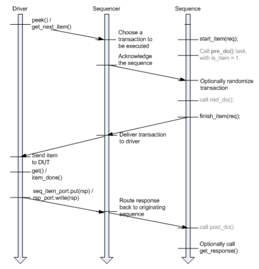

    Sequence Item Flow in Pull Mode

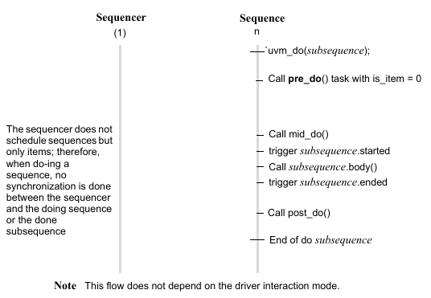

    Subsequence Flow

**3.10.2.2 Sequence and Sequence Item Macros**

This section describes the sequence and sequence functins, `uvm_do`
and `uvm_do_with`. The uvm_do function and variations provide a convenient
set of calls to create, randomize, and send transaction items in a
sequence. The uvm_do function delays randomization of the item until the
driver has signaled that it is ready to receive it and the pre_do method
has been executed. Other function variations allow constraints to be
applied to the randomization (`uvm_do_with`) or bypass the randomization
altogether.

**3.10.2.2.1 uvm_do**

This function takes as an argument a variable of type `UVMSequence` or
UVMSequenceItem. An object is created using the factory settings and
assigned to the specified variable. Based on the processing in Figure
15, when the driver requests an item from the sequencer, the item is
randomized and provided to the driver.

The simple_seq_do sequence declaration in the example in Section 3.10.1
is repeated here. The body of the sequence invokes an item of type
simple_item, using the `uvm_do` function::

    class simple_seq_do extends UVMSequence #(simple_item);

        ...
        // Constructor and UVM automation macros
        // See Section 4.7.2

        virtual task body();
            uvm_do(req)
        endtask : body
    endclass : simple_seq_do

Similarly, a sequence variable can be provided and will be processed as
shown in Figure 16. The following example declares another sequence
(simple_seq_sub_seqs), which uses \`uvm_do to execute a sequence of type
simple_seq_do, which was defined earlier::

    class simple_seq_sub_seqs extends UVMSequence #(simple_item);

        ...
        // Constructor and UVM automation macros
        // See Section 4.7.2
        simple_seq_do seq_do;
        virtual task body();
            uvm_do(seq_do)
        endtask : body
    endclass : simple_seq_sub_seqs

**3.10.2.2.2 uvm_do_with**

This function is similar to \`uvm_do (Section 3.10.2.2.1). The first
argument is a variable of a type derived from UVMSequenceItem,
which includes items and sequences. The second argument can be any
valid inline constraints that would be legal if used in
arg1.randomize() with inline constraints. This enables adding
different inline constraints, while still using the same item or
sequence variable.

*Example*

This sequence produces two data items with specific constraints on
the values of addr and data::

    class simple_seq_do_with(UVMSequence):

        ...
        // Constructor and UVM automation macros
        // See Section 4.7.2
        virtual task body();

            `uvm_do_with(req, { req.addr == 16'h0120; req.data == 16'h0444; } )
            `uvm_do_with(req, { req.addr == 16'h0124; req.data == 16'h0666; } )
        endtask : body
    endclass : simple_seq_do_with

If constraints are used simply to set parameters to specific values,
as in the previous example, the macro can be replaced with a
user-defined task::

    class simple_seq_do_with extends UVMSequence #(simple_item);

        task do_rw(int addr, int data);
            item= simple_item.type_id.create("item",,get_full_name());
            item.addr.rand_mode(0);
            item.data.rand_mode(0);
            item.addr = addr;
            item.data = data;
            start_item(item);
            randomize(item);
            finish_item(item);
        endtask

        virtual task body();
            repeat (num_trans)
                do_rw($urandom(),$urandom());
        endtask
        ...
    endclass: simple_seq_do_with

**3.10.3 Starting a Sequence on a Sequencer**

Sequencers do not execute any sequences by default. The start()
method needs to be called for one or more sequences to source any
transactions. That start() call can be provided directly in user
code. Alternatively, the user can specify a sequence to be started
automatically upon a certain phase via the UVMConfigDb.

**3.10.3.1 Manual Starting**

The user can instantiate and randomize a sequence instance and call
start() for that instance at any point.

**3.10.3.2 Using the Automated Phase-Based Starting**

As each run-time phase starts, the sequencer will check for the
existence of a resource corresponding to that phase to determine if
there is a sequence to start automatically. Such a resource may be
defined in user code, typically the test. For example, this resource
setting causes the specified sequencer instance to be triggered by
starting main_phase and creating an instance of the
loop_read_modify_write_seq sequence, then randomize it and start
executing it::

    UVMConfigDb.set(self,
        ".ubus_example_tb0.ubus0.masters[0].sequencer.main_phase",
        "default_sequence", loop_read_modify_write_seq.type_id.get()
    )

It is also possible to start a specific instance of a sequence::

    lrmw_seq = loop_read_modify_write_seq.type_id.create(
        “lrmw”,, self.get_full_name()) # set parameters in lrmw_seq, if desired
    UVMConfigDb.set(this, ".ubus_example_tb0.ubus0.masters[0].sequencer.main_phase",
        "default_sequence", lrmw_seq)

By creating a specific instance of the sequence, the instance may be
randomized and/or specific parameters set explicitly or constrained
as needed. Upon entering the specified phase, the sequence instance
will be started. The sequencer will not randomize the sequence
instance.

**3.10.4 Overriding Sequence Items and Sequences**

In a user-defined UVMTest, e.g., base_test_ubus_demo (discussed in
Section 4.5.1), you can configure the simulation environment to use a
modified version of an existing sequence or a sequence item by using
the common factory to create instances of sequence and sequence-item
classes. See Section 6.2 for more information.

To override any reference to a specific sequence or sequence-item
type:

a) Declare a user-defined sequence or sequence item class which derives
from an appropriate base class. The following example shows the
declaration of a basic sequence item of type sim- ple_item and a derived
item of type word_aligned_item. b) Invoke the appropriate uvm_factory
override method, depending on whether you are doing a type-wide or
instance-specific override. For example, assume the simple_seq_do
sequence is executed by a sequencer of type simple_sequencer (both
defined in Section 3.10.1). You can choose to replace all processing of
simple_item types with word_aligned_item types. This can be selected for
all requests for simple_item types from the factory or for specific
instances of simple_item. From within an UVM component, the user can
execute any of the following:

// Affect all factory requests for type simple_item.

set_type_override_by_type(simple_item::get_type(),

word_aligned_item::get_type()); // Affect requests for type
simple_item only on a given sequencer.
set_inst_override_by_type("env0.agent0.sequencer.*",

simple_item::get_type(), world_aligned_item::get_type()); //
Alternatively, affect requests for type simple_item for all //
sequencers of a specific env.
set_inst_override_by_type("env0.*.sequencer.*",

simple_item::get_type(), word_aligned_item::get_type());

Allocate the item using the factory (i.e., with create(), see Section
3.10.2); any existing override requests will take effect and a
word_aligned_item will be created instead of a simple_item.

**3.11 Managing End of Test**

UVM provides an objection mechanism to allow hierarchical status
communication among components. There is a built-in objection for
each phase, which provides a way for components and objects to
synchronize their testing activity and indicate when it is safe to
end the phase and, ultimately, the test.

In general, the process is for a component or sequence to raise a
phase objection at the beginning of an activity that must be
completed before the phase stops and to drop the objection at the end
of that activity. Once all of the raised objections are dropped, the
phase terminates.

In simulation, agents may have a meaningful agenda to be achieved
before the test goals can be declared as done. For example, a master
agent may need to complete all its read and write operations before
the run phase should be allowed to stop. A reactive slave agent may
not object to the end-of-test as it is merely serving requests as
they appear without a well-defined agenda.

On the other hand, for the sequences, there are three possible ways
the phase objection can be handled.

a) Non-Phase Aware Sequences

1) The caller will handle phase objection raise/drop around sequence
invocation. 2) The sequence itself is not phase aware.

class test extends ovm_test;

task run_phase(uvm_phase phase);

phase.raise_objection(this); seq.start(seqr);
phase.drop_objection(this); endtask endclass b) Phase Aware Sequences
(Explicit Objection)

1) The caller will pass the starting phase reference before starting the
sequence. 2) The sequence will explicitly call raise/drop to control the
objection. 3) Where exactly the raise/drop is called is up to the user
design. It might be called in pre/ post_body (extra care is needed in
this case as pre/post_body are not always called), or pre/post_start, or
even the body itself. It might also be raised and dropped multiple times
within the sequence execution to guard a specific critical logic class
test extends ovm_test;

task run_phase (uvm_phase phase); seq.set_starting_phase(phase);
seq.start(seqr); endtask endclass

class seq extends UVMSequence #(data_item);

task body();

uvm_phase p = get_starting_phase(); if(p) p.raise_objection(this);

//some critical logic If(p) p.drop_objection(this); endtask endclass c)
Phase Aware Sequences (Implicit Objection)

1) The caller will pass the starting phase reference before starting the
sequence. 2) Within the sequence (mostly inside seq::new), the user will
call set_automat-

ic_phase_objection(1); 3) uvm_sequence_base will handle automatic phase
raise/drop before/after pre/

post_start.

class test extends ovm_test;

task run_phase (uvm_phase phase); seq.set_starting_phase(phase);
seq.start(seqr); endtask endclass

class seq extends UVMSequence #(data_item);

function new(string name = "seq");

super.new(name); set_automatic_phase_objection(1); endfunction task
body();

// Sequence logic with no objection // as it is already handled in
the base class endtask endclass

Note that if you are using UVM task-based phases’ default_sequence
mechanism, the “caller” will be the UVM sequencer, in which case you
can’t really do Option a without some workarounds. So you will
default to Option b or Option c.

When all objections are dropped, the currently running phase is
ended. In practice, there are times in simulation when the “all
objections dropped” condition is temporary. For example, concurrently
running processes may need some additional cycles to convey the last
transaction to a scoreboard.

To accommodate this, you may use the phase_ready_to_end() method to
re-raise the phase objection if a transaction is currently in-flight.

Alternatively, you may set a drain time to inject a delay between the
time a component’s total objection count reaches zero for the current
phase and when the drop is passed to its parent. If any objections
are re- raised during this delay, the drop is canceled and the raise
is not propagated further. While a drain time can be set at each
level of the component hierarchy with the adding effect, typical
usage would be to set a single drain time at the env or test level.
If you require control over drain times beyond a simple time value
(for example, waiting for a few clock cycles or other user-defined
events), you can also use the all_dropped callback to calculate drain
times more precisely. For more information on the all_dropped
callback, refer to uvm_objection in the UVM *1.2 Class Reference*.

Vertical reuse means building larger systems out of existing ones.
What was once a top-level environment becomes a sub-environment of a
large environment. The objection mechanism allows sub-system
environment developers to define a drain time per sub-system.

**3.12 Implementing Checks and Coverage**

Checks and coverage are crucial to a coverage-driven verification
flow. Python/uvm-python allows the usage shown in Table 5 for **assert**,
**@Coverpoint**, and **@Covergroup** constructs.

There are no temporal/concurrent assertions implemented via special
syntax. Users must implement these assertions using normal Python
procedural code and cocotb/uvm-python.

**Table 5—Python/uvm-python Checks and Coverage Construct Usage Overview**

.. csv-table:: uvm-python Checks and Coverage Construct Usage Overview

    **class**, **interface**, **package**, **module**, **initial**, **always**, **generate**, **program**
    **assert**, no, yes, no, yes, yes, yes, yes, yes
    **@Coverpoint**, no, yes, yes, yes, yes, yes, yes, yes
    **@Covergroup**, yes, yes, yes, yes, no, no, yes, yes

In a verification component, checks and coverage are defined in
multiple locations depending on the category of functionality being
analyzed. In Figure 17, checks and coverage are depicted in the
UVMMonitor and interface. The following sections describe how the
**assert**, **cover**, and **covergroup** constructs are used in the
Ubus verification component example (described in Chapter 7).

**3.12.1 Implementing Checks and Coverage in Classes**

Class checks and coverage should be implemented in the classes
derived from UVMMonitor. The derived class of UVMMonitor is always
present in the agent and, thus, will always contain the necessary
checks and coverage. The bus monitor is created by default in an env
and if the checks and coverage collection is enabled the bus monitor
will perform these functions. The remainder of this section uses the
master monitor as an example of how to implement class checks and
coverage, but they apply to the bus monitor as well.

You can write class checks as procedural code or SystemVerilog
immediate assertions.

*Tip*: Use immediate assertions for simple checks that can be written
in a few lines of code and use functions for complex checks that
require many lines of code. The reason is that, as the check becomes
more complicated, so does the debugging of that check.

NOTE—Concurrent assertions are not allowed in SystemVerilog classes
per the IEEE1800 LRM.

The following is a simple example of an assertion check. This
assertion verifies the size field of the transfer is 1, 2, 4, or 8.
Otherwise, the assertion fails.

function void ubus_master_monitor::check_transfer_size();

check_transfer_size : assert(trans_collected.size == 1 \|\|

trans_collected.size == 2 \|\| trans_collected.size == 4 \|\|
trans_collected.size == 8) else begin

// Call DUT error: Invalid transfer size! end endfunction :
check_transfer_size

The following is a simple example of a function check. This function
verifies the size field value matches the size of the data dynamic
array. While this example is not complex, it illustrates a
procedural-code example of a check.

function void ubus_master_monitor::check_transfer_data_size();

if (trans_collected.size != trans_collected.data.size())

// Call DUT error: Transfer size field / data size mismatch.
endfunction : check_transfer_data_size

The proper time to execute these checks depends on the
implementation. You should determine when to make the call to the
check functions shown above. For the above example, both checks
should be executed after the transfer is collected by the monitor.
Since these checks happen at the same instance in time, a wrapper
function can be created so that only one call has to be made. This
wrapper function follows.

function void ubus_master_monitor::perform_transfer_checks();

check_transfer_size(); check_transfer_data_size(); endfunction :
perform_transfer_checks

The perform_transfer_checks() function is called procedurally after
the item has been collected by the monitor.

Functional coverage is implemented using SystemVerilog covergroups.
The details of the covergroup (that is, what to make coverpoints,
when to sample coverage, and what bins to create) should be planned
and decided before implementation begins.

The following is a simple example of a covergroup.

// Transfer collected beat covergroup.

covergroup cov_trans_beat @cov_transaction_beat;

option.per_instance = 1; beat_addr : coverpoint addr {
option.auto_bin_max = 16; } beat_dir : coverpoint
trans_collected.read_write; beat_data : coverpoint data {

option.auto_bin_max = 8; } beat_wait : coverpoint wait_state {

bins waits[] = { [0:9] }; bins others = { [10:$] }; } beat_addrXdir :
cross beat_addr, beat_dir; beat_addrXdata : cross beat_addr,
beat_data; endgroup : cov_trans_beat

This embedded covergroup is defined inside a class derived from
UVMMonitor and is sampled explicitly. For the above covergroup, you
should assign the local variables that serve as coverpoints in a
function, then sample the covergroup. This is done so that each
transaction data beat of the transfer can be covered. This function
is shown in the following example.

// perform_transfer_coverage

virtual protected function void perform_transfer_coverage();

cov_trans.sample(); // another covergroup for (int unsigned i = 0; i <
trans_collected.size; i++) begin

addr = trans_collected.addr + i; data = trans_collected.data[i];
wait_state = trans_collected.wait_state[i]; cov_trans_beat.sample();
end endfunction : perform_transfer_coverage

This function covers several properties of the transfer and each
element of the dynamic array data. SystemVerilog does not provide the
ability to cover dynamic arrays. You should access each element
individually and cover that value, if necessary. The
perform_transfer_coverage() function would, like
perform_transfer_checks(), be called procedurally after the item has
been collected by the monitor.

**3.12.2 Implementing Checks and Coverage in Interfaces**

Interface checks are implemented as assertions. Assertions are added
to check the signal activity for a protocol. The assertions related
to the physical interface are placed in the env’s interface. For
example, an assertion might check that an address is never X or Y
during a valid transfer. Use assert as well as assume properties to
express these interface checks.

An assert directive is used when the property expresses the behavior
of the device under test. An assume directive is used when the
property expresses the behavior of the environment that generates the
stimulus to the DUT. The mechanism to enable or disable the physical
checks performed using assertions is discussed in Chapter 3.12.3.

**3.12.3 Controlling Checks and Coverage**

You should provide a means to control whether the checks are enforced
and the coverage is collected. You can use an UVM bit field for this
purpose. The field can be controlled using the UVMConfigDb
interface. Refer to UVMConfigDb in the UVM *1.2 Class Reference*
for more information. The following is an example of using the
checks_enable bit to control the checks.

if (checks_enable)

perform_transfer_checks();

If checks_enable is set to 0, the function that performs the checks
is not called, thus disabling the checks. The following example shows
how to turn off the checks for the master0.monitor.

UVMConfigDb.set(this,"masters[0].monitor", "checks_enable",
0);

The same facilities exist for the coverage_enable field in the Ubus
agent monitors and bus monitor.

4. Using Verification Components
================================

This chapter covers the steps needed to build a testbench from a set
of reusable verification components. UVM accelerates the development
process and facilitates reuse. UVM users will have fewer hook-up and
configuration steps and can exploit a library of reusable sequences
to efficiently accomplish their verification goals.

In this chapter, a distinction is made between the *testbench
integrator*, who is responsible for the construction and
configuration of the testbench, and the *test writer* who might have
less knowledge about the underlying construction of the testbench,
but wants to use it for creating tests. The test writer may skip the
configuration sections and move directly into the test-creation
sections.

The steps to create a testbench from verification components are:

a) Review the reusable verification component configuration parameters.
b) Instantiate and configure reusable verification components.
c) Create reusable sequences for interface verification components (optional).
d) Add a virtual sequencer (optional).
e) Add checking and functional coverage extensions.
f) Create tests to achieve coverage goals.

Before reading this chapter make sure you read Chapter 1. It is also
recommended (but not required) that you read Chapter 3 to get a
deeper understanding of verification components.

4.1 Creating a Top-Level Environment
####################################

Instantiating individual verification components directly inside of
each test has several drawbacks:

- The test writer must know how to configure each component.
- Changes to the topology require updating multiple test files, which can turn
    into a big task.
- The tests are not reusable because they rely on a specific environment structure.

The *top-level environment* is a container that defines the reusable
component topology within the UVM tests. The top-level environment
instantiates and configures the reusable verification IP and defines
the default configuration of that IP as required by the application.
Multiple tests can instantiate the top-level environment class and
determine the nature of traffic to generate and send for the selected
configuration. Additionally, the tests can override the default
configuration of the top-level environment to better achieve their
goals.

Figure 17 shows a typical verification environment that includes the
test class containing the top-level environment class. Other
verification components (or environments) are contained inside the
top-level environment.

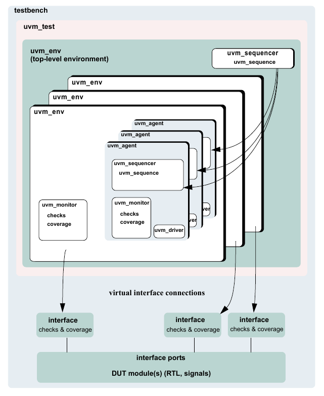

    Verification Environment Class Diagram

4.2 Instantiating Verification Components
#########################################

This section describes how the environment integrator can use
verification components to create a top-level environment that can be
reused for multiple tests. The following example uses the verification
IP in Chapter 7. This interface verification component can be used in
many environments due to its configurability, but in this scenario it
will be used in a simple configuration consisting of one master and one
slave. The top-level environment sets the applicable topology overrides.

The following also apply.

**interface ports**

— Examples for the `UVMConfigDb.set` calls can be found within the
    build_phase() function.

.. code-block:: python

    class ubus_example_env(UVMEnv):

        def __init__(self, name, parent);
            super.new(name, parent);
            self.ubus0 = None  # Scoreboard to check the memory operation of the slave
            self.scoreboard0 = None

        def build_phase(self, phase):
            super().build_phase(phase)  # Configure before creating the
            # subcomponents.
            UVMConfigDb.set(self,"ubus0", "num_masters", 1);
            UVMConfigDb.set(self,".ubus0", "num_slaves", 1);
            self.ubus0 = ubus_env.type_id.create("ubus0", self)
            self.scoreboard0 = ubus_example_scoreboard.type_id.create("scoreboard0", self)

        def connect_phase(self, phase):
            # Connect slave0 monitor to scoreboard.
            self.ubus0.slaves[0].monitor.item_collected_port.connect(
                self.scoreboard0.item_collected_export)

        def end_of_elaboration_phase(self, phase);
            # Set up slave address map for ubus0 (basic default).
            ubus0.set_slave_address_map("slaves[0]", 0, 0xFFFF);

    uvm_component_utils(ubus_example_env)  # UBus reusable environment

Other configuration examples include:

— Set the masters[0] agent to be active::

    UVMConfigDb.set(self,"ubus0.masters[0]", "is_active", UVM_ACTIVE)

— Do not collect coverage for masters[0] agent::

    UVMConfigDb.set(self, "ubus0.masters[0].monitor", "coverage_enable", 0)

— Set all slaves (using a wildcard) to be passive::

    UVMConfigDb.set(self,"ubus0.slaves*", "is_active", UVM_PASSIVE)

Many test classes may instantiate the top-level environment class
above, and configure it as needed. A test writer may use the
top-level environment in its default configuration without having to
understand all the details of how it is created and configured.

The ubus_example_env’s __init__ constructor is not used for creating the
top-level environment subcomponents because there are limitations on
overriding __init__ in object-oriented languages such as SystemVerilog.
Instead, use a virtual build_phase() function, which is a built-in
UVM phase.

The `UVMConfigDb.set` calls specify that the number of masters and
slaves should both be 1. These configuration settings are used by the
ubus0 environment during the ubus0 build_phase(). This defines the
topology of the ubus0 environment, which is a child of the
ubus_example_env.

In a specific test, a user might want to extend the ubus_env and
derive a new class from it. create() is used to instantiate the
subcomponents (instead of directly calling the new() constructor) so
the ubus_env or the scoreboard classes can be replaced with
derivative classes without changing the top-level environment file.
See Section 6.2.3 for more information.

super.build_phase() is called as the first line of the
ubus_example_env’s build() function. If the UVM field automation
mixins are used, this updates the configuration fields of the
ubus_example_tb.

connect_phase() is used to make the connection between the slave
monitor and the scoreboard. The slave monitor contains a TLM analysis
port which is connected to the TLM analysis export on the scoreboard.
connect_phase() is a built-in UVM phase.

After the build_phase() and connect_phase() functions are complete,
the user can make adjustments to run-time properties since the
environment is completely elaborated (that is, created and
connected). For example, the end_of_elaboration_phase() function
makes the environment aware of the address range to which the slave
agent should respond.

4.3 Creating Test Classes
#########################

The UVMTest class defines the test scenario and goals. Part of that
responsibility involved selecting which top level environment will be
used, as well as enabling configuration of the environment and its
children verification components. Although IP developers provide
default values for topological and run-time configuration properties,
the test writer may use the configuration override mechanism provided
by the UVM Class Library when customization is required. The test
writer may additionally provide user-defined sequences in an included
file or package. A test provides data and sequence generation and
inline constraints. Test files are typically associated with a single
configuration. For usage examples of test classes, refer to Section
4.5.

Tests in UVM are classes that are derived from an UVMTest class.
Using classes allows inheritance and reuse of tests. Typically, a
base test class is defined that instantiates and configures the
top-level environment (see Section 4.5.1), and is then extended to
define scenario-specific configurations such as which sequences to
run, coverage parameters, etc. The test instantiates the top-level
environment just like any other verification component (see Section
4.2).

4.4 Verification Component Configuration
########################################

4.4.1 Verification Component Configurable Parameters
----------------------------------------------------

Based on the protocols used in a device, the integrator instantiates
the needed verification components and configures them for a desired
operation mode. Some standard configuration parameters are
recommended to address common verification needs. Other parameters
are protocol- and implementation-specific.

Examples of standard configuration parameters:

— An agent can be configured for active or passive mode. In active mode,
the agent drives traffic to the DUT. In passive mode, the agent
passively checks and collects coverage for a device. A rule of thumb to
follow is to use an active agent per device that needs to be emulated,
and a passive agent for every RTL device that needs to be verified. —
The monitor collects coverage and checks a DUT interface by default. The
user may disable these
activities by the standard checks_enable and coverage_enable parameters.

Examples of user-defined parameters:

— The number of master agents and slave agents in an AHB verification
component. — The operation modes or speeds of a bus.

A verification component should support the standard configuration
parameters and provide user-defined configuration parameters as
needed. Refer to the verification component documentation for
information about its user-defined parameters.

4.4.2 Verification Component Configuration Mechanism
----------------------------------------------------

UVM provides a configuration mechanism (see Figure 18) to allow
integrators to configure an environment without needing to know the
verification component implementation and hook-up scheme. The
following are some examples::

    UVMConfigDb.set(self,"*.masters[0]", "master_id", 0);
    UVMConfigDb.set(self, "*.ubus0.masters[0].sequencer.main_phase", "default_sequence", read_modify_write_seq.type_id.get());
    UVMConfigDb.set(this,"ubus_example_env0.*","vif",vif);
    UVMResourceDb.set(“anyobject”, “shared_config”, data, this);

The `UVMConfigDb` is a type-specific configuration mechanism,
offering a robust facility for specifying hierarchical configuration
values of desired parameters. It is built on top of the more general
purpose uvm_resource_db which provides side-band (non-hierarchical)
data sharing. The first example above shows how to set in integral
value for the master_id field of all master components whose instance
name ends with masters[0]. The second example shows how to tell the
masters[0].sequencer to execute a sequence of type
read_modify_write_seq upon entering the main phase. The third example
shows how to define the virtual interface type that all components
under ubus_example_env0 should use to set their vif variable. The
last example shows how to store some shared resource to a location
where any object anywhere in the verification hierarchy can access
it. When the uvm_resource_db::set() call is made from a class, the
last parameter should be this to allow debugging messages to show
where the setting originated.

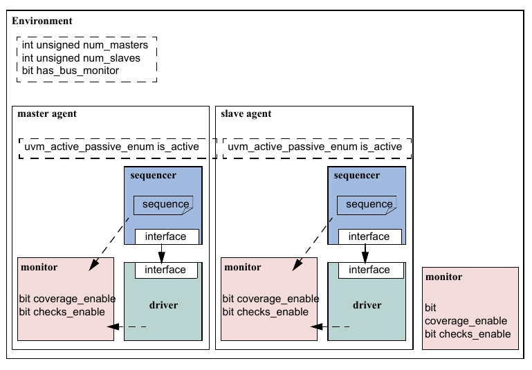

    Standard Configuration Fields and Locations

4.4.3 Choosing between uvm_resource_db and UVMConfigDb
--------------------------------------------------------

The UVMConfigDb and uvm_resource_db share the same underlying
database. Because of this, it is possible to write to the database
using `UVMConfigDb.set` and retrieve from the database using
uvm_resource_db::read_by_name(). The primary reason for using one
method over the other is whether or not a hierarchical context is
important to the setting. For configuration properties that are
related to hierarchical position, e.g., “set all of coverage_enable
bits for all components in a specific agent”, UVMConfigDb is the
correct choice. UVMConfigDb was architected to provide the required
semantic for hierarchical configuration. Likewise, for cases where a
configuration property is being shared without regard to hierarchical
context, uvm_resource_db should be used.

4.4.4 Using a Configuration Class
---------------------------------

Some verification components randomize configuration attributes
inside a configuration class. Dependencies between these attributes
are captured using constraints within the configuration object. In
such cases, users can extend the configuration class to add new
constraints or layer additional constraints on the class using inline
constraints. Once configuration is randomized, the test writer can
use `UVMConfigDb.set` to assign the configuration object to one or
more environments within the top- level environment. Setting
resources allows a configuration to target multiple sub-environments
of the top-level environment regardless of their location, which allows for the
build process of the top-level environment to be impacted without
having to extend it.

4.5 Creating and Selecting a User-Defined Test
##############################################

In UVM, a test is a class that encapsulates test-specific
instructions written by the test writer. This section describes how
to create and select a test. It also describes how to create a test
family base class to verify a topology configuration.

4.5.1 Creating the Base Test
----------------------------

The following example shows a base test that uses the
ubus_example_env defined in Section 4.2. This base test is a starting
point for all derivative tests that will use the ubus_example_env.
The complete test class is shown here:

.. code-block:: python

    class ubus_example_base_test(UVMTest):

        def __init__(self, name="ubus_example_base_test", parent=None):
            super().__init__(name, parent)
            self.test_pass = True
            self.ubus_example_tb0 = None
            self.printer = None

        def build_phase(self, phase):
            super().build_phase(phase)
            # Enable transaction recording for everything
            UVMConfigDb.set(self, "*", "recording_detail", UVM_FULL)
            # Create the tb
            self.ubus_example_tb0 = ubus_example_tb.type_id.create("ubus_example_tb0", self)
            # Create a specific depth printer for printing the created topology
            self.printer = UVMTablePrinter()
            self.printer.knobs.depth = 3
            arr = []
            if UVMConfigDb.get(None, "*", "vif", arr) is True:
                UVMConfigDb.set(self, "*", "vif", arr[0])
            else:
                uvm_fatal("NOVIF", "Could not get vif from config DB")

The build_phase() function of the base test creates the
ubus_example_env. The UVM Class Library will execute the
build_phase() function of the ubus_example_base_test for the user
when cycling through the simulation phases of the components. This
fully creates the top-level environment as each sub-component will
create their own children components in their respective
build_phase() functions.

All of the definitions in the base test are inherited by any test
that derives from ubus_example_base_test. This means any derivative
test will not have to build the top-level environment if the test
calls super.build_phase(). Likewise, the run_phase() task behavior
can be inherited, as well as all other phases. If the current
implementation does not meet the needs of the extended test, the
build_phase() and/or run_phase(), as well as any other run-time phase
methods may be refined as needed because they are all virtual.

4.5.2 Creating Tests from a Test-Family Base Class
--------------------------------------------------

The test writer can derive from the base test defined in Section
4.5.1 to create tests that reuse the same topology. Since the
top-level environment is created by the base test’s build_phase()
function, and the run_phase() task defines the run phase, the
derivative tests can make minor adjustments. (For example, changing
the default sequence executed by the agents in the environment.) The
following is a simple test that inherits from ubus_example_base_test.

.. code-block:: python

    class test_read_modify_write(ubus_example_base_test):

        def __init__(self, name="test_read_modify_write", parent=None):
            super().__init__(name, parent)

        def build_phase(self, phase):
            UVMConfigDb.set(self, "ubus_example_tb0.ubus0.masters[0].sequencer.run_phase",
                    "default_sequence", read_modify_write_seq.type_id.get())
            UVMConfigDb.set(self, "ubus_example_tb0.ubus0.slaves[0].sequencer.run_phase",
                    "default_sequence", slave_memory_seq.type_id.get())
            #    // Create the tb from super class
            ubus_example_base_test.build_phase(self, phase)

        async def run_phase(self, phase):
            phase.raise_objection(self, "test_read_modify_write OBJECTED")
            master_sqr = self.ubus_example_tb0.ubus0.masters[0].sequencer
            slave_sqr = self.ubus_example_tb0.ubus0.slaves[0].sequencer

            uvm_info("TEST_TOP", "Forking master_proc now", UVM_LOW)
            master_seq = read_modify_write_seq("r_mod_w_seq")
            master_proc = cocotb.fork(master_seq.start(master_sqr))

            slave_seq = slave_memory_seq("mem_seq")
            slave_proc = cocotb.fork(slave_seq.start(slave_sqr))
            await sv.fork_join_any([slave_proc, master_proc])
            phase.drop_objection(self, "test_read_modify_write drop objection")

    uvm_component_utils(test_read_modify_write)

This test changes the default sequence executed by the masters[0]
agent and the slaves[0] agent. It is important to understand that
super.build_phase(), through the base class, will create the
top-level environment, ubus_example_env0, and all its subcomponents.
Therefore, any configuration that will affect the building of these
components (such as how many masters to create) must be set before
calling super.build_phase(). For this example, since the sequences
don’t get started until a later phase, they could be called after
super.build_phase().

This test relies on the ubus_example_base_test implementation of the
run_phase() phase.

4.5.3 Test Selection
--------------------

After defining user-defined tests (described in Section 4.5.2), the
uvm_pkg::run_test() task needs to be invoked to select a test to be
simulated. Its prototype is::

    async def run_test(test_name="")

UVM supports declaring which test is to be run via two separate
mechanisms. The testname (i.e. the name which was used to register
the test with the factory) can be passed directly to the run_test()
task or it can be declared on the command-line via +UVM_TESTNAME. If
both mechanisms are used, the command line takes priority. Once a
test name has been selected, the run_test() task calls the factory to
create an instance of the test with an instance name of uvm_test_top.
Finally, run_test() starts the test by cycling through the simulation
phases.

The following example shows how the test with the type name
test_read_modify_write (defined in Section 4.5.2) can be provided to
the run_test() task. A test name is provided to run_test() via a
simulator command-line argument. Using the simulator command-line
argument avoids having to hardcode the test name in the task which
calls run_test(). In an initial block, call the run_test() as
follows:

// DUT, interfaces, and all non-UVM code

initial

uvm_pkg::run_test();

To select a test of type test_read_modify_write (described in Section
4.5.2) using simulator command-line option, use the following
command:

% *simulator-command other-options*
+UVM_TESTNAME=test_read_modify_write

If the test name provided to run_test() does not exist, the
simulation will exit immediately via a call to $fatal. If this
occurs, it is likely the name was typed incorrectly or the
\`uvm_component_utils macro was not used.

By using this method and only changing the +UVM_TESTNAME argument,
multiple tests can be run without having to recompile or re-elaborate
the testbench or underlying design.

4.6 Creating Meaningful Tests
#############################

The previous sections show how test classes are put together. At this
point, random traffic is created and sent to the DUT. The user can
change the randomization seed to achieve new test patterns. To
achieve verification goals in a systematic way, the user will need to
control test generation to cover specific areas.

The user can control the test creation using these methods:

— Add constraints to control individual data items. This method provides
basic functionality (see

Section 4.6.1). — Use UVM sequences to control the order of multiple
data items. This method provides more flexibil-

ity and control (see Section 4.7.2).

4.6.1 Constraining Data Items
-----------------------------

By default, sequencers repeatedly generate random data items. At this
level, the test writer can control the number of generated data items
and add constraints to data items to control their generated values.

To constrain data items:

a) Identify the data item classes and their generated fields in the
verification component. b) Create a derivation of the data item class
that adds or overrides default constraints. c) In a test, adjust the
environment (or a subset of it) to use the newly-defined data items. d)
Run the simulation using a command-line option to specify the test name.

*Data Item Example*

typedef enum bit {BAD_PARITY, GOOD_PARITY} parity_e; class uart_frame
extends UVMSequenceItem; rand int unsigned transmit_delay; rand bit
start_bit; rand bit [7:0] payload; rand bit [1:0] stop_bits; rand bit
[3:0] error_bits; bit parity; // Control fields rand parity_e
parity_type; function new(input string name);

super.new(name); endfunction // Optional field declarations and
automation flags

\`uvm_object_utils_begin(uart_frame)

\`uvm_field_int(start_bit, UVM_ALL_ON) \`uvm_field_int(payload,
UVM_ALL_ON)

\`uvm_field_int(parity, UVM_ALL_ON) \`uvm_field_enum(parity_e,
parity_type, UVM_ALL_ON + UVM_NOCOMPARE) \`uvm_field_int(xmit_delay,
UVM_ALL_ON + UVM_DEC + UVM_NOCOMPARE) \`uvm_object_utils_end //
Specification section 1.2: the error bits value should be

// different than zero. constraint error_bits_c {error_bits != 4'h0;}
// Default distribution constraints

constraint default_parity_type {parity_type dist {

GOOD_PARITY:=90, BAD_PARITY:=10};} // Utility functions

extern function bit calc_parity ( ); ... endfunction endclass:
uart_frame

The uart_frame is created by the uart environment developer.

4.6.2 Data Item Definitions
---------------------------

A few fields in the derived class come from the device specification.
For example, a frame should have a payload that is sent to the DUT.
Other fields are there to assist the test writer in controlling the
generation. For example, the field parity_type is not being sent to
the DUT, but it allows the test writer to easily specify and control
the parity distribution. Such control fields are called “knobs”. The
verification component documentation should list the data item’s
knobs, their roles, and legal range.

Data items have specification constraints. These constraints can come
from the DUT specification to create legal data items. For example, a
legal frame must have error_bits_c not equal to 0. A different type
of constraint in the data items constrains the traffic generation.
For example, in the constraint block default_parity_type (in the
example in Section 4.6.1), the parity bit is constrained to be
90-percent legal (good parity) and 10-percent illegal (bad parity).

4.6.3 Creating a Test-Specific Frame
------------------------------------

In tests, the user may wish to change the way data items are
generated. For example, the test writer may wish to have short
delays. This can be achieved by deriving a new data item class and
adding constraints or other class members as needed::

    // A derived data item example
    // Test code
    class short_delay_frame extends uart_frame;

        // This constraint further limits the delay values.
        constraint test1_txmit_delay {transmit_delay < 10;}
        uvm_object_utils(short_delay_frame)

        function new(input string name="short_delay_frame");
            super.new(name);
        endfunction

    endclass: short_delay_frame

Deriving the new class is not enough to get the desired effect. The
environment needs to be configured to use the new class
(short_delay_frame) rather than the verification component frame. The
UVM Class Library factory mechanism can be used to introduce the
derived class to the environment::

    class short_delay_test(UVMTest):

        def __init__(self, name="short_delay_test", parent=None):
            super().__init__(name, parent)
            self.uart_tb0 = None

        def build_phase(self, phase):
            super.build_phase(phase)  # Use short_delay_frame throughout the environment.
            factory.set_type_override_by_type(uart_frame.get_type(),
                short_delay_frame.get_type())
            self.uart_tb0 = uart_tb.type_id.create("uart_tb0", self)

        async def run_phase(self, phase):
            uvm_top.print_topology()

    uvm_component_utils(short_delay_test)

Calling the factory function set_type_override_by_type() (in bold
above) instructs the environment to use short-delay frames.

At times, a user may want to send special traffic to one interface
but keep sending the regular traffic to other interfaces. This can be
achieved by using set_inst_override_by_type() inside an UVM
component::

    set_inst_override_by_type("uart_env0.master.sequencer.*",
        uart_frame::get_type(), short_delay_frame::get_type());

Wildcards can also be used to override the instantiation of a few
components, e.g. ::

    set_inst_override_by_type("uart_env*.master.sequencer.*",
        uart_frame::get_type(), short_delay_frame::get_type())

4.7 Virtual Sequences
#####################

Section 4.6 describes how to efficiently control a single-interface
generation pattern. However, in a system- level environment, multiple
components are generating stimuli in parallel. The user might want to
coordinate timing and data between the multiple channels. Also, a
user may want to define a reusable system-level scenario. Virtual
sequences are associated with a virtual sequencer and are used to
coordinate stimulus generation in a testbench hierarchy. In general,
a virtual sequencer contains references to its subsequencers, that
is, driver sequencers or other virtual sequencers in which it will
invoke sequences. Virtual sequences can invoke other virtual
sequences associated with its sequencer, as well as sequences in each
of the subsequencers. However, virtual sequencers do not have their
own data item and therefore do not execute data items on themselves.
Virtual sequences can execute items on other sequencers that can
execute items.

Virtual sequences enable centralized control over the activity of
multiple verification components which are connected to the various
interfaces of the DUT. By creating virtual sequences, existing
sequence libraries of the underlying interface components and
block-level environments can be used to create coordinated
system-level scenarios.

In Figure 19, the virtual sequencer invokes configuration sequences
on the ethernet and cpu verification components. The configuration
sequences are developed during block-level testing.

.. figure:: fig/19_highly_reusable_verification_component_agent.png
    :align: center
    :alt: alternate text
    :figclass: align-center

    Virtual Sequence

There are three ways in which the virtual sequencer can interact with
its subsequencers:

a) “Business as usual”—Virtual subsequencers and subsequencers send
    transactions simultaneously.
b) Disable subsequencers—Virtual sequencer is the only one driving.
c) Using grab() and ungrab()—Virtual sequencer takes control of the
    underlying driver(s) for a limited time.

When using virtual sequences, most users disable the subsequencers and
invoke sequences only from the virtual sequence. For more information,
see Section 4.7.3.

To invoke sequences, do one of the following: Use the appropriate
uvm_do function. Use the sequence start() method.

4.7.1 Creating a Virtual Sequencer
----------------------------------

For high-level control of multiple sequencers from a single sequencer,
use a sequencer that is not attached to a driver and does not process
items itself. A sequencer acting in this role is referred to as a
virtual sequencer.

To create a virtual sequencer that controls several subsequencers:

a) Derive a virtual sequencer class from the uvm_sequencer class.
b) Add references to the sequencers where the virtual sequences will
    coordinate the activity. These references will be assigned by a
    higher-level component (typically the top-level environment).

The following example declares a virtual sequencer with two
subsequencers. Two interfaces called eth and cpu are created in the
build function, which will be hooked up to the actual sub-sequencers::

    class simple_virtual_sequencer extends uvm_sequencer;

        eth_sequencer eth_seqr;
        cpu_sequencer cpu_seqr; // Constructor

        function new(input string name="simple_virtual_sequencer",
                input uvm_component parent=null);
            super.new(name, parent);
        endfunction

        // UVM automation macros for sequencers
        `uvm_component_utils(simple_virtual_sequencer)

    endclass: simple_virtual_sequencer

Subsequencers can be driver sequencers or other virtual sequencers.
The connection of the actual subsequencer instances via reference is
done later, as shown in Section 4.7.4.

4.7.2 Creating a Virtual Sequence
---------------------------------

Creating a virtual sequence is similar to creating a driver sequence,
with the following differences:

— A virtual sequence use \`uvm_do_on or \`uvm_do_on_with to execute
sequences on any of the

subsequencers connected to the current virtual sequencer. — A virtual
sequence uses \`uvm_do or \`uvm_do_with to execute other virtual
sequences of this sequencer. A virtual sequence cannot use \`uvm_do or
\`uvm_do_with to execute items. Virtual sequencers do not have items
associated with them, only sequences.

To create a virtual sequence:

a) Declare a sequence class by deriving it from UVMSequence, just like
    a driver sequence.
b) Define a body() method that implements the desired logic of the sequence.
c) Use the \`uvm_do_on (or \`uvm_do_on_with) macro to invoke sequences in the
    underlying subsequencers.
d) Use the \`uvm_do (or \`uvm_do_with) macro to invoke other virtual
    sequences in the current virtual sequencer.

The following example shows a simple virtual sequence controlling two
subsequencers: a cpu sequencer and an ethernet sequencer. Assume the
cpu sequencer has a cpu_config_seq sequence in its library and the
ethernet sequencer provides an eth_large_payload_seq sequence in its
library. The following sequence example invokes these two sequencers,
one after the other.

class simple_virt_seq extends UVMSequence;

... // Constructor and UVM automation macros // A sequence from the cpu
sequencer library cpu_config_seq conf_seq; // A sequence from the
ethernet subsequencer library eth_large_payload_seq frame_seq; // A
virtual sequence from this sequencer's library random_traffic_virt_seq
rand_virt_seq;

virtual task body();

// Invoke a sequence in the cpu subsequencer. \`uvm_do_on(conf_seq,
p_sequencer.cpu_seqr) // Invoke a sequence in the ethernet
subsequencer. \`uvm_do_on(frame_seq, p_sequencer.eth_seqr) // Invoke
another virtual sequence in this sequencer. \`uvm_do(rand_virt_seq)
endtask : body endclass : simple_virt_seq

4.7.3 Controlling Other Sequencers
----------------------------------

When using a virtual sequencer, the behavioral relationship between
the subsequencers and the virtual sequence need to be considered.
There are three typical possibilities:

a) Business as usual—The virtual sequencer and the subsequencers
generate traffic at the same time, using the built-in capability of the
original subsequencers. The data items resulting from the subse-
quencers’ default behavior—along with those injected by sequences
invoked by the virtual sequencer—will be intermixed and executed in an
arbitrary order by the driver. This is the default behavior, so there is
no need to do anything to achieve this.

b) Disable the subsequencers—Using the UVMConfigDb::set routines,
the default_sequence property of the subsequencers is set to null,
disabling their default behavior. The following code snippet
disables the default
sequences on the subsequencers in the example in Section 4.7.4::

    // Configuration: Disable subsequencer sequences.
    UVMConfigDb.set(this, "*.cpu_seqr.*_phase",
        "default_sequence", null);;
    UVMConfigDb.set(this, "*.eth_seqr.*_phase",
        "default_sequence", null);

c) Use grab()/lock() and ungrab()/unlock()—In
this case, a virtual sequence can achieve full control over its
subsequencers for a limited time and then let the original sequences
continue working. The grab and lock APIs effectively prevent sequence
items from being executed on the locked sequencer, unless those items
originate from the locking sequence. The grab() method places the lock
request at the head of the sequencer’s arbitration queue, allowing the
caller to prevent items currently waiting for grant from being
processed, whereas the lock() method places the request at the end of
the queue, allowing the items to be processed before the lock is
granted.

NOTE—Sequences which are executing on the sequencer, but not actively
attempting to send a sequence item (or attempting to achieve a lock)
will continue to operate as normal. Therefore, it is important to ensure
a given subsequencer is not a virtual sequencer before attempting to
lock it.

The following example illustrates this using the functions grab() and
ungrab() in the sequence consumer interface::

    virtual task body();
        // Grab the cpu sequencer if not virtual.
        if (p_sequencer.cpu_seqr != null)
            grab(p_sequencer.cpu_seqr); // Execute a sequence.
        `uvm_do_on(conf_seq, p_sequencer.cpu_seqr) // Ungrab.
        if (p_sequencer.cpu_seqr != null) ungrab(p_sequencer.cpu_seqr);
    endtask

NOTE—When grabbing several sequencers, make sure to use some convention
to avoid deadlocks. For example, always grab in a standard order.

4.7.4 Connecting a Virtual Sequencer to Subsequencers
-----------------------------------------------------

To connect a virtual sequencer to its subsequencers:

a) Assign the sequencer references specified in the virtual sequencer to
instances of the sequencers.

This is a simple reference assignment and should be done only after all
components are created::

    v_sequencer.cpu_seqr = cpu_seqr
    v_sequencer.eth_seqr = eth_seqr

b) Perform the assignment in the connect() phase of the verification
environment at the appropriate
location in the verification environment hierarchy.

Alternatively, the sequencer pointer could be set as a resource
during build, as shown with eth_seqr below.

The following more-complete example shows a top-level environment,
which instantiates the ethernet and cpu components and the virtual
sequencer that controls the two. At the top-level environment, the
path to the sequencers inside the various components is known and
that path is used to get a handle to them and connect them to the
virtual sequencer::

    class simple_tb(UVMEnv):

        cpu_env_c cpu0; // Reuse a cpu verification component.
        eth_env_c eth0;
        // Reuse an ethernet verification component.
        simple_virtual_sequencer v_sequencer; ... // Constructor and UVM automation macros virtual

        function void build_phase(uvm_phase phase);
            super.build_phase(phase);
            // Configuration: Set the default sequence for the virtual sequencer.
            UVMConfigDb.set(this, "v_sequencer.run_phase",
                "default_sequence", simple_virt_seq.type_id::get());
            // Build envs with subsequencers.
            cpu0 = cpu_env_c.type_id.create("cpu0", this);
            eth0 = eth_env_c.type_id.create("eth0", this);

            // Build the virtual sequencer. v_sequencer =
            simple_virtual_sequencer.type_id.create("v_sequencer", this);
        endfunction : build_phase

        // Connect virtual sequencer to subsequencers.

        function void connect_phase();
            v_sequencer.cpu_seqr = cpu0.master[0].sequencer;
            UVMConfigDb.set(this,“v_sequencer”, “eth_seqr”,eth0.tx_rx_agent.sequencer);
        endfunction : connect_phase

    endclass: simple_tb

4.8 Checking for DUT Correctness
################################

Getting the device into desired states is a significant part of
verification. The environment should verify valid responses from the
DUT before a feature is declared verified. Two types of auto-checking
mechanisms can be used:

a) Assertions—Derived from the specification or from the implementation
and ensure correct timing

behavior. Assertions typically focus on signal-level activity. b) Data
checkers—Ensure overall device correctness.

As was mentioned in Section 1.1.9, checking and coverage should be
done in the passive domain independently of the active logic.
Reusable assertions are part of reusable components. See Chapter 3
for more information. Designers can also place assertions in the DUT
RTL. Refer to your ABV documentation for more information.

4.9 Scoreboards
###############

A crucial element of a self-checking environment is the scoreboard.
Typically, a scoreboard verifies the proper operation of the design
at a functional level. The responsibility of a scoreboard varies
greatly depending on the implementation. This section will show an
example of a scoreboard that verifies that a given UBus slave
interface operates as a simple memory. While the memory operation is
critical to the UBus demonstration environment, the focus of this
section is on the steps necessary to create and use a scoreboard in
an environment so those steps can be repeated for any scoreboard
application.

*UBus Scoreboard Example*

For the UBus demo environment, a scoreboard is necessary to verify
the slave agent is operating as a simple memory. The data written to
an address should be returned when that address is read. The desired
topology is shown in Figure 20.

In this example, the user has created a top-level environment with
one UBus environment that contains the bus monitor, one active master
agent, and one active slave agent. Every component in the UBus
environment is created using the build_phase() methods defined by the
IP developer.

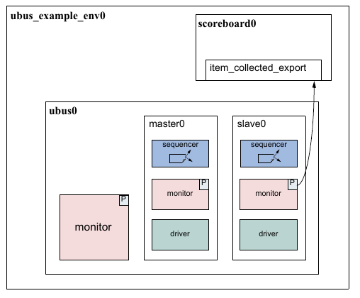

    UBus Demo Environment

4.9.1 Creating the Scoreboard
-----------------------------

Before the scoreboard can be added to the ubus_example_env, the
scoreboard component must be defined.

To define the scoreboard:

a) Add the TLM export necessary to communicate with the environment
monitor(s). b) Implement the necessary functions and tasks required by
the TLM export. c) Define the action taken when the export is called.

4.9.2 Adding Exports to uvm_scoreboard
--------------------------------------

In the example shown in Figure 20, the scoreboard requires only one
port to communicate with the environment. Since the monitors in the
environment have provided an analysis port write() interface via the
TLM uvm_analysis_port(s), the scoreboard will provide the TLM
uvm_analysis_imp.

The ubus_example_scoreboard component derives from the uvm_scoreboard
and declares and instantiates an analysis_imp. For more information
on TLM interfaces, see “TLM Interfaces” in the UVM *1.2 Class
Reference*. The declaration and creation is done inside the
constructor.

1 class ubus_example_scoreboard extends uvm_scoreboard; 2
uvm_analysis_imp #(ubus_transfer, ubus_example_scoreboard) 3
item_collected_export; 4 ... 5 function new (string name,
uvm_component parent); 6 super.new(name, parent);

item_collected_export

**ubus0**

master0

sequencer

P

driver

slave0

P

monitor

sequencer

driver

driver

P

monitor

monitor

monitor

7 endfunction : new 8 function void build_phase(uvm_phase phase); 9
item_collected_export = new("item_collected_export", this); 10
endfunction 11 ...

Line 2 declares the uvm_analysis_export. The first parameter,
ubus_transfer, defines the uvm_object communicated via this TLM
interface. The second parameter defines the type of this
implementation’s parent. This is required so that the parent’s
write() method can be called by the export.

Line 9 creates the implementation instance. The constructor arguments
define the name of this implementation instance and its parent.

4.9.3 Requirements of the TLM Implementation
--------------------------------------------

Since the scoreboard provides an uvm_analysis_imp, the scoreboard
must implement all interfaces required by that export. This means
that the implementation for the write virtual function needs to be
defined. For the ubus_example_scoreboard, write() has been defined
as:

virtual function void write(ubus_transfer trans);

if (!disable_scoreboard)

memory_verify(trans); endfunction : write

The write() implementation defines what happens when data is provided
on this interface. In this case, if disable_scoreboard is 0, the
memory_verify() function is called with the transaction as the
argument.

4.9.4 Defining the Action Taken
-------------------------------

When the write port is called via write(), the implementation of
write() in the parent of the implementation is called. For more
information, see “TLM Interfaces” in the UVM *1.2 Class Reference*.
As seen in Section 4.9.3, the write() function is defined to called
the memory_verify() function if disable_scoreboard is set to 0.

The memory_verify() function makes the appropriate calls and
comparisons needed to verify a memory operation. This function is not
crucial to the communication of the scoreboard with the rest of the
environment and not discussed here. The ubus_example_scoreboard.sv
file shows the implementation.

4.9.5 Adding the Scoreboard to the Environment
----------------------------------------------

Once the scoreboard is defined, the scoreboard can be added to the
UBus example top-level environment. First, declare the
ubus_example_scoreboard inside the ubus_example_env class.

ubus_example_scoreboard scoreboard0;

After the scoreboard is declared, it can be constructed inside the
build() phase:

function ubus_example_env::build_phase(uvm_phase phase);

... scoreboard0 =
ubus_example_scoreboard.type_id.create("scoreboard0",

this);

... endfunction

Here, the scoreboard0 of type ubus_example_scoreboard is created
using the create() function and given the name scoreboard0. It is
then assigned the ubus_example_tb as its parent.

After the scoreboard is created, the ubus_example_env can connect the
port on the UBus environment slaves[0] monitor to the export on the
scoreboard.

function ubus_example_env::connect_phase(uvm_phase phase);

... ubus0.slaves[0].monitor.item_collected_port.connect(

scoreboard0.item_collected_export); ... endfunction

This ubus_example_env’s connect() function code makes the connection,
using the TLM ports connect() interface, between the port in the
monitor of the slaves[0] agent inside the ubus0 environment and the
implementation in the ubus_example_scoreboard called scoreboard0. For
more information on the use of binding of TLM ports, see “TLM
Interfaces” in the UVM *1.2 Class Reference*.

4.9.6 Summary
-------------

The process for adding a scoreboard in this section can be applied to
other scoreboard applications in terms of environment communication.
To summarize:

a) Create the scoreboard component.

1) Add the necessary exports. 2) Implement the required functions and
tasks. 3) Create the functions necessary to perform the
implementation-specific functionality. b) Add the scoreboard to the
environment.

1) Declare and instantiate the scoreboard component. 2) Connect the
scoreboard implementation(s) to the environment ports of interest.

The UBus demo has a complete scoreboard example. See Chapter 7 for
more information.

**4.10 Implementing a Coverage Model**

To ensure thorough verification, observers should be used to
represent the verification goals. SystemVerilog provides a rich set
of functional-coverage features.

**4.10.1 Selecting a Coverage Method**

No single coverage metric ensures completeness. There are two
coverage methods:

a) Explicit coverage—is user-defined coverage. The user specifies the
coverage goals, the needed val- ues, and collection time. As such,
analyzing these goals is straightforward. Completing all your cov- erage
goals should be one of the metrics used to determine the completion of
the DUT’s verification. An example of such a metric is SystemVerilog
functional coverage. The disadvantage of such met- rics is that missing
goals are not taken into account.

b) Implicit coverage—is done with automatic metrics that are driven from
the RTL or other metrics already existing in the code. Typically,
creating an implicit coverage report is straightforward and does not
require a lot of effort. For example, code coverage, expression
coverage, and FSM (finite- state machine) coverage are types of implicit
coverage. The disadvantage of implicit coverage is it is difficult to
map the coverage requirements to the verification goals. It also is
difficult to map cover- age holes into unexecuted high-level features.
In addition, implicit coverage is not complete, since it does not take
into account high-level abstract events and does not create associations
between paral- lel threads (that is, two or more events occurring
simultaneously).

Starting with explicit coverage is recommended. You should build a
coverage model that represents your high-level verification goals.
Later, you can use implicit coverage as a “safety net” to check and
balance the explicit coverage.

NOTE—Reaching 100% functional coverage with very low code-coverage
typically means the functional coverage needs to be refined and
enhanced.

4.10.2 Implementing a Functional Coverage Model
---------------------------------------------------

A verification component should come with a protocol-specific
functional-coverage model. You may want to disable some coverage
aspects that are not important or do not need to be verified. For
example, you might not need to test all types of bus transactions in
your system or you might want to remove that goal from the coverage
logic that specifies all types of transactions as goals. You might
also want to extend the functional-coverage model and create
associations between the verification component coverage and other
attributes in the system or other interface verification components.
For example, you might want to ensure proper behavior when all types
of transactions are sent and the FIFO in the system is full. This
would translate into crossing the transaction type with the
FIFO-status variable. This section describes how to implement this
type of functional coverage model.

**4.10.3 Enabling and Disabling Coverage**

The verification IP developer should provide configuration properties
that allow the integrator or test writer to control aspects of the
coverage model (see Section 3.12.3). The VIP documentation should
cover what properties can be set to affect coverage. The most basic
of controls would determine whether coverage is collected at all. The
UBus monitors demonstrate this level of control. To disable coverage
before the environment is created, use the UVMConfigDb() interface::

  UVMConfigDb#(int)::(this,"ubus0.masters[0].monitor", "coverage_enable", 0)

Once the environment is created, the property can be set directly::

  ubus0.masters[0].monitor.coverage_enable = 0;

5. Using the Register Layer Classes
===================================

5.1 Overview
############

The UVM *register layer classes* are used to create a high-level,
object-oriented model for memory-mapped registers and memories in a
design under verification (DUV). The UVM *register layer* defines
several base classes that, when properly extended, abstract the
read/write operations to registers and memories in a DUV. This
abstraction mechanism allows the migration of verification environments
and tests from block to system levels without any modifications. It also
can move uniquely named fields between physical registers without
requiring modifications in the verification environment or tests.
Finally, UVM provides a register test sequence library containing
predefined testcases you can use to verify the correct operation of
registers and memories in a DUV.

A register model is typically composed of a hierarchy of blocks that
map to the design hierarchy. Blocks can contain registers, register
files and memories, as well as other blocks. The register layer classes
support front-door and back-door access to provide redundant paths to
the register and memory implementation, and verify the correctness of
the decoding and access paths, as well as increased performance after
the physical access paths have been verified. Designs with multiple
physical interfaces, as well as registers, register files, and memories
shared across multiple interfaces, are also supported.

Most of the UVM register layer classes must be specialized via
extensions to provide an abstract view that corresponds to the actual
registers and memories in a design. Due to the large number of registers
in a design and the numerous small details involved in properly
configuring the UVM register layer classes, this specialization is
normally done by a model generator. Model generators work from a
specification of the registers and memories in a design and thus are
able to provide an up-to-date, correct-by-construction register model.
Model generators are outside the scope of the UVM library.

Figure 21 shows how a register model is used in a verification
environment.

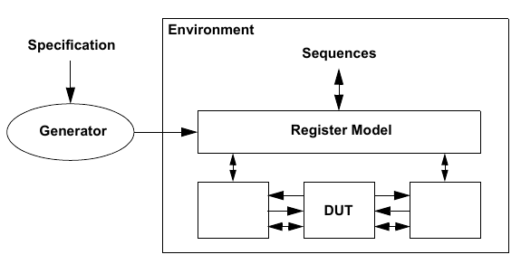

    Register Model in an UVM Environment

5.2 Usage Model
###############

A register model is an instance of a register block, which may contain
any number of registers, register files, memories, and other blocks.
Each register file contains any number of registers and other register
files. Each register contains any number of fields, which mirror the
values of the corresponding elements in hardware.

For each element in a register model–field, register, register file,
memory or block–there is a class instance that abstracts the read and
write operations on that element.

Figure 22 shows the class collaboration diagram of the register model.

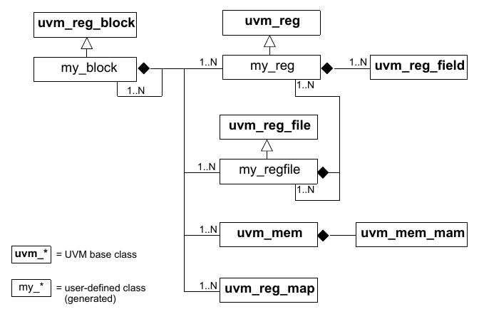

    Register Model Class Collaboration

A *block* generally corresponds to a design component with its own host
processor interface(s), address decoding, and memory-mapped registers
and memories. If a memory is physically implemented externally to the
block, but accessed through the block as part of the block’s address
space, then the memory is considered as part of the block register
model.

All data values are modeled as fields. *Fields* represent a contiguous
set of bits. Fields are wholly contained in a register. A register may
span multiple addresses. The smallest register model that can be used is
a block. A block may contain one register and no memories, or thousands
of registers and gigabytes of memory. Repeated structures may be modeled
as register arrays, register file arrays, or block arrays.

Figure 23 shows the structure of a sample design block containing two
registers, which have two and three fields respectively, an internal
memory, and an external memory. Figure 24 shows the structure of the
corresponding register model.

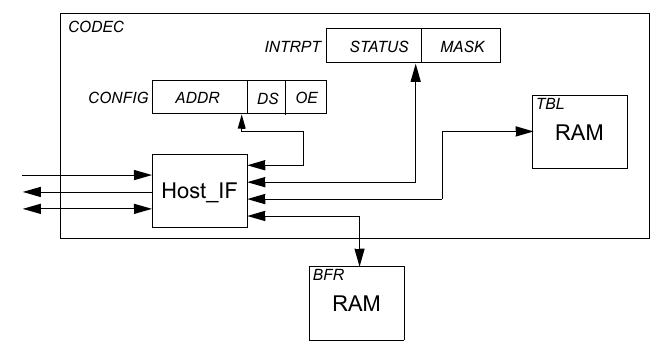

    Design Structure of Registers, Fields, and Memories

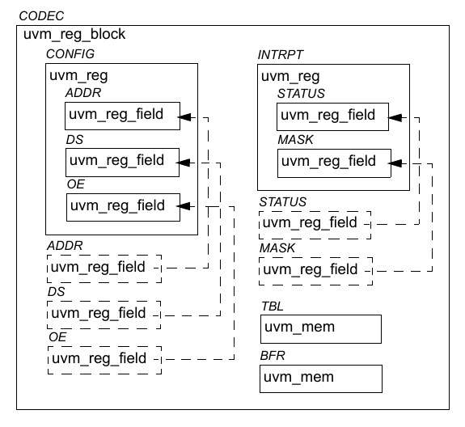

    Register Model Structure

When using a register model, fields, registers, and memory locations are
accessed through read and write methods in their corresponding
abstraction class. It is the responsibility of the register model to
turn these abstracted accesses into read and write cycles at the
appropriate addresses via the appropriate bus driver. A register model
user never needs to track the specific address or location of a field,
register, or memory location, only its name.

For example, the field ADDR in the CONFIG register shown in Figure 23
can be accessed through the register model shown in Figure24 using the
CODEC.CONFIG.ADDR.read() method. Similarly, location 7 in the BFR memory
can be accessed using the CODEC.BFR.write(7,value) method.

The location of fields within a physical register is somewhat arbitrary.
If a field name is unique across all registers’ fields within a block,
it may also be accessed independently of their register location using
an *alias handle* declared in the block. For example, the same ADDR
field, being unique in name to all other fields in the CODEC block, may
also be accessed using CODEC.ADDR.read(). Then, if ADDR is relocated
from CONFIG to another register, any tests or environments that
reference CODEC.ADDR will not be affected. Because a typical design has
hundreds if not thousands of fields, the declaration and assignment of
field aliases in a block are left as an optional feature in a register
model generator.

5.2.1 Sub-register Access
-------------------------

When reading or writing a field using uvm_reg_field::read() or
uvm_reg_field::write(), what actually happens depends on a lot of
factors. If possible, only that field is read or written. Otherwise, the
entire register containing that field is read or written, possibly
causing unintended side effects to the other fields contained in that
same register.

Consider the 128-bit register shown in Figure 25. Assuming a 32-bit data
bus with a little-endian layout, accessing this entire register requires
four cycles at addresses 0x00, 0x04, 0x08, and 0x0C respectively.
However, field D can be accessed using a single cycle at address 0x01.
Since this field occupies an entire physical address, accessing it does
not pose a challenge.

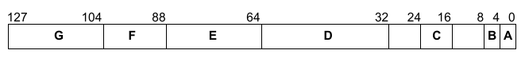

    128-bit Register

Similarly, accessing field C can be done using a single access at
address 0x00. However, this will also access fields B and A. Accessing
field F requires two physical accesses, at addresses 0x02 and 0x03, but
this would also access fields E and G at the same time. Accessing
adjacent fields might not be an issue, but if the access has a
side-effect on any of these fields, such as a clear-on-read field or
writable field, this process will have unintended consequences.

When the underlying bus-protocol supports byte-enabling, field C (at
address 0x00, lane #2) can be accessed without affecting the other
fields at the same address. And since field F is byte-aligned, it can be
accessed without side effects by accessing address 0x02, lane #3 and
address 0x03, lane #0. However, fields B and A remain inaccessible
without mutual side effects as they do not individually occupy an entire
byte lane.

Thus, individual field access is supported for fields that are the sole
occupant of one or more byte lane(s) if the containing register does not
use a user-defined front-door and the underlying bus protocol supports
byte enabling. A field may also be individually-accessible if the other
fields in the same byte lanes are not
affected by read or write operations. Whether a field can be
individually accessible (assuming the underlying protocol supports
byte-enabling) is specified by the register model generator in the
uvm_reg_field::configure() method.

For individual field access to actually occur, two conditions must be
met: the field must be identified as being the sole occupant of its byte
lane by the register model generator via the uvm_reg_field::configure()
method and the bus protocol must report that it supports byte- enables
via the uvm_reg_adapter::supports_byte_enable property.

Finally, individual field access is only supported for front-door
accesses. When using back-door accesses, the entire register–and thus
all the fields it contains–will always be accessed via a
peek-modify-poke operation.

5.2.2 Mirroring
---------------

The register model maintains a mirror of what it thinks the current
value of registers is inside the DUT. The mirrored value is not
guaranteed to be correct because the only information the register model
has is the read and write accesses to those registers. If the DUT
internally modifies the content of any field or register through its
normal operations (e.g., by setting a status bit or incrementing an
accounting counter), the mirrored value becomes outdated.

The register model takes every opportunity to update its mirrored value.
For every read operation, the mirror for the read register is updated.
For every write operation, the new mirror value for the written register
is predicted based on the access modes of the bits in the register
(read/write, read-only, write-1- to-clear, etc.). Resetting a register
model sets the mirror to the reset value specified in the model. A
mirror is not a scoreboard, however; while a mirror can accurately
predict the content of registers that are not updated by the design, it
cannot determine if an updated value is correct or not.

You can update the mirror value of a register to the value stored in the
DUT by using the uvm_reg_field::mirror(), uvm_reg::mirror(), or
uvm_reg_block::mirror() methods. Updating the mirror for a field also
updates the mirror for all the other fields in the same register.
Updating the mirror for a block updates the mirror for all fields and
registers it contains. Updating a mirror in a large block may take a lot
of simulation time if physical read cycles are used; whereas, updating
using back-door access usually takes zero-time.

You can write to mirrored values in the register model in zero-time by
using the `UVMRegField.set` or `UVMReg.set` methods. Once a mirror
value has been overwritten, it no longer reflects the value in the
corresponding field or register in the DUT. You can update the DUT to
match the mirror values by using the uvm_reg::update() or
uvm_reg_block::update() methods. If the new mirrored value matches the
old mirrored value, the register is not updated, thus saving unnecessary
bus cycles. Updating a block with its mirror updates all the fields and
registers the block contains with their corresponding mirror values.
Updating a large block may take a lot of simulation time if physical
write cycles are used; whereas, updating using back-door access usually
takes zero-time. It is recommended you use this update-from-mirror
process when configuring the DUT to minimize the number of write
operations performed.

To access a field or register’s current mirror value in zero-time, use
the `UVMRegField.get` or `UVMReg.get` methods. However, if
`UVMRegField.set` or `UVMReg.set` is used to write a desired value
to the DUT, get() only returns the desired value, modified according to
the access mode for that field or register, until the actual write to
the DUT has taken place via update().

5.2.3 Memories are not Mirrored
-------------------------------

Memories can be quite large, so they are usually modeled using a
sparse-array approach. Only the locations that have been written to are
stored and later read back. Any unused memory location is not modeled.
Mirroring a memory would require that the same technique be used.

When verifying the correct operations of a memory, it is necessary to
read and write all addresses. This negates the memory-saving
characteristics of a sparse-array technique, as both the memory model of
the DUT and the memory would mirror, become fully populated, and
duplicate the same large amount of information.

Unlike bits in fields and registers, the behavior of bits in a memory is
very simple: all bits of a memory can either be written to or not. A
memory mirror would then be a ROM or RAM memory model–a model that is
already being used in the DUT to model the memory being mirrored. The
memory mirror can then be replaced by providing back-door access to the
memory model.

Therefore, using the uvm_mem::peek() or uvm_mem::poke() methods provide
the exact same functionality as a memory mirror. Additionally, unlike a
mirror based on observed read and write operations, using back-door
accesses instead of a mirror always returns or sets the actual value of
a memory location in the DUT.

5.3 Access API
##############

Register and fields have a variety of methods to get the current value
of a register or field and modify it. It is important to use the correct
API to obtain the desired result.

5.3.1 read / write
------------------

The normal access API are the read() and write() methods. When using the
front-door (path=BFM), one or more physical transactions is executed on
the DUT to read or write the register. The mirrored value is then
updated to reflect the expected value in the DUT register after the
observed transactions.

When using the back-door (path=BACKDOOR), peek or poke operations are
executed on the DUT to read or write the register via the back-door
mechanism, bypassing the physical interface. The behavior of the
registers is mimicked as much as possible to duplicate the effect of
reading or writing the same value via the front-door. For example, a
read from a clear-on-read field causes 0’s to be poked back into the
field after the peek operation. The mirrored value is then updated to
reflect the actual sampled or deposited value in the register after the
observed transactions.

Desired Value

predict(READ/WRITE)

Mirrored Value

read/write(frontdoor)

Bus Agent

Register in DUT

Register in DUT

5.3.2 peek / poke
-----------------

Using the peek() and poke() methods reads or writes directly to the
register respectively, which bypasses the physical interface. The
mirrored value is then updated to reflect the actual sampled or
deposited value in the register after the observed transactions.

5.3.3 get / set
---------------

Using the get() and set() methods reads or writes directly to the
desired mirrored value respectively, without accessing the DUT. The
desired value can subsequently be uploaded into the DUT using the
update() method.

5.3.4 randomize
---------------

Using the randomize() method copies the randomized value in the
uvm_reg_field::value property into the desired value of the mirror by
the post_randomize() method. The desired value can subsequently be
uploaded into the DUT using the update() method.

Desired Value

Mirrored Value

read/write(backdoor) Mimic

Register in DUT Desired Value

Mirrored Value

peek/poke()

Register in DUT Desired Value

Mirrored Value

get/set()

Register in DUT

Desired Value

Mirrored Value

randomize() Register in DUT **5.3.5 update**

Using the update() method invokes the write() method if the desired
value (previously modified using set() or randomize()) is different from
the mirrored value. The mirrored value is then updated to reflect the
expected value in the register after the executed transactions.

Desired Value

update() If different

Mirrored Value

Register in DUT

5.3.6 mirror
------------

Using the mirror() method invokes the read() method to update the
mirrored value based on the readback value. mirror() can also compare
the readback value with the current mirrored value before updating it.

Desired Value

mirror()

Mirrored Value

Register in DUT

5.3.7 Concurrent Accesses
-------------------------

The register model can be accessed from multiple concurrent execution
threads. However, it internally serializes the access to the same
register to ensure predictability of the implicitly-updated mirrored
value and of the other field values in the same register when a
individual field is accessed.

A semaphore in each register ensures it can be read or written by only
one process at a time. Any other process attempting access will block
and not resume until after the current operation completes and after
other processes that were blocked before it have completed their
operations.

If a thread in the middle of executing a register operation is
explicitly killed, it will be necessary to release the semaphore in the
register it was accessing by calling the uvm_reg::reset() method.

5.4 Coverage Models
###################

The UVM register library classes do not include any coverage models as a
coverage model for a register will depend on the fields it contains and
the layout of those fields, and a coverage model for a block will depend
on the registers and memories it contains and the addresses where they
are located. Since coverage model information is added to the UVM
register library classes by the register model generator, that generator
needs to include a suitable coverage model. Consequently, the UVM
register library classes provide the necessary API for a coverage model
to sample the relevant data into a coverage model.

Due to the significant memory and performance impact of including a
coverage model in a large register model, the coverage model needs to
handle the possibility that specific cover groups will not be
instantiated or to turn off coverage measurement even if the cover
groups are instantiated. Therefore, the UVM register library classes
provide the necessary API to control the instantiation and sampling of
various coverage models.

5.4.1 Predefined Coverage Identifiers
-------------------------------------

The UVM library has several predefined functional coverage model
identifiers, as shown in Table 6. Each symbolic value specifies a
different type of coverage model. The symbolic values use a one-hot
encoding. Therefore, multiple coverage models may be specified by OR’ing
them. Additional symbolic values may be provided for vendor-specific and
user-specific coverage models that fall outside of the pre-defined
coverage model types. To avoid collisions with pre-defined UVM,
vendor-defined, and user-defined coverage model identifiers, bits 0
through 7 are reserved for UVM, bits 8 through 15 are reserved for
vendors, and bits 16 through 23 are reserved for users. Finally, bits 24
and above are reserved for future assignment.

**Table 6–Pre-defined Functional Coverage Type Identifiers**

**Identifier Description**

**UVM_NO_COVERAGE** No coverage models.

**UVM_CVR_REG_BITS** Coverage models for the bits read or written in
registers.

**UVM_CVR_ADDR_MAP** Coverage models for the addresses read or written
in an address map.

**UVM_CVR_FIELD_VALS** Coverage models for the values of fields.

**UVM_CVR_ALL** All coverage models.

5.4.2 Controlling Coverage Model Construction and Sampling
----------------------------------------------------------

By default, coverage models are not included in a register model when it
is instantiated. To be included, they must be enabled via the
uvm_reg::include_coverage() method. It is recommended register-level
coverage models are only included in unit-level environments;
block-level coverage models may be included in block and system-level
environments::

    UVMReg.include_coverage(“\*”, UVM_CVR_REG_BITS + UVM_CVR_FIELD_VALS)

Furthermore, the sampling for a coverage model is implicitly disabled by
default. To turn the sampling for specific coverage models on or off,
use the `UVMRegBlock.set_coverage`, `UVMReg.set_coverage`, and
`UVMMem.set_coverage` methods.

5.5 Constructing a Register Model
#################################

This section describes how to construct a UVM register model to
represent different register and memory access and composition
structures. The target audience for this section is generator writers.
End users of the register model need not be familiar with the model
construction process, only the final structure of the model.

5.5.1 Field Types
-----------------

There is usually no need to construct field types. Fields are simple
instantiations of the uvm_reg_field class. A field type may only be
needed to specify field-level constraints, which could also be specified
in the containing register.

A field type is constructed using a class extended from the
uvm_reg_field class. There must be one class per unique field type. The
name of the field type is created by the register model generator. The
name of the field type class must be unique within the scope of its
declaration. The field type class must include an appropriate invocation
of the `uvm_object_utils()`::

    class my_fld_type(UVMRegField):
        ...
    uvm_object_utils(my_fld_type) # Outside the class

Field types are instantiated in the build() method of the containing
register types.

5.5.1.1 Class Properties and Constraints
----------------------------------------

A separate constraint block should be defined for each aspect being
constrained–e.g., one to keep it valid, one to keep it reasonable–so
they can be turned off individually. The name of a constraint block
shall be indicative of its purpose. Constraints shall constrain the
value class property. Additional state variables may be added to the
field class if they facilitate the constraints::

    class my_fld_type extends uvm_reg_field;
        constraint valid {
            value inside {0, 1, 2, 4, 8, 16, 32};
        };
    endclass

To ensure state variable and constraint block names do not collide with
other symbols in uvm_reg_field base class, it is recommended their names
be in all UPPERCASE.

If the post_randomize() method is overridden, it must call
super.post_randomize().

5.5.1.2 Constructor
-------------------

The constructor must be a valid uvm_object constructor. The constructor
shall call the uvm_reg_field::new() method with appropriate argument
values for the field type::

    class my_fld_type extends uvm_reg_field;
        function new(string name = “my_fld_type”);
            super.new(name);
        endfunction
    endclass

5.5.1.3 Predefined Field Access Policies
----------------------------------------

The access policy of a field is specified using the
uvm_reg_field::configure() method, called from the build() method of the
register that instantiates it.

Table 7 shows the pre-defined access policies for uvm_reg_field\ **.**
Unless otherwise stated, the effect of a read cycle on the current value
is performed after the current value has been sampled for read-back.
Additional field access policies may be defined using the
uvm_reg_field::define_access() method and by modeling their behavior by
extending the uvm_reg_field or uvm_reg_cbs classes.

**Table 7–Pre-defined Field Access Policies**

**Access Policy Description Effect of a Write **

**on Current Field Value**

**Effect of a Read on Current Field Value**

**Read- back Value**

**RO** Read Only No effect. No effect. Current

value

**RW** Read, Write Changed to written value. No effect. Current

value

**RC** Read Clears All No effect. Sets all bits to 0’s. Current

value

**RS** Read Sets All No effect. Sets all bits to 1’s. Current

value

**WRC** Write,

Read Clears All

Changed to written value. Sets all bits to 0’s. Current

value

**WRS** Write, Read Sets All

Changed to written value. Sets all bits to 1’s. Current

value

**WC** Write Clears All Sets all bits to 0’s. No effect. Current

value

**WS** Write Sets All Sets all bits to 1’s. No effect. Current

value

**WSRC** Write Sets All,

Read Clears All

Sets all bits to 1’s. Sets all bits to 0’s. Current

value

**WCRS** Write Clears All,

Read Sets All

Sets all bits to 0’s. Sets all bits to 1’s. Current

value

**W1C** Write 1 to Clear If the bit in the written value is a 1, the
cor- responding bit in the field is set to 0. Other- wise, the field bit
is not affected.

No effect. Current

value

**W1S** Write 1 to Set If the bit in the written value is a 1, the cor-
responding bit in the field is set to 1. Other- wise, the field bit is
not affected.

No effect. Current

value

**W1T** Write 1 to Toggle If the bit in the written value is a 1, the
cor-

responding bit in the field is inverted. Other- wise, the field bit is
not affected.

No effect. Current

value

**W0C** Write 0 to Clear If the bit in the written value is a 0, the
cor- responding bit in the field is set to 0. Other- wise, the field bit
is not affected.

No effect. Current

value

**Table 7–Pre-defined Field Access Policies (Continued)**

**Access Policy Description Effect of a Write **

**on Current Field Value**

5.5.1.4 IP-XACT Field Access Mapping
------------------------------------

Table 8 – Table 12 show the mapping between the IEEE 1685-2009 field
access policies (as specified by the fieldData group, see section
6.10.9.2 of the IEEE 1685-2009 Standard) and the pre-defined access
policies for uvm_reg_field. Several combinations of access,
modifiedWriteValue, and readAction are specified as n/a because they do
not make practical sense. However, they can always be modeled as
user-defined fields if they are used in a design.

**Effect of a Read on Current Field Value**

**Read- back Value**

**W0S** Write 0 to Set If the bit in the written value is a 0, the cor-
responding bit in the field is set to 1. Other- wise, the field bit is
not affected.

No effect. Current

value

**W0T** Write 0 to Toggle If the bit in the written value is a 0, the
cor-

responding bit in the field is inverted. Other- wise, the field bit is
not affected.

No effect. Current

value

**W1SRC** Write 1 to Set,

Read Clears All

If the bit in the written value is a 1, the cor- responding bit in the
field is set to 1. Other- wise, the field bit is not affected.

Sets all bits to 0’s. Current

value

**W1CRS** Write 1 to Clear,

Read Sets All

If the bit in the written value is a 1, the cor- responding bit in the
field is set to 0. Other- wise, the field bit is not affected.

Sets all bits to 1’s. Current

value

**W0SRC** Write 0 to Set,

Read Clears All

If the bit in the written value is a 0, the cor- responding bit in the
field is set to 1. Other- wise, the field bit is not affected.

Sets all bits to 0’s. Current

value

**W0CRS** Write 0 to Clear,

Read Sets All

If the bit in the written value is a 0, the cor- responding bit in the
field is set to 0. Other- wise, the field bit is not affected.

Sets all bits to 1’s. Current

value

**WO** Write Only Changed to written value. No effect. Undefined

**WOC** Write Only

Clears All

Sets all bits to 0’s. No effect. Undefined

**WOS** Write Only Sets All

Sets all bits to 1’s. No effect. Undefined

**W1** Write Once Changed to written value if this is the first

write operation after a hard reset. Otherwise, has no effect.

No effect. Current

value

**WO1** Write Only, Once Changed to written value if this is the first

write operation after a hard reset. Otherwise, has no effect.

No effect. Undefined

**Table 8–IP-XACT Mapping for access==read-write**

   **access == read-write**

**modifiedWriteValue**

**readAction**

**Unspecified clear set modify**

**Unspecified** RW WRC WRS User-defined

**oneToClear** W1C n/a W1CRS User-defined

**oneToSet** W1S W1SRC n/a User-defined

**oneToToggle** W1T n/a n/a User-defined

**zeroToClear** W0C n/a W0CRS User-defined

**zeroToSet** W0S W0SRC n/a User-defined

**zeroToToggle** W0T n/a n/a User-defined

**clear** WC n/a WCRS User-defined

**set** WS WSRC n/a User-defined

**modify** User-defined User-defined User-defined User-defined

**Table 9–IP-XACT Mapping for access==read-only**

**access == read-only**

**modifiedWriteValue**

**readAction**

**Unspecified clear set modify**

**Unspecified** RO RC RS User-defined

All others n/a n/a n/a n/a

**Table 10–IP-XACT Mapping for access==write-only**

**access == write-only**

**modifiedWriteValue**

**readAction**

**Unspecified clear set modify**

**Unspecified** WO n/a n/a n/a

**clear** WOC n/a n/a n/a

**set** WOS n/a n/a n/a

All others n/a n/a n/a n/a

**Table 11–IP-XACT Mapping for access==read-writeOnce**

   **access == read-writeOnce**

**modifiedWriteValue**

5.5.1.5 Reserved Fields
-----------------------

There is no pre-defined field access policy for reserved fields. That is
because —reserved" is a documentation concept, not a behavioral
specification. Reserved fields should be left unmodelled (where they
will be assumed to be RO fields filled with 0’s), modeled using an
access policy that corresponds to their actual hardware behavior or not
be compared using uvm_reg_field::set_compare(0).

If reserved fields are not to be used, they should be identified with
the NO_REG_TESTS attribute and have a user-defined behavior extension
that will issue an error message if they are used.

5.5.1.6 User-defined Field Access Policy
----------------------------------------

The UVM field abstraction class contains several predefined field access
modes. The access modes are used, in combination with observed read and
write operations, to determine the expected value of a field. Although
most fields fall within one of the predefined access policies, it is
possible to design a field that behaves predictably but differently from
the predefined ones.

New access policy identifiers can similarly be defined to document the
user-defined behavior of the field.

class protected_field extends uvm_reg_field;

local static bit m_protected = define_access(“Protected”); ... endclass

The behavior of the user-defined field access policy is implemented by
extending the pre/post read/write virtual methods in the field
abstraction class or in the field callback methods. For example, a
protected field that can only be written if another field is set to a
specific value can be modeled as shown below:

class protected_field extends uvm_reg_field;

local uvm_reg_field protect_mode;

**readAction**

**Unspecified clear set modify**

**Unspecified** W1 n/a n/a n/a

All others n/a n/a n/a n/a

**Table 12–IP-XACT Mapping for access==writeOnce**

**access == writeOnce**

**modifiedWriteValue**

**readAction**

**Unspecified clear set modify**

**Unspecified** WO1 n/a n/a n/a

All others n/a n/a n/a n/a

virtual task pre_write(uvm_reg_item rw);

// Prevent the write if protect mode is ON if (protect_mode.get()) begin

rw.value = value; endtask endclass

You can modify the behavior of any field to the user-specified behavior
by registering a callback extension with that field. First, define the
callback class; then, register an instance of it with an instance of the
field whose behavior you want to modify::

class protected_field_cb extends uvm_reg_cbs;

local uvm_reg_field protect_mode; virtual task pre_write(uvm_reg_item
rw);

// Prevent the write if protect mode is ON if (protect_mode.get()) begin

uvm_reg_field field; if ($cast(field,rw.element)) rw.value =
field.get(); end endtask endclass

protected_field_cb protect_cb = new(“protect_cb”,protect_mode)
uvm_callbacks#(my_field_t, uvm_reg_cbs)::add(my_field, protect_cb);

5.5.1.7 Field Usage vs. Field Behavior
--------------------------------------

The access mode of a field is used to specify the physical behavior of
the field so the mirror can track, as best as it can, the value of the
field. It is not designed to specify whether or not it is suitable or
functionally correct to use the field in a particular fashion from the
application’s perspective.

For example, a configuration field could be designed to be written only
once by the software after the design comes out of reset. If the design
does not support dynamic reprovisioning, it may not be proper to
subsequently modify the value of that configuration field. Whether the
field should be specified as write- once (W1) depends on the hardware
functionality. If the hardware does not prevent the subsequent write
operation, the field should be specified as read-write as that would
accurately reflect the actual behavior of the field.

To include usage assertions to specific fields (e.g., specifying a
configuration field is never written to more than once despite the fact
that doing so is physically possible), implement that check in an
extension of the field abstraction class, but do not prevent the mirror
from reflecting that value in the hardware::

    class config_once_field extends uvm_reg_field;

        local bit m_written = 0;
        virtual task pre_write(uvm_reg_item rw);
            if (m_written)
                ’uvm_error(field.get_full_name(), "..."); m_written = 1;
        endtask: pre_write

        virtual function reset(string kind = “HARD”);
            if (has_reset(kind)) m_written = 0;
            super.reset(kind);
        endfunction
    endclass

5.5.2 Register Types
--------------------

A register type is constructed using a class extended from the uvm_reg
class. There must be one class per unique register type. The name of the
register type is created by the register model generator. The name of
the register type class must be unique within the scope of its
declaration. The register type class must include an appropriate
invocation of the \`uvm_object_utils() macro.

class my_reg_type extends uvm_reg;

\`uvm_object_utils(my_reg_type) endclass

Register types are instantiated in the build() method of the block and
register file types.

5.5.2.1 Class Properties and Constraints
----------------------------------------

The register type must contain a public class property for each field it
contains. The name of the field class property shall be the name of the
field. The field class property shall have the rand attribute. Field
class properties may be arrays.

class my_reg_type extends uvm_reg;

rand uvm_reg_field F1; rand uvm_reg_field F2[3]; endclass

To ensure field names do not collide with other symbols in the uvm_reg
base class, it is recommended their names be in all UPPERCASE.

Constraints, if any, should be defined in separate blocks for each
aspect being constrained. This allows them to be turned off
individually. The name of a constraint block shall be indicative of its
purpose. Constraints shall constrain the value class property of each
field in the register. Additional state variables may be added to the
register type class if they facilitate the constraints. If the
post_randomize() method is overridden, it must call the
super.post_randomize() method.

If a register has only one field, then you would not want to have to
write:

R.randomize() with (value.value == 5);

Instead, instantiate a private dummy field and include a rand class
property named value in the register class. A constraint shall keep the
value class property equal to the field’s value class property.

class my_reg_type extends uvm_reg;

rand uvm_reg_data_t value; local rand uvm_reg_field \_dummy;

constraint \_dummy_is_reg {

\_dummy.value == value; } endclass

Then, randomizing an instance of the register looks like the more
natural:

R.randomize() with (value == 5);

5.5.2.2 Constructor
-------------------

The constructor must be a valid uvm_object constructor. The constructor
shall call the uvm_reg::new() method with appropriate argument values
for the register type.

class my_reg_type extends uvm_reg;

function new(string name = “my_reg_type”);

super.new(.name(name), .n_bits(32), .has_coverage(UVM_NO_COVERAGE));
endfunction endclass

5.5.2.3 Build() Method
----------------------

A virtual build() function, with no arguments, shall be implemented.

The build() method shall instantiate all field class properties using
the class factory. Because the register model is a uvm_object hierarchy,
not a uvm_component hierarchy, no parent reference is specified and the
full hierarchical name of the register type instance is specified as the
context. The build() method shall call the uvm_reg_field::configure()
method for all field class properties with the appropriate argument
values for the field instance and specifying this as the field parent.

class my_reg_type extends uvm_reg;

virtual function build();

this.F1 = uvm_reg_field.type_id.create(.name(“F1”),

.parent(null), .contxt(get_full_name())); this.F1.configure(this, ...);

endfunction endclass

5.5.2.4 Additional Methods
--------------------------

Register model generators are free to add access methods to abstract
common operations, For example, a read-modify-write method could be
added to a register model:

class my_reg extends uvm_reg;

... task RMW(output uvm_status_e status;

input uvm_reg_data_t data; input uvm_reg_data_t mask; ...);
uvm_reg_data_t tmp; read(status, tmp, ...); tmp &= ~mask; tmp \|= data &
mask; write(status, tmp, ...); endtask endclass

Although allowed by UVM, such additional methods are not part of the
standard. To avoid collisions with class members that may be added in
the future, the name of these methods should be in UPPERCASE or be given
a generator-specific prefix.

5.5.2.5 Coverage Model
----------------------

A register-level coverage model is defined and instantiated in the
register type class. It measures the coverage of read and write
operations and field values on each instance of that register type. The
uvm_reg::sample() or uvm_reg::sample_values() methods shall be used to
trigger the sampling of a coverage point based on the data provided as
argument or data gathered from the current state of the register type
instance. The sampling of the coverage model shall only occur if
sampling for the corresponding coverage model has been turned on, as
reported by the uvm_reg::get_coverage() method.

class my_reg extends uvm_reg;

protected uvm_reg_data_t m_current; protected uvm_reg_data_t m_data;
protected bit m_is_read;

covergroup cg1;

... endgroup ... virtual function void sample(uvm_reg_data_t data,

uvm_reg_data_r byte_en, bit is_read, uvm_reg_map map); if
(get_coverage(UVM_CVR_REG_BITS)) begin

m_current = get(); m_data = data; m_is_read = is_read; cg1.sample();
endif endfunction endclass

All the coverage models that may be included in the register type shall
be reported to the uvm_reg base class using the
uvm_reg::build_coverage() method when super.new() is called or the
uvm_reg::add_coverage() method. If no functional coverage models are
included in the generated register type, UVM_NO_COVERAGE shall be
specified. Register-level coverage groups shall only be instantiated in
the constructor if the construction of the corresponding coverage model
is enabled, as reported by the uvm_reg::has_coverage() method.

class my_reg_typ extends uvm_reg;

... covergroup cg1;

... endgroup

covergroup cg_vendor;

... endgroup

function new(string name = “my_reg_typ”);

super.new(name, 32, build_coverage(UVM_CVR_REG_BITS + VENDOR_CVR_REG));
if (has_coverage(UVM_CVR_REG_BITS))

cg1 = new(); if (has_coverage(VENDOR_CVR_REG))

cg_vendor = new(); endfunction

... endclass

The content, structure, and options of the coverage group is defined by
the register model generator and is outside the scope of UVM.

5.5.3 Register File Types
-------------------------

A register file type is constructed using a class extended from the
uvm_reg_file class. There must be one class per unique register file
type. The name of the register file type is created by the register
model generator. The name of the register file type class must be unique
within the scope of its declaration. The register file type class must
include an appropriate invocation of the \`uvm_object_utils() macro.

class my_rf_type extends uvm_reg_file;

’uvm_object_utils(my_rf_type) endclass

Register file types are instantiated in the build() method of the block
and register file types.

5.5.3.1 Class Properties
------------------------

A register file type must contain a public class property for each
register it contains. The name of the register class property shall be
the name of the register. The type of the register class property shall
be the name of the register type. Each register class property shall
have the rand attribute. Register class properties may be
arrays.\ :sub:`class my_rf_type extends uvm_reg_file; `

rand my_reg1_type R1; rand my_reg2_type R2[3]; endclass

Register files can contain other register files. A register file type
must contain a public class property for each register file it contains.
The name of the register file class property shall be the name of the
register file. The type of the register file class property shall be the
name of the register file type. The register file class property shall
have the rand attribute. Register file class properties may be arrays.

class my_rf_type extends uvm_reg_file;

rand my_regfile1_type RF1; rand my_regfile2_type RF2[3]; endclass

To ensure register and register file names do not collide with other
symbols in the register file abstraction base class, it is recommended
their name be in all UPPERCASE or prefixed with an underscore (_).

The register file type may contain a constraint block for each
cross-register constraint group it contains. The name of the constraint
block shall be indicative of its purpose. Constraints shall constraint
the uvm_reg_field::\ *value* class property of the fields in the
registers contained in the register file. Additional state variables may
be added to the register field type if they facilitate the constraints.

5.5.3.2 Constructor
-------------------

The constructor must be a valid uvm_object constructor. The constructor
shall call the uvm\_ reg::configure() method with appropriate argument
values for the register type.

class my_rf_type extends uvm_reg_file;

function new(string name = “my_rf_type”);

super.(name); endfunction endclass

5.5.3.3 build() Method
----------------------

A virtual build() function, with no arguments, shall be implemented.

The build() method shall instantiate all register and register file
class properties using the class factory. The name of the register or
register file instance shall be prefixed with the name of the enclosing
register file instance. Because the register model is a uvm_object
hierarchy, not a uvm_component hierarchy, no parent reference is
specified and the full hierarchical name of the block parent of the
register file type instance is specified as the context. The build()
method shall call the configure() method for all register and register
file class properties, specifying get_block() for the parent block and
this for the parent register file. The build() method shall call the
build() method for all register and register file class properties.

class my_rf_type extends uvm_reg_file;

virtual function build();

uvm_reg_block blk = get_block();

this.RF1 = my_rf1_type.type_id.create(

.name($psprintf(“%s.rf1”, get_name())), .parent(null),
.contxt(blk.get_full_name())); this.RF1.configure(get_block(), this,
...); this.RF1.build(); this.RF1.add_hdl_path(); endfunction endclass

5.5.3.4 map() Method
--------------------

A virtual map() function, with uvm_reg_map and address offset arguments,
shall be implemented. The map() method shall call uvm_reg_map::add_reg()
for all register class properties, adding the value of the address
offset argument to the offset of the register in the register file. The
map() method shall call the map() method of all register file class
properties, adding the value of the address offset argument to the
offset of the register file base offset. The map() method may call the
add_hdl_path() method for all register or register file class properties
with appropriate argument values for the register or register file
instance.

class my_rf_type extends uvm_reg_file;

virtual function map(uvm_reg_map mp, uvm_reg_addr_t offset);

mp.add_reg(this.R1, offset + ’h04, ...); mp.add_reg(this.R2, offset +
’h08, ...); this.RF1.map(mp, offset + ’h200); endfunction endclass

5.5.3.5 set_offset() Method
---------------------------

A virtual set_offset() function, with a uvm_reg_map and address offset
arguments, may also be implemented. The set_offset() method shall call
the set_offset() method for all register and

register file class properties with appropriate argument values for the
each instance, adding the value of the address offset argument to the
offset of the register and register file base offset.

class my_rf_type extends uvm_reg_file;

virtual function set_offset(uvm_reg_map mp, uvm_reg_addr_t offset);

this.R1.set_offset(mp, offset + ’h04, ...); this.R2.set_offset(mp,
offset + ’h08, ...); this.RF1.set_offset(mp, offset + ’h200);
endfunction endclass

5.5.4 Memory Types
------------------

A memory type is constructed using a class extended from the uvm_mem
class. There must be one class per unique memory type. The name of the
memory type is created by the register model generator. The name of the
memory type class must be unique within the scope of its declaration.
The memory type class must include an appropriate invocation of the
\`uvm_object_utils() macro.

class my_mem_type extends uvm_mem;

\`uvm_object_utils(my_mem_type) endclass

Memory types are instantiated in the build() method of the block and
register file types.

5.5.4.1 Class Properties
------------------------

The memory type need not contain any class property.

5.5.4.2 Constructor
-------------------

The constructor must be a valid uvm_object constructor. The constructor
shall call the uvm\_ mem::new() method with appropriate argument values
for the memory type.

class my_mem_type extends uvm_mem;

function new(string name = “my_mem_type”);

super.new(name, ...); endfunction endclass

5.5.4.3 Coverage Model
----------------------

A memory-level coverage model is defined and instantiated in the memory
type class. It measures the coverage of the accessed offsets on each
instance of that memory type. The uvm_mem::sample() method shall be used
to trigger the sampling of a coverage point, based on the data provided
as an argument or gathered from the current state of the memory type
instance. The sampling of the coverage model shall only occur if
sampling for the corresponding coverage model has been turned on, as
reported by the uvm_mem::get_coverage(() method.

class my_mem extends uvm_mem;

local uvm_reg_addr_t m_offset;

covergroup cg_addr;

... endgroup ...

virtual function void sample(uvm_reg_addr_t offset,

bit is_read, uvm_reg_map map); if (get_coveragen(UVM_CVR_ADDR_MAP))
begin

m_offset = offset; cg_addr.sample(); end endfunction endclass

All the coverage models that may be included in the memory type shall be
reported to the uvm_mem base class using uvm_mem::build_coverage() when
super.new() is called or using the uvm_mem::add_coverage() method. If no
functional coverage models are included in the generated memory type,
UVM_NO_COVERAGE shall be specified. Memory-level coverage groups shall
only be instantiated in the constructor if the construction of the
corresponding coverage model is enabled, as reported by the
uvm_mem::has_coverage() method.

class my_mem extends uvm_mem;

... covergroup cg_addr;

... endgroup

function new(string name = "my_mem");

super.new(name, ..., build_coverage(UVM_CVR_ADDR_MAP)); if
(has_coverage(UVM_CVR_ADDR_MAP))

cg_addr = new(); endfunction: new ... endclass : my_mem

The content, structure, and options of the coverage group is defined by
the register model generator and is outside the scope of UVM.

5.5.5 Block Types
-----------------

A block type is constructed using a class extended from the
uvm_reg_block class. There must be one class per unique block type. The
name of the block type is created by the register model generator. The
name of the block type class must be unique within the scope of its
declaration. The block type class must include an appropriate invocation
of the \`uvm_object_utils() macro.

class my_blk_type extends uvm_reg_block;

\`uvm_object_utils(my_blk_type) endclass

Block types are instantiated in the build() method of other block types
and in verification environments.

5.5.5.1 Class Properties
------------------------

The block type must contain a class property for each named address map
it contains. The name of the address map class property shall be the
name of the address map. The type of the address map class property
shall be uvm_reg_map. The address map class property shall not have the
rand attribute. Address map class properties shall not be arrays.

class my_blk_type extends uvm_reg_block;

uvm_reg_map AHB; uvm_reg_map WSH; endclass

The block type must contain a class property for each register it
contains. The name of the register class property shall be the name of
the register. The type of the register class property shall be the name
of the register type. The register class property shall have the rand
attribute. Register class properties may be
arrays.\ :sub:`class my_blk_type extends uvm_reg_block; `

rand my_r1_type R1; rand my_r2_type R2[3]; endclass

The block type must contain a class property for each register file it
contains. The name of the register file class property shall be the name
of the register file. The type of the register file class property shall
be the name of the register file type. The register file class property
shall have the rand attribute. Register file class properties may be
arrays.

class my_blk_type extends uvm_reg_block;

rand my_rf1_type RF1; rand my_rf2_type RF2[3]; endclass

The block type must contain a class property for each memory it
contains. The name of the memory class property shall be the name of the
memory. The type of the memory class property shall be the name of the
memory type. The memory class property should not have the rand
attribute. Memory class properties may be arrays.

class my_blk_type extends uvm_reg_block;

my_mem1_type RAM1; my_mem2_type RAM2[3]; endclass

The block type must contain a class property for each sub-block it
contains. The name of the sub-block class property shall be the name of
the sub-block. The type of the sub-block class property shall be the
name of the sub-block type. The sub-block class property shall have the
rand attribute. Sub-block class properties may be arrays.

class my_blk_type extends uvm_reg_block;

rand my_blk1_type BLK1; rand my_blk2_type BLK2[3]; endclass

To ensure register, register file, memory and block names do not collide
with other symbols in uvm_reg_block base class, it is recommended their
name be in all UPPERCASE or prefixed with an underscore (_).

Constraints, if any, should be defined in separate blocks for each
aspect being constrained. This allows them to be turned off
individually. The name of a constraint block shall be indicative of its
purpose. Constraints shall constraint the uvm_reg_field::\ *value* class
property of the fields in lower-level registers. Additional state
variables may be added to the block type class if they facilitate the
constraints. If the post_randomize() method is overridden, it must call
the super.post_randomize() method.

5.5.5.2 Constructor
-------------------

The constructor must be a valid uvm_object constructor. The constructor
shall call the uvm_reg_block::new() method with appropriate argument
values for the block type.

class my_blk_type extends uvm_reg_block;

function new(string name = “my_blk_type”);

super.new(.name(name), .has_coverage(UVM_NO_COVERAGE)); endfunction
endclass

5.5.5.3 build() Method
----------------------

A virtual build() function, with no arguments, shall be implemented.

The build() method shall instantiate all named address maps by calling
the uvm_reg_block::create_map() method, specifying appropriate argument
values for the address map in the block type. One of the named address
maps shall be assigned to the uvm_reg_block::default_map class property.

class my_blk_type extends uvm_reg_block;

virtual function build();

this.AHB = create_map(); this.WSH = create_map(); this.default_map =
this.AHB; endfunction endclass

If the block does not contain any named address maps, the build() method
shall instantiate an anonymous address map by calling the
uvm_reg_block::create_map() method, specifying the name of the address
map and other appropriate argument values for the block type, and assign
those to the uvm_reg_block::default_map class property.

class my_blk_type extends uvm_reg_block;

virtual function build();

this.default_map = create_map(.name(“default_map”,

.base_addr(’h1000), .n_bytes(4), .endian(UVM_LITTLE_ENDIAN));
endfunction endclass

The build() method shall instantiate all register, register file,
memory, and sub-block class properties using the class factory. Because
the register model is a uvm_object hierarchy, not a uvm_component
hierarchy, no parent reference is specified and the full hierarchical
name of the block type instance is specified as the context. The build()
method shall call the configure() method for all register, register
file, memory, and sub-block class properties, specifying this as the
block parent and null as the register file parent. The build() method
shall call the build() method for all register, register file, and
sub-block class properties. The build() method may call the
add_hdl_path() method for any register, register file, memory, or
sub-block class properties with the appropriate argument values for the
register, register file, memory, or sub-block instance.

class my_blk_type extends uvm_reg_block;

virtual function build();

this.BLK1 = my_blk1_type.type_id.create(“BLK1”, null,

get_full_name()); this.BLK1.configure(this, ...); this.BLK1.build();
endfunction endclass

After a register or memory has been created, the build() method shall
call the appropriate uvm_reg_map::add_*() method for all address maps
where the register, register file, or memory is accessible, specifying
its offset in that address map.

class my_blk_type extends uvm_reg_block;

virtual function build();

this.R1 = my_reg1_type.type_id.create(“R1”, null, get_full_name());
this.R1.configure(this,...); this.R1.build();
this.default_map.add_reg(this.R1, ’h04, ...); endfunction endclass

After a register file has been built, the build() method shall call its
map() method for all address maps where the register file is accessible,
specifying its offset in that address map.

class my_rf_type extends uvm_reg_regfile;

virtual function build();

this.RF1 = my_rf1_type.type_id.create(“RF1”, null, get_full_name());
this.RF1.build(); this.RF1.map(this.default_map, ’h200, ...);
endfunction endclass

After a sub-block has been built, for each address map in that
sub-block, the build() method shall call the appropriate
uvm_reg_map::add_submap() method for all address maps where the
sub-block address map is accessible, specifying its offset in that upper
address map.

class my_blk_type extends uvm_reg_block;

virtual function build();

this.BLK1.build(); this.default_map.add_submap(this.BLK1.default_map,
’h8000); endfunction endclass

5.5.5.4 Coverage Model
----------------------

A block-level coverage model is defined and instantiated in the block
type class. It measures the coverage of the accessed offsets and field
values on each instance of that block type. The uvm_reg_block::sample()
or uvm_reg_block::sample_values() methods shall be used to trigger the
sampling of a coverage point, based on the data provided as an argument
or gathered from the current state of the block type instance. The
sampling of the coverage model shall only occur if sampling for the
corresponding coverage model has been turned on, as reported by the
uvm_reg_block::get_coverage() method.

class my_blk extends uvm_reg_block;

covergroup cg_vals;

... endgroup

... virtual function void sample_values();

super.sample_values(); if (get_coverage(UVM_CVR_FIELD_VALS))

cg_vals.sample(); endfunction endclass : my_blk

All the coverage models that may be included in the block type shall be
reported to the uvm_reg_mem base class using
uvm_reg_block::build_coverage() when super.new() is called or using the
uvm_reg_block::add_coverage() method. If no functional coverage models
are included in the generated block type, UVM_NO_COVERAGE shall be
specified. Block-level coverage groups shall only be instantiated in the
constructor if the construction of the corresponding coverage model is
enabled, as reported by the uvm_reg_block::has_coverage() method.

class my_blk extends uvm_reg_block;

covergroup cg_vals;

... endgroup ... function new(string name = "my_blk");

super.new(name, build_coverage(UVM_CVR_FIELD_VALS)); if
(has_coverage(UVM_CVR_FIELD_VALS))

cg_vals = new(); endfunction: new ... endclass : my_blk

The content, structure, and options of the coverage group is defined by
the register model generator and is outside the scope of UVM.

5.5.6 Packaging a Register Model
--------------------------------

The generator is free to structure the generated code into packages and
files to facilitate compilation or reuse.

The following practices are recommended, but not required:

a) Block types, and all the register, register file, and memory types
they require, should be located in

separate packages. b) Register, register file, and memory types shared
by more than one block type should be located in

separate packages. c) A header file, with all the required import
statements to use the register model, should be generated. d) A lengthy
build() method may be split into several, shorter sub-methods. The
sub-methods shall

be declared local and called by the build() method.

5.5.7 Maximum Data Size
-----------------------

By default, the maximum size of fields, registers, and memories is 64
bits. This limitation is implemented via the definition of the
uvm_reg_data_t type.

typedef bit [63:0] uvm_reg_data_t;

The uvm_reg_data_t type is used in all methods and API that deal with
data values to and from the register model. Smaller fields, registers,
and memories are intrinsically supported by using the SystemVerilog
automatic value extension and truncation.

The maximum data size may be reduced to save memory in large register
models. It may also be increased to support larger fields, registers, or
memory values. The size of data values may be specified at compile-time
by defining the ’UVM_REG_DATA_WIDTH macro.

% ... +define+UVM_REG_DATA_WIDTH=256 ...

It is recommended register model generator provide a warning message if
the maximum data size need to be increased. It is also recommended the
register model contain a static initializer check for the required
minimum data size and issue a fatal error message when that is not set
appropriately:

class my_blk extends uvm_reg_block;

local static bit m_req_data_width = check_data_width(256); ... endclass

5.6 Back-door Access
####################

Back-door access to registers and memory locations is an important tool
for efficiently verifying their correct operation.

A back-door access can uncover bugs that may be hidden because write and
read cycles are performed using the same access path. For example, if
the wrong memory is accessed or the data bits are reversed, whatever bug
is introduced on the way in (during the write cycle) will be undone on
the way out (during the read cycle).

A back-door improves the efficiency of verifying registers and memories
since it can access registers and memory locations with little or no
simulation time. Later, once the proper operation of the physical
interface has been demonstrated, you can use back-door access to
completely eliminate the simulation time required to configure the DUT
(which can sometimes be a lengthy process).

A back-door access operates by directly accessing the simulation
constructs that implement the register or memory model through a
hierarchical path within the design hierarchy. The main challenges of
implementing a back-door access are the identification and maintenance
of that hierarchical path and the nature of the simulation constructs
used to implement the register or memory model.

5.6.1 Back-door read/write vs. peek/poke
----------------------------------------

You can perform back-door access to registers and memory by calling the
following read/write methods with their path argument as UVM_BACKDOOR:

a) uvm_reg_field::read() or uvm_reg_field::write() b) uvm_reg::read() or
uvm_reg::write() c) uvm_mem::read() or uvm_mem::write()

... or by calling the following peek/poke methods:

d) uvm_reg_field::peek() or uvm_reg_field::poke() e) uvm_reg::peek() or
uvm_reg::poke() f) uvm_mem::peek() or uvm_mem::poke()

The peek() methods return the raw value read using the back-door without
modifying the content of the register or memory. Should the register
content be modified upon a normal read operation, such as a
clear-on-read field, it will not be modified. Therefore, reading using
peek() methods may yield different results than reading through read()
methods.

The poke() methods deposit the specified value directly in the register
or memory. Should the register contain non-writable bits or bits that do
not reflect the exact value written, such as read-only or write-
1-to-clear fields, they will contain a different value than if the same
value had been written through normal means. All field values,
regardless of their access mode, will be forced to the poked value.
Therefore, writing using poke() methods may yield different results than
writing through the front-door.

When using the read() methods with a back-door access path, the behavior
of the register or memory access mimics the same access performed using
a front-door access. For example, reading a register containing a
clear-on-read field will cause the field value to be cleared by poking
0’s into it.

When using the write() method with a back-door access path, the behavior
of the register or memory access mimics the same access performed using
a front-door access. For example, writing to a read-only field using
back-door access will cause the field value to be maintained by first
peeking its current value then poking it back in instead of the
specified value.

5.6.2 Hierarchical HDL Paths
----------------------------

To access a register or memory directly into the design, it is necessary
to know how to get at it. The UVM register library can specify arbitrary
hierarchical path components for blocks, register files, registers and
memories that, when strung together, provide a unique hierarchical
reference to a register or memory. For example, a register with a
hierarchical path component defined as X, inside a block with a
hierarchical path component defined as Y, inside a block with a
hierarchical path component defined as Z has a full hierarchical path
defined as Z.Y.X.

HDL path components are specific to the language used to model the DUT
and the structure of the DUT model. They may be individual hierarchical
scope names (e.g., decoder), partial dot-separated (.) hierarchical
paths (e.g., bus_if.decoder) or empty (i.e., they do not contribute to
the overall path). They can also be build-time string expressions, but
must be string constants at run-time, where the value of the string must
be a constant name or partial path: it cannot be an expression. Each
path component must be empty or a valid path component: they cannot
start or end with a dot separator (.). They need not be valid
SystemVerilog path components, as they may be used to refer to
hierarchical paths that cross language boundaries. HDL paths terminate
at registers and memories.

Multiple HDL paths may be defined for the same block, register file,
register or memory abstraction. This indicates the block, register file,
register, or memory is duplicated in the model of the DUT. The value of
a duplicated register or memory must be kept coherent across all copies.

For example, assuming the following register model hierarchy and HDL
path components:

Block b1 "b1"

Block b2 "b2_a", "b2_b"

Register r1 "r1" Register r2 {"r2_1", "r2_0"} Block b3 ""

Register r3 "r3.z", {"r3_1", "r3_0"}

The full hierarchical paths would be as follows:

Block b1 "b1"

Block b2 "b1.b2_a", "b1.b2_b"

Register r1 "b1.b2_a.r1", "b1.b2_b.r1" Register r2 {"b1.b2_a.r2_1",
"b1.b2_a.r2_0"}, {"b1.b2_b.r2_1", "b1.b2_b.r2_0"} Block b3 n/a

Register r3 "b1.r3.z", {" b1.r3_1", "b1.r3_0"}

HDL path components are specified using the following methods:

a) uvm_reg_block::configure() and uvm_reg_block::add_hdl_path() b)
uvm_reg_file::configure() and uvm_reg_file::add_hdl_path() c)
uvm_reg::configure() and uvm_reg::add_hdl_path_slice() d)
uvm_mem::configure() and uvm_mem::add_hdl_path_slice()

The HDL path for a register or memory may be a concatenation of simple
names. This is used when the register is implemented or modeled as a
concatenation of individual fields variables, or when the memory is
implemented or modeled using vertical banking. When specifying a
concatenation, the bits may be left unspecified if they are not
physically implemented.

For example, the register with the implementation illustrated in Figure
26 has its HDL path component specified using the following
concatenation:

rg.add_hdl_path_slice(“RDY”, 15, 1); rg.add_hdl_path_slice(“ID”, 6, 6);
rg.add_hdl_path_slice(“COUNT”, 0, 4);

15 11 6 3 0 **RDY ID**

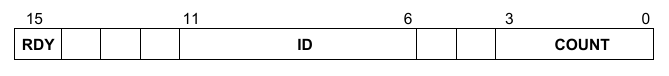

    Composite Register Structure**

HDL paths are created by concatenating each path component from the root
block to the leaf register or memory. However, if a block HDL path
component is defined has a root HDL path component, the HDL path
component of any blocks above it are ignored.

5.6.3 VPI-based Back-door Access
--------------------------------

The UVM register library provides a default back-door access mechanism
that uses the HDL path(s) returned by the uvm_reg::get_full_hdl_path()
and uvm_reg::get_full_hdl_path() methods for the default design
abstraction. Using standard SystemVerilog VPI routines, it samples or
deposits values in the HDL constructs referenced by the resulting
hierarchical HDL paths. If the HDL paths are valid hierarchical
SystemVerilog variables, including indexing and slicing operators, this
should work without any further requirements.

5.6.3.1 Including the DPI C Library
-----------------------------------

The implementation of the default back-door access mechanism requires
the inclusion of some DPI C code. Please refer to the *supplementary*
UVM *documentation* provided by your simulator vendor on how to compile
and link the UVM C library.

5.6.3.2 Performance Issues with the VPI-based Back-door Access
--------------------------------------------------------------

Enabling the VPI functionality required by the default back-door access
mechanism may disable performance optimizations normally done in your
simulator. Please refer to the *supplementary* UVM *documentation*
provided by your simulator vendor for additional or alternative steps
that may be taken to improve the performance of your simulation.

5.6.4 User-defined Back-door Access
-----------------------------------

Should the DPI-based back-door access prove to be insufficient, a
user-defined back-door access can be used instead. A user-defined
back-door access is able to use any SystemVerilog constructs or
tool-specific utility to access registers and memories. For example, if
a memory or register is located in an encrypted model, a user-defined
back-door may be used to peek and poke values directly into the
encrypted model via a suitable API.

A user-defined register back-door is provided through an extension of
the uvm_reg_backdoor class. A back-door write operation is implemented
in the uvm_reg_backdoor::write() virtual method whereas a back-door read
operation is implemented in the uvm_reg_backdoor::read() virtual method.
This back-door access is then associated with a specific register
through the uvm_reg::set_backdoor() method or with all the registers
within a block using the uvm_reg_block::set_backdoor() method.

A user-defined memory back-door is provided through an extension of the
uvm_mem_backdoor class. A back-door write operation is implemented in
the uvm_mem_backdoor::write() virtual method whereas a back-door read
operation is implemented in the uvm_mem_backdoor::read() virtual method.
This back-door access is then associated with a specific memory through
the uvm_mem::set_backdoor() method.

User-defined back-door access mechanisms may be defined by the register
model generators. They are instantiated and associated with their
corresponding block, register, or memory abstraction class in the
implementation of their respective build() method. User-defined
back-door access mechanisms may also be registered with their
corresponding block, register, or memory after the register model
construction, overriding any previously defined (or default) back-door
access mechanisms. In the latter case, they are instantiated and
associated with their corresponding block, register, or memory
abstraction class in the implementation of the environment’s build()
method.

function void

tb_env::build_phase(uvm_phase phase); super.build_phase(phase); ...
begin\ :sub:`my_mem_backdoor bkdr = new; `

regmodel.mem.set_backdoor(bkdr); end endfunction: build_phase

5.6.5 Back-door Access for Protected Memories
---------------------------------------------

The content of memories may be protected using one or more protection
schemes. They can vary from simple additional bits providing an Error
Correction Code to full encryption of its content.

When performing back-door write operations, it is necessary to correctly
protect the memory content to avoid errors when a physical interface
subsequently reads these memory locations. It may also be useful or

necessary to have direct access to the protected form because these bits
are created and used entirely within the design, and can only be
accessed through back-door access. The back-door is the only way
protected values can be checked and protection errors injected.

The encode() and decode() callback methods located in the
uvm_mem_backdoor_cbs class are designed to handle such data protection.
The encode() method is applied on the way in and the decode() method is
applied on the way out. But, unlike regular callback methods, the
decoding is done in the reverse order of registration. This allows
multiple layers of data protections to be implemented in the same
memory, each modeled using a single callback extension. The order of
registration determines the order in which the various layers of
protections are applied–then undone.

For example, ECC bits are located in additional memory bits within the
same memory location as the data they protect; they must be generated
and set for write accesses, and must checked and masked when read.

class ecc_protected extends uvm_mem_backdoor_cbs;

virtual function uvm_reg_data_t encode(uvm_reg_data_t data);

// Append the ECC bits to the data to write data[35:32] =
ecc::compute(data[31:0]); return data; endfunction

virtual function uvm_reg_data_t decode(uvm_reg_data_t data);

// Check and mask the ECC bits to the data to write if (data[35:32] !=
ecc::compute(data[31:0])) ’uvm_error(...) return data[31:0]; endfunction

endclass

Similarly, data written to an encrypted memory must be ciphered during
write accesses and deciphered when read.

class encrypted_mem extends uvm_mem_backdoor_cbs;

virtual function uvm_reg_data_t encode(uvm_reg_data_t data);

return crypt::encrypt(data); endfunction

virtual function uvm_reg_data_t decode(uvm_reg_data_t data);

return crypt::decrypt(data); endfunction

endclass

5.6.6 Active Monitoring
-----------------------

The mirrored field values in a register model are updated when the
fields are accessed through the register model based on the current
mirrored value, the accessed data value, and the access policy of the
field. They may also be updated based on observed read and write
transactions on the bus interface if the register model is integrated
with the bus monitor and explicit monitoring is enabled (see Section
5.9.3). Any changes to the field value performed by the design itself
cannot be detected and then mirrored in the register model.

The back-door mechanism can be used to automatically update the mirror
value of fields that are modified by the design itself by observing the
SystemVerilog constructs which are used to store the field values. When
a change of value is detected, the mirrored value can be similarly
updated.

Because there is no standard value-change callback VPI or PLI
functionality, the automatic update of a field can only be implemented
using a user-defined back-door. The active monitoring of a register
requires the implementation of the uvm_reg_backdoor::is_auto_updated()
and uvm_reg_backdoor::wait_for_change() methods.

uvm_reg_backdoor::is_auto_updated() returns TRUE if the specified named
field is actively monitored. All actively-monitored fields have their
mirror value updated strictly and only through the active mirroring
mechanism. Executed or observed transactions are not used to update
their mirrored value.

The uvm_reg_backdoor::wait_for_change() task must return only when a
change in any of the actively-monitored fields is observed. For each
actively-monitored register, a thread calls this task to wait for any
change in any of the fields in the register. As soon as it returns,
their values are sampled and their mirror values updated. The
implementation of that method should not simply wait for the active edge
of the clock signal used to update the field values in the design; for
optimal performance, the implementation of that method should only
return when an actual change occurs.

class active_monitor_r1 extends uvm_reg_backdoor;

virtual function bit is_auto_updated(string fld_name);

case (fld_name) "f1": return 1; "f2": return 1; endcase endfunction

virtual task wait_for_change();

@($root.tb_top.dut.rf.f1 or $root.tb_top.dut.rf.f2); endtask endclass

The active-monitoring thread must be started for each actively-monitored
register by invoking the uvm_reg_backdoor::start_update_thread() method
of its back-door access class once an instance of that back-door access
class is created, as shown in the following example:

class add_active_monitors extends my_blk;

virtual function build();

super.build(); begin

active_monitor_r1 am_r1 = new; r1.set_backdoor(am_r1);
am_r1.start_update_thread(r1); end endfunction endclass

5.7 Special Registers
#####################

The UVM register library presumes all registers and memories are average
registers and memories, they are accessible at a known, constant, unique
physical address(es), their behavior is constant throughout the
simulation regardless of the physical interface used to access them, and
they contain a single value.

Designer creativity, the demands of the application, or implementation
constraints often require special behaviors be implemented. Special
register behavior can be modeled using any number of extension
capabilities provided in the UVM register and field abstraction classes.
Pre- and post-read/write callback objects, virtual callback methods,
user-defined front-doors, and user-defined back-doors may be used to
extend the behavior of the base library. And, if all else fails, it is
always possible to override virtual methods that are used to access the
register content, i.e., read(), write(), peek(), and poke().

5.7.1 Pre-defined Special Registers
-----------------------------------

The UVM library pre-defines some commonly used special registers. A
register model generator is free to provide a library of additional
special register models and use them in its generated model.

5.7.1.1 Indirect Indexed Registers
----------------------------------

Some registers are not directly accessible via a dedicated address.
Indirect access of an array of such registers is accomplished by first
writing an —index" register with a value that specifies the array’s
offset, followed by a read or write of a —data" register to obtain or
set the value for the register at that specified offset. The pre-defined
uvm_reg_indirect_data class models the behavior the —data" register.

A —data" register type is defined by extending the uvm_reg_indirect_data
register class. The —data" register must not contain any fields. The
—index" and indirect register array must be built first, as the —index"
registers and the register array are specified when the —data" register
is configured using the uvm_reg_indirect_data::configure() method. The
indirect register array, —index“, and —data” registers are added as
members of the containing block. However, only the —index" and —data"
registers are added to a map in the containing block. The registers in
the indirect register array must be not added to the address map in the
containing block because they have no dedicated address.

class my_blk_type extends uvm_reg_block;

ind_idx_reg IND_IDX; ind_data_reg IND_DATA; ind_reg INDIRECT_REG[256];

virtual function build();

foreach (INDIRECT_REG[i]) begin

string name = $sformatf("INDIRECT_REG[%0d]",i); INDIRECT_REG[i]=

ind_reg.type_id.create(name,,get_full_name());
INDIRECT_REG[i].configure(this, null, ...); INDIRECT_REG[i].build(); end

IND_IDX = ind_idx_reg.type_id.create(“IND_IDX”,,get_full_name());
IND_IDX.configure(this, null, ...); IND_IDX.build();

IND_DATA = ind_data_reg.type_id.create(“IND_DATA”,,get_full_name());
IND_DATA.configure(IND_IDX, INDIRECT_REG, this, null); IND_DATA.build();

default_map = create_map("", 0, 4, UVM_BIG_ENDIAN);
default_map.add_reg(IND_IDX, 0); default_map.add_reg(IND_DATA, 4);
endfunction endclass

The registers in the indirect register array cannot be accessed via a
back-door access to the —data" register. Back-door access to the
register array is provided by performing back-door accesses via the
unmapped, indirect register itself.

If a different indirection mechanism is required, a user-defined
register extension will be necessary.

5.7.1.2 FIFO (first-in, first-out) Registers
--------------------------------------------

A FIFO register is not a register in the usual sense. It is a FIFO whose
push and pop operations are mapped to write and read operations at a
specific address. Writing to that address causes the data written to be
pushed at the end of the FIFO. Reading from that address returns the
data that is currently at the head of the FIFO and pops it. Whether the
FIFO is full or empty is usually specified via status bits in another
register.

To model a FIFO register, the register type shall be extended from the
uvm_reg_fifo class. The maximum number of entries in the FIFO and the
size of each entry is specified when calling super.new().

class fifo_reg extends uvm_reg_fifo;

   function new(string name = "fifo_reg");

   super.new(name,8,32,UVM_NO_COVERAGE); endfunction: new

   \`uvm_object_utils(fifo_reg)

endclass

Backdoor access to a FIFO register is not allowed.

5.7.2 Unmapped Registers and Memories
-------------------------------------

By default, the entire register or memory is assumed to be linearly
mapped into the address space of the block that instantiates it. Each
register or location in a memory thus corresponds to a unique address in
the block. However, you can use different addressing mechanisms. For
example, you could access a large memory in a limited address space
using an indexing mechanism: the desired offset within the memory is
written into a register, then the data at that memory offset is read or
written by reading or writing another register. This memory is
effectively unmapped: it does not appear in the linear address space
used to access it. See Section 5.7.1.1.

The number of possible access mechanisms is potentially infinite and
only limited by the imagination, requirements, and constraints of
designers. To support arbitrary access mechanisms, it is possible to
replace the default linearly mapped access mechanism with any
user-defined access mechanism.

5.7.2.1 User-defined Front-door Access
--------------------------------------

User-defined front-door access is made possible by extending the
uvm_reg_frontdoor class and registering an instance of the class with
specific registers or memories using the uvm_reg::set_frontdoor() or
uvm_mem::set_frontdoor() method. The uvm_reg_frontdoor is a
UVMSequence. For each write or read operation, the register model
creates a uvm_reg_item object representing the operation, assigns it to
the rw_info property of registered front-door sequence, and calls its
start method. Ultimately, the front-door’s body task is called, which
must be implement to perform the actual operation.

class indexed_reg_frontdoor extends uvm_reg_frontdoor;

local uvm_reg m_idx_reg; local uvm_reg m_data_reg; local bit [7:0]
m_addr;

function new(string name=“indexed_reg_frontdoor_inst”);

super.new(name); endfunction

function void configure(uvm_reg idx, uvm_reg data, bit [7:0] addr);

m_idx = idx;; m_data = data; m_addr = addr; endfunction: new

virtual task body(uvm_reg_item rw);

m_idx_reg.write(status, m_addr, ...); if (status != UVM_IS_OK)

return; if (rw.kind == UVM_WRITE)

m_data.write(rw.status, data, ...);
else\ :sub:`m_data.read(rw.status, data, ...);` endtask

endclass

User-defined front-doors are instantiated and associated with their
corresponding register or memory abstraction class in the build() method
of the block or register file that instantiates them or the build()
phase callback of the environment component where the register model is
instantiated and built.

virtual function void build();

foreach TABLE[i] begin

indexed_reg_frontdoor idx_frtdr = new(INDEX, DATA, i);

= idx_reg_frontdoor.type_id.create(“idx_frtdr”,,get_full_name());
idx_frntdoor.configure(idx_reg, data_reg, i);
regmodel.TABLE[i].set_frontdoor(idx_frontdoor, default_map, ...); end
endfunction: build

A user-defined front-door is registered on a per-map basis, affecting
the access of a register or memory through a specific physical
interface. A different front-door mechanism (or the built-in one) can be
used for other physical interfaces. For example, a memory could use the
indexed addressing scheme described above for one physical interface but
be mapped normally within the address map of another physical interface.

5.7.2.2 Mirroring Unmapped Registers
------------------------------------

When using explicit or passive monitoring to update the mirror value in
unmapped registers, it will be necessary to override the
uvm_reg::predict() method of the register(s) used to access the unmapped
registers, since the observed transactions will be using the address of
those access registers, not the unmapped (unaddressable) registers that
are ultimately accessed.

In the case of an indirect register, the uvm_reg_indirect_data class
extends predict for you and serves as an example of how you do this for
your custom unmapped registers.

function bit uvm_reg_indirect_data::predict (uvm_reg_data_t value, ...);

if (m_idx.get() >= m_tbl.size()) begin

\`uvm_error(“Index reg > than size of indirect register array”) return
0; end return m_tbl[m_idx.get()].predict(value, ...); endfunction

5.7.3 Aliased Registers
-----------------------

Aliased registers are registers that are accessible from multiple
addresses in the same address map. They are different from shared
registers as the latter are accessible from multiple address maps.
Typically, the fields in aliased registers will have different behavior
depending on the address used to access them. For example, the fields in
a register may be readable and writable when accessed using one address,
but read-only when accessed from another.

Modelling aliased registers in UVM involves more than simply mapping the
same register at two different addresses. A UVM register model requires
each instance of a uvm_reg class be mapped to a unique address in an
address map. For aliased registers, this requires a register class
instance for each address. All this enables using a specific register
instance to access the aliased register via a specific address.

For example, the (incomplete) register model shown below models a
register aliased at two addresses: ’h0100 and ’h0200. Each alias is
known under a different instance name, Ra and Rb respectively. To access
the aliased register via address ’h0100, the Ra instance would be used.

class my_blk extends uvm_reg_block;

rand my_reg_Ra Ra; rand my_reg_Rb Rb; virtual function build();

... default_map.add_reg(Ra, ’h0100); default_map.add_reg(Rb, ’h0200);
endfunction endclass

Each register instance must be of a register type that models the
behavior of the register and field it contains of its corresponding
alias. For example, a register that contains a field that is RW when
accessed via one address, but RO when accessed via another would require
two register types: one with a RW field and another one with a RW field,
and both using the same field names.

class my_reg_Ra extends uvm_reg;

rand uvm_reg_field F1; ... virtual function void build();

F1 = uvm_reg_field.type_id.create("F1"); F1.configure(this, 8, 0,
"RW", 0, 8'h0, 1, 1, 1); endfunction ... endclass

class my_reg_Rb extends uvm_reg;

uvm_reg_field F1; ... virtual function void build();

F1 = uvm_reg_field.type_id.create("F1"); F1.configure(this, 8, 0,
"RO", 0, 8'h0, 1, 0, 1); endfunction

... endclass

The aliasing functionality must be provided in a third class that links
the two register type instances. The aliasing class can make use of the
pre-defined register and field callback methods to implement the
aliasing functionality. It may also make use of additional APIs or
functionality created by the register model generator in the different
register types that model each alias of the register. The aliasing class
should be based on uvm_object to be factory-enabled. The required
reference to the various register instance aliases shall be supplied via
a configure() method.

class write_also_to_F extends uvm_reg_cbs;

local uvm_reg_field m_toF;

function new(uvm_reg_field toF);

m_toF = toF; endfunction

virtual function void post_predict(uvm_reg_field fld,

uvm_reg_data_t value, uvm_predict_e kind, uvm_path_e path, uvm_reg_map
map); if (kind != UVM_PREDICT_WRITE) return;

void'(m_toF.predict(value, -1, UVM_PREDICT_WRITE, path, map));
endfunction

endclass

class alias_RaRb extends uvm_object;

protected reg_Ra m_Ra; protected reg_Rb m_Rb;

\`uvm_object_utils(alias_RaRb)

function new(string name = "alias_RaRb");

super.new(name); endfunction: new

function void configure(reg_Ra Ra, reg_Rb Rb);

write_also_to_F F2F;

m_Ra = Ra; m_Rb = Rb;

F2F = new(Rb.F1); uvm_reg_field_cb::add(Ra.F1, F2F); endfunction :
configure endclass : alias_RaRb

The register file or block containing the various register aliases shall
also instantiate the aliasing class in its build() method and call the
configure() method with appropriate arguments.

class my_blk extends uvm_reg_block;

rand my_reg_Ra Ra; rand my_reg_Rb Rb; ...

virtual function build();

default_map = create_map("", 0, 4, UVM_BIG_ENDIAN);

Ra = reg_Ra.type_id.create("Ra",,get_full_name()); Ra.configure(this,
null); Ra.build();

Rb = reg_Rb.type_id.create("Rb",,get_full_name()); Rb.configure(this,
null); Rb.build();

default_map.add_reg(Ra, ’h0100); default_map.add_reg(Rb, ’h0200);

begin

alias_RaRb RaRb;

RaRb = alias_RaRb.type_id.create("RaRb",,get_full_name());
RaRb.configure(Ra, Rb); end endfunction endclass

There are no pre-defined aliasing classes because the nature of the
aliasing is highly variable, not just in how the fields provide
different behaviors through the various aliases, but potentially in
their layout as well.

5.7.4 Unimplemented Registers
-----------------------------

A UVM register model can model registers that are specified, but have
not yet been implemented in the DUV. This allows the verification
environment and testcases to make use of these registers before they are
available.

Because these registers are unimplemented, there is nothing to actually
read or write inside the DUT. Since the mirror in a register abstraction
class provides a faithful model of the expected behavior of that
register, it can be used to provide a read back value. A
yet-to-be-implemented register is thus modeled by writing to and reading
from the mirror.

An unimplemented register can be modeled by providing a user-defined
front- and back-door that access the mirrored value instead of
performing bus transactions.

class not_yet_implemented_fd extends uvm_reg_frontdoor;

... virtual task body();

uvm_reg R;

$cast(R, rw_info.element); if (rw_info.kind == UVM_READ)
rw_info.value[0] = R.get();

R.predict(rw_info.value[0], -1,

(rw_info.kind == UVM_READ) ?

UVM_PREDICT_READ : UVM_PREDICT_WRITE, rw_info.path, rw_info.map);
endtask endclass

The user-defined front- and back-door can be registered in the
environment where the register model is instantiated. As Register model
generators will not have access to environment, they can register the
back- door and front-door in the build() method of the containing block
for the unimplemented register. Additionally, it is recommended to log
info/warning messages indicating that the particular register is
unimplemented.

virtual function void connect_phase(uvm_phase phase);

... if (get_parent() == null) begin

not_yet_implemented_fd fd; ’uvm_warning(“NotYetImpl”,

“Working around yet-to-be-implemented registers”); fd = new;
regmodel.R2.set_frontdoor(fd); end endfunction

5.7.5 RO and WO Registers Sharing the Same Address
--------------------------------------------------

It is possible for a register containing only write-only fields (WO,
WOC, WOS, and WO1) to share the same address with another register
containing only read-only fields (RO, RC, and RS). The fields in each
register are unrelated and can have different layouts.

This register structure is modeled by simply mapping both registers at
the same address. Only one read-only register and one write-only
register may be mapped at the same address. Once mapped, calling the
uvm_reg::read() method on a write-only register or calling the
uvm_reg::write() method on a read-only register will cause an error
message to be issued, the operation will be aborted, and UVM_NOT_OK will
be returned as the status. Back-door poke and peek are allowed on
read-only and write-only registers respectively.

class block_B extends uvm_reg_block;

rand reg_RO R; rand reg_WO W; ... virtual function void build();

default_map = create_map("", 0, 4, UVM_BIG_ENDIAN);

R = reg_RO.type_id.create("R"); R.configure(this, null, "R_reg");
R.build();

W = reg_WO.type_id.create("W"); W.configure(this, null, "W_reg");
W.build();

default_map.add_reg(R, 'h100, "RO"); default_map.add_reg(W, 'h100,
"WO"); endfunction : build ... endclass

5.8 Integrating a Register Model in a Verification Environment
##############################################################

Test sequences, whether pre-defined or user-defined ones, need a
verification environment in which to execute. The register model needs
to be an integral part of that verification environment to be used by
the tests to access registers and memories in the DUT.

An environment must have a reference to the register model that
corresponds to the DUT it verifies. It is recommended a class property
named regmodel be used for that purpose. To enable vertical reuse of the
environment, it must first check if its register model has been defined
by a higher-level environment. If not, it must be allocated using the
class factory, explicitly built by calling its build() method, then it
calls the uvm_reg_block::lock_model() method. After creating any
sub-block environments, their register models must then be specified by
setting their respective regmodel class properties. All of this must be
implemented in the environment’s build phase method.

class block_env(UVMEnv):

block_reg_model regmodel; subblk_env subblk;

virtual function void build_phase(uvm_phase phase);

if (regmodel == null) begin

regmodel = block_reg_model.type_id.create(“regmodel”, this);
regmodel.build(); regmodel.lock_model(); end subblk =
subblk_env.type_id.create(“subblk”, this); subblk.regmodel =
regmodel.subblk; endfunction endclass

If HDL paths are used, the root HDL paths must be specified in the
environment that instantiates the register model. The value of that root
path will depend on the location of the model for the DUT within the
complete simulation model.

class block_env(UVMEnv):

block_reg_model regmodel; virtual function void build_phase(uvm_phase
phase);

if (regmodel == null) begin

regmodel = block_reg_model.type_id.create(“regmodel”, this);
regmodel.build(); regmodel.set_hdl_path_root(“tb_top.dut”); end
endfunction endclass

5.9 Integrating a Register Model
################################

A register model must be integrated with the bus agents that perform and
monitor the actual read and write operations. The terms —bus driver“,
—bus agent”, —bus interface" and —bus operations" are used to describe
the components, protocol, and interface associated with the execution of
read and write operations on the DUT. The integration may be established
via a non-bus-based interface and protocol.

The integration with the bus agent must only be done on root blocks.
Root blocks model the entire DUT and they are the only ones who have
access to and knowledge of the externally-visible address maps. Lower-
level register models will translate their read and write operations in
terms of read and write operations at the root block level, using
root-level addresses and bus protocols.

To that end, the integration process must be conditional to the register
model being a root register model. This is accomplished by checking if
the register model has a parent. If not, it is a root model and
integration with the bus agent may proceed. All this must be implemented
in the environment’s connect phase.

class block_env(UVMEnv):

block_reg_model regmodel; subblk_env subblk;

virtual function void connect_phase(uvm_phase phase);

if (regmodel.get_parent() == null) begin // Integrate register model
with bus agent ... end endfunction endclass

There are three structural bus agent integration approaches for keeping
the register model’s mirror values in sync with the DUT: implicit
prediction, explicit prediction, and passive.

Implicit prediction only requires the integration of the register model
with one or more bus sequencers. Updates to the mirror are predicted
automatically (i.e., implicitly) by the register model after the
completion of each read, write, peek, or poke operation. This
integration is the simplest and quickest, but it will fail to observe
bus operations that did not originate from the register model (e.g., by
a third-party bus agent) and thus fail to appropriately update the
corresponding mirror values.

Explicit prediction requires the register model be integrated with both
the bus sequencers and corresponding bus monitors. In this mode,
implicit prediction is turned off and all updates to the mirror are
predicted externally (i.e., explicitly) by a uvm_reg_predictor
component, one for each bus interface. The predictor receives the bus
operations observed by a connected bus monitor, determines the register
being accessed by performing a reverse-lookup using the observed
address, and then calls the found register’s predict method explicitly
to update the mirror. This integration requires more work, but it will
observe all bus operations, whether they originated from the register
model or a third-party bus agent, and thus appropriately update the
corresponding mirror values.

Passive integration only requires the integration of the register model
with the bus monitor as described above. All the monitoring of the
register operations is performed externally to (i.e., explicitly) the
register model. All bus operations, whether they originated from the
register model or a third-party bus agent, are observed and thus
appropriately reflected in the corresponding mirror values. Because the
register model is not integrated with a bus sequencer, it cannot be used
to read and write register and memories in the DUT, only to track and
verify their current value.

5.9.1 Transaction Adapter
-------------------------

The first step in integrating a register model with a bus agent are the
conversion functions between a generic read/write bus operation
descriptor, uvm_reg_bus_op, used by the register model and the protocol-
specific read/write transaction descriptor used by the bus agent.

The transaction adapter is implemented by extending the uvm_reg_adapter
class and implementing the reg2bus() and bus2reg() methods. Being a
uvm_object, the bus adapter must implement a suitable uvm_object
constructor and use the ’uvm_object_utils() macro to enable it for the
class factory.

class reg2apb_adapter extends uvm_reg_adapter;

\`uvm_object_utils(reg2apb_adapter)

function new(string name = "reg2apb_adapter");

super.new(name); endfunction

virtual function UVMSequenceItem reg2bus(const ref uvm_reg_bus_op rw);

apb_rw apb = apb_rw.type_id.create("apb_rw"); apb.kind = (rw.kind ==
UVM_READ) ? apb_rw::READ : apb_rw::WRITE; apb.addr = rw.addr; apb.data =
rw.data; return apb; endfunction

virtual function void bus2reg(UVMSequenceItem bus_item,

ref uvm_reg_bus_op rw); apb_rw apb; if (!$cast(apb,bus_item)) begin

\`uvm_fatal("NOT_APB_TYPE",

"Provided bus_item is not of the correct type") return; end rw.kind =
apb.kind ? UVM_READ : UVM_WRITE; rw.addr = apb.addr; rw.data = apb.data;
rw.status = UVM_IS_OK; endfunction endclass

If the bus protocol supports byte lane enables (i.e., it is possible to
read or write individual bytes in a multi- byte bus), the
supports_byte_enable class property should be set to TRUE in the
constructor. Similarly, the provides_responses class property should be
set to TRUE if the bus driver returns responses, e.g., the result of a
read operation, in a separate response descriptor:

class reg2apb_adapter extends uvm_reg_adapter;

function new(string name = "");

super.new(name); supports_byte_enables = 0; provides_responses = 1;
endfunction endclass

Because this transaction adapter is specific to the bus agent, not the
register model, it should be provided as part of a UVM-compliant bus
UVC.

The transaction adapter is then instantiated in the connect phase of the
environments corresponding to root register models:

class block_env(UVMEnv): block_reg_model regmodel; subblk_env
subblk;

virtual function void connect_phase(uvm_phase phase);

... if (regmodel.get_parent() == null) begin

reg2apb_adapter reg2apb =

reg2apb_adapter.type_id.create(“reg2apb”,,get_full_name()); ...

end endfunction

endclass

5.9.2 Integrating Bus Sequencers
--------------------------------

All integration approaches require a register model be configured with
one or more bus sequencers. The register model becomes a property of a
uvm_reg_sequence subtype that executes

a) directly on a bus sequencer, if there is only one bus interface
providing access to the DUT registers; b) as a virtual sequence, if
there are one or more bus interfaces providing access to the DUT
registers; c) as a register sequence running on a generic,
bus-independent sequencer, which is layered on top of a

downstream bus sequencer.

Note–To keep the code examples that follow succinct and focused on
register model integration, we do not show obtaining handles via
configuration or the resources database, or a priori sequence
registration to a specific sequencer.

5.9.2.1 Register Sequence Running on the Bus Sequencer
------------------------------------------------------

The simplest approach is to run register sequences directly on the bus
sequencer, competing directly with all other —native" bus sequences
concurrently running on the bus sequencer. The register sequence will,
via the register model, produce bus sequence stimulus using a
preconfigured bus adapter. This approach is suitable for when the
registers being accessed by the register sequence are accessible via a
single bus interface, as shown in Figure 27.

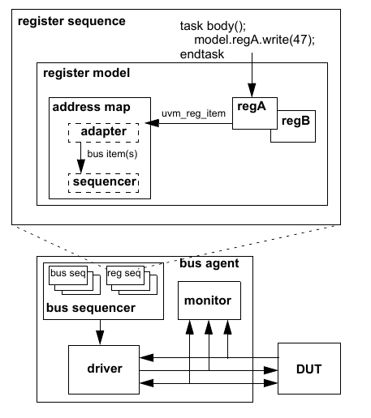

    Register Sequence Running Directly on a Bus Sequencer

Implementing this approach is accomplished by registering the bus
sequencer and corresponding transaction adapter with the appropriate
address map in the register model. The model is registered with the
user- defined register sequence and the sequence started on the bus
sequencer. As with any other running bus sequence, the register
sequence’s is_relevant, pre_do, mid_do, and post_do methods are called
during execution of each bus item generated by the model. To gain
exclusive access to the bus, the register sequence may also call grab or
lock to prevent other bus sequences from running::

    class block_env(UVMEnv):

        block_reg_model regmodel;
        apb_agent apb;

        virtual function void connect_phase(uvm_phase phase);
            if (regmodel.get_parent() == null) begin

            reg2apb_adapter reg2apb =

            reg2apb_adapter.type_id.create(“reg2apb”,,get_full_name());
            regmodel.APB.set_sequencer(apb.sequencer, reg2apb);
            regmodel.set_auto_predict(1); end ...
        endfunction ...
    endclass

The above example registers an APB bus sequencer and APB-specific bus
adapter with the APB address map defined in top-level register model. If
the register model defines only a single map, the map may be referenced
via the handle default_map.

You define a register sequence by extending uvm_reg_sequence and
defining the body() task to use the model property::

    class my_reg_sequence(UVMRegSequence):

        # block_reg_model model;

        async def body(self):

            uvm_status_e status;
            uvm_reg_data_t data;

            self.model.A.write(status, 'h33, .parent(this));
            if (status == UVM_NOT_OK)
                ’uvm_error(...) model.A.read(status, data, .parent(this));
            if (data != ’h33)
                uvm_error(...)

    uvm_object_utils(my_reg_sequence)

The uvm_reg_sequence class parameterizes its base class. This allows you
to splice in any user-defined UVMSequence subtype if needed:

class VIP_sequence extends UVMSequence #(VIP_base_item); class
my_reg_sequence extends uvm_reg_sequence (VIP_sequence);

To run the register sequence, assign the sequence model property and
start it on the bus sequencer::

    class my_test extends UVMTest;

        block_env env;

        virtual function void run_phase(uvm_phase phase);
            my_reg_sequence seq = my_reg_sequence.type_id.create(“seq”,this);
            seq.start(env.apb.master);
        endfunction

    endclass

5.9.2.2 Register Sequence Running as a Virtual Sequence
-------------------------------------------------------

When the registers in the DUT become accessible via more than one
physical bus interface, the same register sequence may instead be
started as a virtual sequence as the sequencer used in each write/read
call is not directly referenced. The register model routes the operation
to the appropriate sequencer based on which map is in effect.

Consider a register model with two registers accessible via different
bus interfaces, as shown in Figure 28. As in the previous example in
Section 5.9.2.1, the sequence calls write and read on regA and regB
without referring to a map or sequencer.

Note–Write and read calls have an optional map argument, but specifying
a map explicitly would limit sequence reuse.

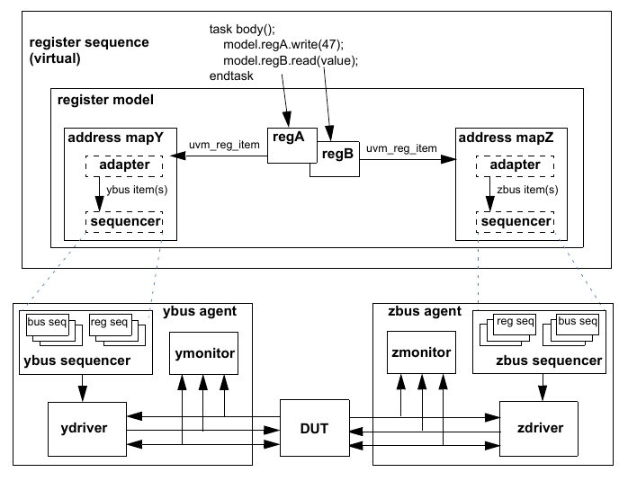

    Register Sequence Running as a Virtual Sequence**

The only difference between this and running directly on a bus sequencer
is more than one sequencer/ adapter pair is registered with the register
model and the register sequence’s start method is called without
specifying a sequencer to run::

    class block_env(UVMEnv):

        block_reg_model regmodel; apb_agent apb; wishbone_agent wsh;

        virtual function void connect_phase(uvm_phase phase);

            if (regmodel.get_parent() == null) begin

                reg2apb_adapter reg2apb =

                reg2apb_adapter.type_id.create(“reg2apb”,,get_full_name());
                reg2wsh_adapter reg2wsh =

                reg2wsh_adapter.type_id.create(“reg2wsh”,,get_full_name());
                regmodel.APB.set_sequencer(apb.sequencer, reg2apb);
                regmodel.WSH.set_sequencer(wsh.sequencer, reg2wsh);
                regmodel.set_auto_predict(1);
            end ...
        endfunction ...

    endclass

A register model having more than one configured interface offers
interesting timing possibilities. For example, if two registers are
accessible via different busses, their accesses can be concurrent:

class my_reg_sequence extends uvm_reg_sequence;

\`uvm_object_utils(my_reg_sequence)

block_reg_model model;

virtual task body();

uvm_status_e status;

fork\ :sub:`model.APB.write(status, 'h33, .parent(this)); `

model.WSH.read(status, ’h66, .parent(this)); join

endtask

endclass

To run the register sequence, register the model and start it without
specifying a particular sequencer::

    class my_test(UVMTest):

        def __init__(self, name="my_test", parent=None):
            super().__init__(name, parent)
            self.env = block_env('block_env', self)

        async def run_phase(self, phase):
            seq = my_reg_sequence.type_id.create(“seq”, self)
            await seq.start(None)

If you needed to grab a particular sequencer for corner-case testing and
were not concerned about creating a dependency on a particular
sequencer::

    self.grab(regmodel.APB.get_sequencer());
    ...
    self.ungrab(regmode.APB.get_sequencer());

5.9.2.3 Register Sequence Running on a Layered Register Sequencer
-----------------------------------------------------------------

An alternative integration mechanism is to connect the register model
with a register sequencer, then layer that register sequencer on top of
the bus sequencer, as shown in Figure 29. The register operations will
—execute" as abstract sequence items on the register sequencer, allowing
central, bus-independent control of the register sequences. However,
this also prevents register sequences from competing directly with or
having control over concurrently executing bus sequences (i.e., via grab
and ungrab), mixing register and bus-specific sequences and sequence
item execution within the same sequence, and being notified of bus-
specific operations (via pre_do, mid_do, post_do, and is_relevant). This
process also only works with a single bus interface, as all register
operations are funneled through a single register sequence.

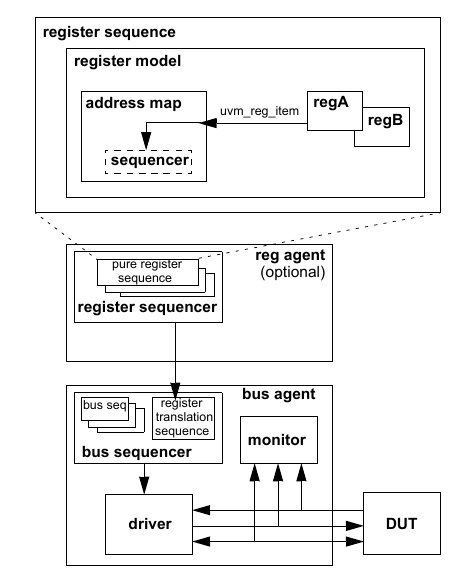

    Register Sequence Running on a Layered Register Sequencer

In this scheme, you are effectively moving the built-in register-to-bus
item conversion and bus item execution from the register model to an
external translation sequence, which can be overridden to perform custom
address translation or item conversions. The register model sends
abstract uvm_reg_item descriptors to the register sequencer. It is the
responsibility of the translation sequence running on the bus sequencer
to get these abstract items and convert them to physical bus items and
start them on the bus sequencer. The uvm_reg_sequence base class
provides this functionality. It parameterizes its base class to enable
it to run on bus-specific sequencers.

This is implemented in the connect phase by first registering a
uvm_reg_item sequencer and null adapter with the address map
corresponding to the bus being targeted. In a single-map model, the
default_map is typically used.

You then create an instance of a translation sequence and configure it
with the register sequencer handle and bus adapter. The pre-defined
layering sequence uvm_reg_sequence, properly parameterized and
configured, may be used in this step.

Then, in the run phase, you start the translation sequence on the bus
sequencer.

// translation sequence type

**reg agent**

sequence

(optional)

:sub:`bus seq register `

translation **bus agent** sequence **bus sequencer**

**monitor**

**driver**

typedef uvm_reg_sequence #(UVMSequence #(apb_rw)) reg2apb_seq_t;

class block_env(UVMEnv):

block_reg_model regmodel; uvm_sequencer#(uvm_reg_item) reg_seqr;
apb_agent apb; reg2apb_seq_t reg2apb_seq;

virtual function void connect_phase(uvm_phase phase);

if (regmodel.get_parent() == null) begin

regmodel.default_map.set_sequencer(reg_seqr,null); reg2apb_seq =
reg2apb_seq_t.type_id.create(“reg2apb_seq”,,

get_full_name()); reg2apb_seq.reg_seqr = reg_seqr; reg2apb_seq.adapter =
reg2apb_adapter.type_id.create(“reg2apb”,,

get_full_name()); regmodel.set_auto_predict(1); end endfunction

virtual task run();

reg2apb_seq.start(apb.sequencer); endtask

endclass

To run a register sequence, you register the model and start it on the
register sequencer:

class my_test extends UVMTest;

block_env env;

virtual function void run_phase(uvm_phase phase);

my_reg_sequence seq = my_reg_sequence.type_id.create(“seq”,this);
seq.start(env.reg_seqr); endfunction

endclass

5.9.3 Integrating the Register Model with a Bus Monitor
-------------------------------------------------------

By default, the register model updates its mirror copy of the register
values implicitly. Every time a register is read or written through the
register model, its mirror value is updated. However, if other agents on
the bus interface perform read and write transactions outside the
context of the register model, the register model must learn of these
bus operations to update its mirror accordingly.

Integration of a bus monitor (see Figure30) to make predictions based on
observed transactions is independent from how bus sequencers are
integrated. All previously described bus sequencer integration
approaches may employ explicit, bus monitor-based prediction.

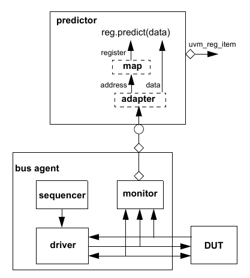

    Integration with a Bus Monitor

The predictor accepts bus transactions from a connected bus monitor. It
uses the preconfigured adapter to obtain the canonical address and data
from the bus operation. The map is used to lookup the register object
associated with that address. The register’s predict() method is then
called with the observed data to update the mirror value. If the
register width is wider than the bus, the predictor will collect
multiple observed bus operations before calling predict() with the
register’s full value. As a final step, a generic uvm_reg_item
descriptor representing the abstract register operation is broadcast to
subscribers of its analysis port.

Integration is accomplished by first instantiating a uvm_reg_predictor
component, parameterized to the bus transaction type, and configuring it
with the adapter and address map in the register model that corresponds
to the bus being monitored. The uvm_reg_predictor component is then
connected to the bus monitor’s analysis port::

    class block_env(UVMEnv):

        block_reg_model regmodel;
        uvm_reg_predictor#(apb_rw) apb2reg_predictor;
        apb_agent apb;

        virtual function void build_phase(uvm_phase phase);
            ...
            apb2reg_predictor = new(“apb2reg_predictor”, this);
        endfunction

        virtual function void connect_phase(uvm_phase phase);

            if (regmodel.get_parent() == null) begin
                reg2apb_adapter reg2apb =
                reg2apb_adapter.type_id.create(“reg2apb”,,get_full_name());
                ...
                apb2reg_predictor.map = regmodel.APB;
                apb2reg_predictor.adapter = reg2apb;
                regmodel.APB.set_auto_predict(0);
                apb.monitor.ap.connect(apb2reg_predictor.bus_in);
            end
            ...
        endfunction
        ...

    endclass

When explicit prediction is employed, the implicit prediction must be
turned off using uvm_reg_map::set_auto_predict(0).

Note–For register models with a single address map, the name of the
address map will be default_map.

**5.10 Randomizing Field Values**

A register model can specify constraints on field values. You can add
additional constraints by extending the field, register, register file,
or block abstraction class and substituting it in the register model
using the factory or by using randomize() with {} when randomizing a
field, register, register file, or block. When constraining a field
value, the class property to be constrained is named value. This is
*not* the class property that is eventually mirrored or updated and used
by the get() and set() methods; it cannot be used for purposes other
than random constraints::

    ok = regmodel.r1.randomize() with { f1.value <=’hF; };

Once randomized, the selected field values in a register or block may be
automatically uploaded to the DUT by using the uvm_reg::update() or
uvm_reg_block::update() method. This will upload any randomized value
that is different from the current mirrored value to the DUT. If you
override the post_randomize() method of a field abstraction class, you
must call super.post_randomize() to ensure the randomized value is
properly set into the mirror.

You can relax constraints specified in a register model by turning the
corresponding constraint block OFF::

    regmodel.r1.consistency.constraint_mode(0);

**5.11 Pre-defined Sequences**

Once a register model has been instantiated in an environment and
integrated with the DUT, it is possible to execute any of the predefined
register tests sequences to verify the proper operation of the registers
and memories in the DUV. It is recommended you start with the simplest
test–the hardware reset test–to debug the register model, the
environment, the physical transactors, and the DUV to a level where it
can be taken through more complicated tests. Some of the predefined test
sequences require back-door access be available for registers or
memories.

The predefined test sequences in Table 13 are included in the register
library. You can combine them in a higher-level virtual sequence to
better verify your design. Test sequences are not applied to any block,

register, or memory with the NO_REG_TESTS attribute defined. Refer to
the UVM *1.2 Class Reference* for more details on each pre-defined test
sequence.

**Table 13–Pre-defined Test Sequences**

   **Sequence Name Description Attributes**

uvm_reg_hw_reset_seq Reads all the register in a block and

check their value is the specified reset value.

Skip block or register if any of the following attributes are defined:
NO_REG_HW_RESET_TEST :sub:`NO_REG_TESTS `

uvm_reg_single_bit_bash\_ seq

Sequentially writes 1’s and 0’s in each bit of the register, checking it
is appro- priately set or cleared, based on the field access policy
specified for the field containing the target bit.

Skip register if any of the follow- ing attributes are defined:
NO_REG_BIT_BASH_TEST NO_REG_TESTS

Skip register if any of the follow- ing attributes are defined:
NO_REG_BIT_BASH_TEST NO_REG_TESTS

uvm_reg_bit_bash_seq Executes the uvm_reg_single\_

bit_bash_seq sequence for all reg- isters in a block and sub-blocks.

Skip block if any of the following attributes are defined:
NO_REG_BIT_BASH_TEST NO_REG_TESTS

uvm_reg_single_access\_ seq

Requires the back-door be defined for the register. For each address map
in which the register is accessible, writes the register then confirms
the value was written using the back-door. Sub- sequently writes a value
via the back- door and checks the corresponding value can be read
through the address map.

Skip register if any of the follow- ing attributes are defined:
NO_REG_ACCESS_TEST NO_REG_TESTS

Skip register if any of the follow- ing attributes are defined:
NO_REG_ACCESS_TEST NO_REG_TESTS

uvm_reg_access_seq Executes the uvm_reg_single\_

access_seq sequence for all regis- ters in a block and sub-blocks.

Skip block if any of the following attributes are defined:
NO_REG_ACCESS_TEST NO_REG_TESTS

uvm_mem_single_walk_seq Write a walking pattern into the mem-

ory then checks it can be read back with the expected value.

Skip memory if any of the follow- ing attributes are defined:
NO_MEM_WALK_TEST NO_MEM_TESTS NO_REG_TESTS

uvm_mem_walk_seq Executes the uvm_mem_single\_

walk_seq sequence for all memories in a block and sub-blocks.

Skip block if any of the following attributes are defined:
NO_MEM_WALK_TEST NO_MEM_TESTS NO_REG_TESTS

uvm_mem_single_access\_ seq

Requires the back-door be defined the memory. For each address map in
which the memory is accessible, writes the memory locations for each
memory then confirms the value was written using the back-door.
Subsequently writes a value via the back-door and checks the
corresponding value can be read through the address map.

Skip memory if any of the follow- ing attributes are defined:
NO_MEM_ACCESS_TEST NO_MEM_TESTS NO_REG_TESTS

Skip memory if any of the follow- ing attributes are defined:
NO_MEM_ACCESS_TEST NO_MEM_TESTS NO_REG_TESTS

**Table 13–Pre-defined Test Sequences (Continued)**

   **Sequence Name Description Attributes**

uvm_mem_access_seq Executes the uvm_mem_single\_

access_seq sequence for all memo- ries in a block and sub-blocks.

Skip block if any of the following attributes are defined:
NO_MEM_ACCESS_TEST NO_MEM_TESTS NO_REG_TESTS

uvm_reg_shared_access\_ seq

Requires the register be mapped in multiple address maps. For each
address map in which the register is accessible, writes the register via
one map then confirms the value was writ- ten by reading it from all
other address maps.

Skip register if any of the follow- ing attributes are defined:
NO_SHARED_ACCESS_TEST NO_REG_TESTS

Skip register if any of the follow- ing attributes are defined:
NO_SHARED_ACCESS_TEST NO_REG_TESTS

uvm_mem_shared_access\_ seq

Requires the memory be mapped in multiple address maps. For each address
map in which the memory is accessible, writes each memory loca- tion via
one map then confirms the value was written by reading it from all other
address maps.

Skip memory if any of the follow- ing attributes are defined:
NO_SHARED_ACCESS_TEST NO_MEM_TESTS NO_REG_TESTS

Skip memory if any of the follow- ing attributes are defined:
NO_SHARED_ACCESS_TEST NO_MEM_TESTS NO_REG_TESTS

uvm_reg_mem_shared\_ access_seq

Executes the uvm_reg_shared\_ access_seq sequence for all regis- ters in
a block and sub-blocks. Exe- cutes the uvm_mem_shared\_ access_seq
sequence for all memo- ries in a block and sub-blocks.

Skip block if any of the following attributes are defined:
NO_SHARED_ACCESS_TEST NO_MEM_TESTS NO_REG_TESTS

Skip block if any of the following attributes are defined:
NO_SHARED_ACCESS_TEST NO_MEM_TESTS NO_REG_TESTS

uvm_reg_mem_built_in_seq Execute all the selected predefined

block-level sequences. By default, all pre-defined block-level sequences
are selected.

Applies attributes governing each predefined sequence, as defined above.

uvm_reg_mem_hdl_paths\_ seq

Verify the HDL path(s) specified for registers and memories are valid.

Skip register or memory if no HDL path(s) have been specified.

Skip register or memory if no HDL path(s) have been specified.

6. Advanced Topics
==================

This chapter discusses UVM topics and capabilities of the UVM Class
Library that are beyond the essential material covered in the previous
chapters. Consult this chapter as needed.

6.1 The uvm_component Base Class
################################

All the infrastructure components in an UVM verification environment,
including environments and tests, are derived either directly or
indirectly from the uvm_component class. These components become part of
the environment hierarchy that remains in place for the duration of the
simulation.\ :sup:`1` Typically, you will derive your classes from the
methodology classes, which are themselves extensions of uvm_component.
However, understanding the uvm_component is important because many of
the facilities that the methodology classes offer are derived from this
class. User-defined classes derived from this class inherit built-in
automation, although this feature is entirely optional.

The following sections describe some of the capabilities that are
provided by the uvm_component base class and how to use them.The key
pieces of functionality provided by the uvm_component base class
include:

– Phasing and execution control – Configuration methods – Factory
convenience methods – Hierarchical reporting control.

6.2 The Built-In Factory and Overrides
######################################

6.2.1 About the Factory
-----------------------

UVM provides a built-in factory to allow components to create objects
without specifying the exact class of the object being creating. The
mechanism used is referred to as an override and the override can be by
instance or type. This functionality is useful for changing sequence
functionality or for changing one version of a component for another.
Any components which are to be swapped shall be polymorphically
compatible. This includes having all the same TLM interface handles and
TLM objects need to be created by the new replacement component. The
factory provides this capability with a static allocation function that
you can use instead of the built-in new function. The function provided
by the factory is:

*type_name*.type_id.create(string *name*, uvm_component *parent*)

Since the create() method is automatically type-specific, it may be used
to create components or objects. When creating objects, the second
argument, *parent*, is optional.

A component using the factory to create data objects would execute code
like the following:

task mycomponent::run_phase(uvm_phase phase);

mytype data; // Data must be mytype or derivative. data =
mytype.type_id.create("data"); $display("type of object is: %0s",
data.get_type_name());

... endtask

1\ :sub:`Contrast to UVMSequence, sequence_item, and transaction, which are transient –they are created, used, and then`
garbage collected when dereferenced.

In the code above, the component requests an object from the factory
that is of type mytype with an instance name of data.

When the factory creates this object, it will first search for an
instance override that matches the full instance name of the object. If
no instance-specific override is found, the factory will search for a
type-wide override for the type mytype. If no type override is found
then the type created will be of type mytype.

6.2.2 Factory Registration
--------------------------

You must tell the factory how to generate objects of specific types. In
UVM, there are a number of ways to do this allocation.

– The recommended method is to use the \`uvm_object_utils(T) or
\`uvm_compo- nent_utils(T) macro in a derivative uvm_object or
uvm_component class declaration, respectively. These macros contain code
that will register the given type with the factory. If T is a
parameterized type, use \`uvm_object_param_utils or
\`uvm_component_param_utils, e.g.,

\`uvm_object_utils(packet) ’uvm_component_param_utils(my_driver) – Use
the \`uvm_object_registry(T,S) or \`uvm_component_registry(T,S)
registra- tion macros. These macros can appear anywhere in the
declaration space of the class declaration of T and will associate the
string S to the object type T. These macros are called by the
corresponding uvm_*_utils macros, so you may only use them if you do not
use the ’uvm_*_utils macros.

6.2.3 Component Overrides
-------------------------

A global factory allows you to substitute a predefined-component type
with some other type that is specialized for your needs, without having
to derive the container type. The factory can replace a component type
within the component hierarchy without changing any other component in
the hierarchy. You need to know how to use the factory, but not how the
factory works.

NOTE–All type-override code should be executed in a parent prior to
building the child(ren). This means that environ- ment overrides should
be specified in the test.

Two interfaces exist to replace default components. These interfaces
allow overriding by type or instance, and will be examined one at a
time.

To override a default component:

a) Define a class that derives from the default component class. b)
Execute the override (described in the following sections). c) Build the
environment.

6.2.3.1 Type Overrides
----------------------

The first component override replaces all components of the specified
type with the new specified type. The prototype is.

<orig_type>.type_id.set_type_override(<override_type>::get_type(),

bit replace = 1);

The set_type_override() method is a static method of the static type_id
member of the orig_type class. These elements are defined in the
uvm_component_utils and

uvm_object_utils macros. The first argument (override_type::get_type())
is the type that will be returned by the factory in place of the
original type. The second argument, replace, determines whether to
replace an existing override (replace = 1). If this bit is 0 and an
override of the given type does not exist, the override is registered
with the factory. If this bit is 0 and an override of the given type
does exist, the override is ignored.

If no overrides are specified, the environment will be constructed using
the original types. For example, suppose the environment creates an
ubus_master_driver type component inside ubus_master_agent.build(). The
set_type_override method allows you to override this behavior in order
to have an ubus_new_master_driver for all instances of
ubus_master_driver.

ubus_master_driver.type_id.set_type_override(ubus_new_master_driver::

get_type);

This overrides the original type (ubus_master_driver) to be the new type
(ubus_new_master_driver). In this case, we have overridden the type that
is created when the environment should create an ubus_master_driver. The
complete hierarchy would now be built as shown in Figure 31. Note that
the ubus_master_agent definition does not change, but the factory was
used to create the child instances, the type override causes the new
type to be created instead.

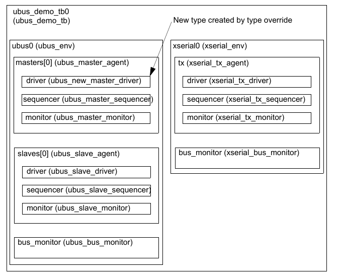

    Hierarchy Created with set_type_override() Applied

NOTE–While only one ubus_master_driver instance is replaced in this
example, any and all ubus_mas- ter_driver instances would be replaced in
an environment containing multiple ubus_master_drivers

6.2.3.2 Instance Overrides
--------------------------

The second component override replaces targeted components of the
matching instance path with the new specified type. The prototype for
uvm_component is::

    <orig_type>.type_id.set_inst_override(<override_type>.get_type(),
        string inst_path);

As shown in Section 6.2.3.1, set_inst_override() is a static method of
the type_id member of orig_type. The first argument is the type that
will be returned in place of the original type when creating the
component at the relative path as specified by the second argument. The
second argument can be considered the —target" of the override.

Assume the ubus_new_slave_monitor has already been defined. Once the
following code is executed, the environment will now create the new
type, ubus_new_slave_monitor, for all instances that match the instance
path::

    ubus_slave_monitor.type_id.set_inst_override(ubus_new_slave_monitor.
        get_type(), “slaves[0].monitor”);

In this case, the type is overridden that is created when the
environment should create an ubus_slave_monitor for only the
slaves[0].monitor instance that matches the instance path in the
override. The complete hierarchy would now be built as shown in Figure
32. For illustration purposes, this hierarchy assumes both overrides
have been executed.

NOTE–Instance overrides are used in a first-match order. For each
component, the first applicable instance override is used when the
environment is constructed. If no instance overrides are found, then the
type overrides are searched for any applicable type overrides. The
ordering of the instance overrides in your code affects the application
of the instance overrides. You should execute more-specific instance
overrides first. For example,

mytype.type_id.set_inst_override(newtype::get_type(), "a.b.*");
my_type.type_id.set_inst_override(different_type::get_type(),
"a.b.c");

will create a.b.c with different_type. All other objects under a.b of
mytype are created using newtype. If you switch the order of the
instance override calls then all of the objects under a.b will get
newtype and the instance override a.b.c is ignored.

my_type.type_id.set_inst_override(different_type::get_type(),
"a.b.c"); mytype.type_id.set_inst_override(newtype::get_type(),
"a.b.*");

.. figure:: fig/32_hierarchy_created_with_both_overrides_applied.png
    :align: center
    :alt: alternate text
    :figclass: align-center

    Hierarchy Created with both Overrides Applied**

6.3 Callbacks
#############

Callbacks are an optional facility end users can use to augment
component behavior. Callbacks may have a noticeable impact on
performance, so they should only be used when the desired functionality
cannot be achieved in any other way.

6.3.1 Use Model
---------------

To provide a callback facility to end-users, the component developer
needs to:

a) Derive a callback class from the uvm_callback base. It should declare
one or more methods that

comprise the —callback interface". b) Optionally, define a typedef to
the uvm_callbacks pool typed to our specific component-call-

back combination. c) Define the component to iteratively invoke the
registered implementations of each method defined in the callback class
defined in Step (a) at the desired locations within a component main
body of code. Whether a function or a task is used is determined by the
ability of the component’s code or behavior to be suspended or not
during its execution.

To use callbacks, the user needs to:

xserial0 (xserial_env)

tx (xserial_tx_agent)

driver (ubus_new_master_driver)

slaves[0] (ubus_slave_agent)

bus_monitor (xserial_bus_monitor)

monitor (ubus_new_slave_monitor)

driver (xserial_tx_driver)

sequencer (ubus_master_sequencer)

sequencer (xserial_tx_sequencer)

New type created by instance override

bus_monitor (ubus_bus_monitor)

monitor (xserial_tx_monitor)

driver (ubus_slave_driver)

sequencer (ubus_slave_sequencer)

d) Define a new callback class extending from the callback base class
provided by the developer, over-

riding one or more of the available callback methods. e) Register one or
more instances of the callback with the component(s) you wish to extend.

These steps are illustrated in the following simple example.

6.3.2 Example
-------------

The example below demonstrates callback usage. The component developer
defines a driver component and a driver-specific callback class. The
callback class defines the hooks available for users to override. The
component using the callbacks (that is, calling the callback methods)
also defines corresponding virtual methods for each callback hook. The
end-user may then define either a callback or a driver subtype to extend
driver’s behavior.

6.3.2.1 Developer Code
----------------------

a) Define a callback class extending from uvm_callback.

The callback class defines an application-specific interface consisting
of one or more function or task prototypes. The signatures of each
method have no restrictions. To be able to use the callback invocation
macros, functions should return void or bit type. In the example below,
a new bus_bfm_cb class extending from uvm_callback is defined. The
developer of the bus_bfm component decides to add two hooks for users,
trans_received and trans_executed: 1) trans_received–the bus driver
calls this after it first receives a new transaction item. It provides a
handle to both itself and the new transaction. An additional argument
determines whether to drop (1) or execute (0) the transaction. 2)
trans_executed–the bus driver calls this after executing the
transaction, passing in a han-

   dle to itself and the transaction, which may contain read data or
   other status information.

virtual class bus_driver_cb extends uvm_callback;

virtual function void trans_received(bus_driver driver, bus_tr tr,

ref bit drop); endfunction virtual task trans_executed(bus_driver
driver, bus_tr tr);

endtask function new(string name="bus_driver_cb");

super.new(name); endfunction endclass b) Define a typedef to the
uvm_callbacks pool typed to our specific component-callback com-

bination. UVM callbacks are type-safe, meaning any attempt to register a
callback to a component not designed for that callback simply will not
compile. In exchange for this type-safety we must endure a bit of
parameterized syntax as follows:

typedef uvm_callbacks #(bus_driver, bus_driver_cb) bus_driver_cb_pool;
The alias bus_driver_cb_pool can help both the component developer and
the end-user pro- duce more readable code. c) Embed the callback feature
in the component that will use it.

The developer of the bus_bfm adds the trans_received and trans_executed
virtual methods, with empty default implementations and utilizes some
macros that implement the most common algorithms

for executing all registered callbacks. With this in place, end-users
can now customize component behavior in two ways:

– extend bus_driver and override one or more of the virtual methods
trans_received or trans_executed. Then configure the factory to use the
new type via a type or instance override. – extend bus_driver_cb and
override one or more of the virtual methods trans_received or
trans_executed. Then register an instance of the new callback type with
all or a specific instance of bus_driver. The latter requires access to
the specific instance of the bus_driver.

class bus_driver extends uvm_driver;

function new (string name, uvm_component parent=null);

super.new(name,parent); endfunction \`uvm_register_cb(bus_driver,
bus_driver_cb) virtual function bit trans_received(bus_tr tr, ref bit
drop);

endfunction virtual task trans_executed(bus_tr tr);

endtask virtual task run_phase(uvm_phase phase);

super.run_phase(phase); forever begin bus_tr tr; bit drop = 0;
seq_item_port.get_next_item(tr); ’uvm_info("bus_tr
received",tr.convert2string(), UVM_LOW) trans_received(tr, drop);
’uvm_do_callbacks(bus_driver_cb, bus_driver,

trans_received(this, tr, drop)) if (drop) begin

’uvm_info("bus_tr dropped",

"user callback indicated DROPPED", UVM_HIGH) return; end #100;
trans_executed(tt); \`uvm_do_callbacks(bus_driver_cb, bus_driver,

trans_executed(this, tr)) ’uvm_info("bus_tr executed",
tr.convert2string(), UVM_LOW)

seq_item_port.item_done(tr); end // forever endtask endclass

The driver’s put task, which implements the component’s primary
functionality, merely calls the virtual methods and callbacks at the
appropriate times during execution.

6.3.2.2 End User Code
---------------------

Using the callback feature of a component involves the following steps:

a) Extend the developer-supplied callback class.

Define a new callback class that extends from the class provided by the
component developer, implementing any or all of the methods of the
callback interface. In our example, we define both hooks, trans_received
and trans_executed. For trans_received, we randomly choose whether to
return 0 or 1. When 1, the bus_driver will —drop" the received
transaction. For trans_executed, we delay #10 to prevent back-to- back
transactions.

class my_bus_bfm_cb extends bus_bfm_cb;

function new(string name="bus_bfm_cb_inst");

super.new(name); endfunction \`uvm_object_utils(my_bus_bfm_cb) virtual
function bit trans_received(bus_bfm driver, bus_tr tr);

’uvm_info_context("trans_received_cb",

{" bus_bfm=",driver.get_full_name(),"

tr=",tr.convert2string()}, UVM_LOW, driver) return $urandom & 1;
endfunction virtual task trans_executed(bus_bfm driver, bus_tr tr);

’uvm_info("trans_executed_cb",

{" bus_bfm=",driver.get_full_name(),"

tr=",tr.convert2string()}, UVM_LOW, driver) #10; endtask endclass b)
Create callback object(s) and register with component you wish to
extend.

To keep the example simple and focus on callback usage, we do not show a
complete or compliant UVM environment. In the top module, we instantiate
the bus_bfm and an instance of our custom callback class. To register
the callback object with the driver, we first get a handle to the global
callback pool for our specific driver-callback combination. Luckily, the
developer provided a convenient typedef in his Step (b) that makes our
code a little more readable. Then, we associate (register) the callback
object with a driver using the callback pool’s add_cb method. After
calling display_cbs to show the registration was successful, we push
several transactions into the driver. The output shows that the methods
in our custom callback implementa- tion are called for each transaction
the driver receives.

module top;

bus_tr tr = new; bus_bfm driver = new("driver"); my_bus_bfm_cb cb =
new("cb");

initial begin

bd_cb::add(driver,cb); cbs.display_cbs(); for (int i=1; i<=5; i++) begin

tr.addr = i; tr.data = 6-i; driver.in.put(tr); end end endmodule c)
Instance-specific callback registrations can only be performed after the
component instance exists. Therefore, those are typically done in the
build() and end_of_elaboration() for exten- sions that need to apply for
the entire duration of the test and in the run() method for extensions
that need to apply for a specific portion of the testcase.

class error_test extends UVMTest;

function new(string name = “error_test”, uvm_component parent = null);

super.new(name, parent); endfunction

virtual task run_phase(uvm_phase phase);

cbs = new;

#1000; bd_cb::add_by_name(“top.bfm”, cbs, this); #100;
bd_cb::delete(this, cbs); endtask endclass

6.4 The Sequence Library
########################

In UVM, it is possible to group similar sequences together into a
*sequence library*. The uvm_sequence_library is an extension of the
UVMSequence base class.

class uvm_sequence_library #(type REQ=int, RSP=REQ)

extends UVMSequence#(REQ,RSP);

The uvm_sequence_library is a sequence that contains a list of
registered sequence types. It can be configured to create and execute
these sequences any number of times using one of several modes of
operation, including a user-defined mode. When started (as any other
sequence) the sequence library will randomly select and execute a
sequence from its sequences queue, depending on the selection_mode
chosen.

– UVM_SEQ_LIB_RAND: Randomly select from the queue. – UVM_SEQ_LIB_RANDC:
Randomly select from the queue without repeating until all sequences

have executed. – UVM_SEQ_LIB_ITEM: Execute a single item. –
UVM_SEQ_LIB_USER: Call the select_sequence() method, which the user may
override, to

generate an index into the queue to select a sequence to execute.

The selection mode may be set using the configuration database:

UVMConfigDb.set(this, “<sequencer path>”,

“default_sequence.selection_mode”,

MODE);

To create a sequence library, declare your own extension of
uvm_sequence_library and initialize it as follows:

class my_seq_lib extends uvm_sequence_library #(my_item);

’uvm_object_utils(my_seq_lib) ’uvm_sequence_library_utils(my_seq_lib)
function new(string name="");

super.new(name); init_sequence_library(); endfunction ... endclass

Individual sequence types may then be added to the sequence library, by
type, using the ’uvm_add_to_seq_lib macro:

class my_seq1 extends my_seq; ’uvm_object_utils(my_seq1);
’uvm_add_to_seq_lib(my_seq1, my_seq_lib) ’uvm_add_to_seq_lib(my_seq1,
my_other_seq_lib) ... endclass

A sequence type may be added to more than one sequence library by having
multiple ’uvm_add_to_seq_lib calls in the sequence definition. The
parameterization of the sequences and the sequence library must be
compatible.

Alternatively, sequences can be added to every instance of a particular
type of sequence library using the add_typewide_sequence() and/or
add_typewide_sequences() methods:

class mem_seq_lib extends uvm_sequence_library #(mem_item);

... function new(string name="mem_seq_lib");

super.new(name); //Explicitly add the memory sequences to the library
add_typewide_sequences({mem_seq1::get_type(), mem_seq2::get_type(),

mem_seq3::get_type(), mem_seq4::get_type(), mem_seq5::get_type(),
mem_seq6::get_type()}); init_sequence_library(); endfunction : new
endclass : mem_seq_lib

The most convenient location to place the add_typewide_sequence() and/or
add_typewide_sequences() call is in the constructor of the
sequence_library type itself. You may also register a sequence with an
individual instance of a sequence library by using the add_sequence() or
add_sequences() method. This would typically be done in the test where
the sequence is instantiated.

class test_seq_lib extends test_base;

... task main_phase(uvm_phase phase);

phase.raise_objection(this, "Raising Main Objection"); //Register
another sequence with this sequence library instance
seq_lib.add_sequence( mem_error_seq::get_type() ); //Start the mem
sequence seq_lib.start(m_mem_sequencer); //This task call is blocking
phase.drop_objection(this, "Dropping Main Objection"); endtask :
main_phase endclass : test_seq_lib

The sequence library is then just started as any other sequence.

class test_seq_lib extends test_base;

... task main_phase(uvm_phase phase);

phase.raise_objection(this, "Raising Main Objection"); //Configure the
constraints for how many sequences are run seq_lib.min_random_count = 5;
seq_lib.max_random_count = 12; //Randomize the sequence library if
(!seq_lib.randomize()) \`uvm_error(report_id, "The mem_seq_lib library
failed to randomize()") //Start the mem sequence
seq_lib.start(m_mem_sequencer); //This task call is blocking
phase.drop_objection(this, "Dropping Main Objection"); endtask :
main_phase endclass : test_seq_lib

6.5 Advanced Sequence Control
#############################

This section discusses advanced techniques for sequence control.

6.5.1 Implementing Complex Scenarios
------------------------------------

This section highlights how to implement various complex scenarios.

6.5.1.1 Executing Multiple Sequences Concurrently
-------------------------------------------------

There are two ways you can create concurrently-executing sequences: the
following subsections show an example of each method.

6.5.1.1.1 Using the uvm_do Macros with fork/join
------------------------------------------------

In this example, the sequences are executed with fork/join. The
simulator schedules which sequence requests interaction with the
sequencer. The sequencer schedules which items are provided to the
driver, arbitrating between the sequences that are willing to provide an
item for execution and selects them one at a time. The a and b sequences
are subsequences of the fork_join_sequence.

class fork_join_sequence extends UVMSequence #(simple_item);

... // Constructor and UVM automation macros go here.

// See Section 4.7.2 a_seq a; b_seq b; virtual task body();

fork\ :sub:`\`uvm_do(a)` \`uvm_do(b) join endtask : body endclass :
fork_join_sequence

6.5.1.1.2 Starting several Sequences in Parallel
------------------------------------------------

In this example, the concurrent_seq sequence activates two sequences in
parallel. It waits for the sequences to complete. Instead, it
immediately finishes after activating the sequences. Also, the a and b
sequences are started as root sequences.

class concurrent_seq extends UVMSequence #(simple_item);

... // Constructor and UVM automation macros go here.

// See Section 4.7.2 a_seq a; b_seq b; virtual task body();

// Initialize the sequence variables with the factory. \`a =
a_seq.type_id.create(“a”); b = b_seq.type_id.create(“b”); // Start
each subsequence as a new thread. fork\ :sub:`a.start(m_sequencer);`
b.start(m_sequencer); join endtask : body endclass : concurrent_seq

NOTE–The sequence.start() method allows the sequence to be started on
any sequencer.

See uvm_create in the `UVM 1.2 Class Reference <uvm_1.2_class_reference>`
for additional information.

6.5.1.1.3 Using the pre_body()/post_body() a
--------------------------------------------
pre_start()/post_start() Callbacks**

The UVM Class Library provides additional callback tasks to use with the
various flavors of the \`uvm_do macros. pre_body() and pre_start() are
invoked before the sequence’s body() task, and post_body() and
post_start() are invoked after the body() task. The \*_body() callbacks
are designed to be skipped for child sequences, while \*_start()
callbacks are executed for all sequences. When calling the start()
method of a sequence, the call_pre_post parameter should be set to 0 for
child sequences. The library will automatically set this parameter for
sequences started via \`uvm_do macros.

NOTE–The \*_body() callbacks are included primarily for legacy reasons,
with the intention that non-root sequences do not execute them.

The following example declares a new sequence type and implements its
callback tasks.

class revised_seq extends fork_join_sequence;

... // Constructor and UVM automation macros go here.

// See Section 4.7.2 task pre_start();

super.pre_start(); // Wait until initialization is done.
@p_sequencer.initialization_done; endtask : pre_start task post_start();

super.post_start(); do_cleanup(); endtask : post_start endclass :
revised_seq

NOTE–The initialization_done event declared in the sequencer can be
accessed directly via the p_se- quencer variable. The p_sequencer
variable is available if the ’uvm_declare_p_sequencer macro was used.

6.5.1.2 Interrupt Sequences
---------------------------

A DUT might include an interrupt option. Typically, an interrupt should
be coupled with some response by the agent. Once the interrupt is
serviced, activity prior to the interrupt should be resumed from the
point where it was interrupted. Your verification environment can
support interrupts using sequences.

6.5.1.2.1 Using grab/ungrab
---------------------------

To handle interrupts using sequences:

a) Define an interrupt handler sequence that will do the following:

1) Wait for the interrupt event to occur. 2) Grab the sequencer for
exclusive access. 3) Execute the interrupt service operations using the
proper items or sequences. 4) Ungrab the sequencer. b) Start the
interrupt-handler sequence in the sequencer or in the default sequence.
(You can configure

the sequencer to run the default sequence when the simulation begins.)

*Example*

Define an interrupt handler sequence.

// Upon an interrupt, grab the sequencer, and execute a

// read_status_seq sequence. class interrupt_handler_seq extends
UVMSequence #(bus_transfer);

... // Constructor and UVM automation macros here

// See Section 4.7.2 read_status_seq interrupt_clear_seq;

virtual task body();

forever begin

// Initialize the sequence variables with the factory.
@p_sequencer.interrupt; grab(p_sequencer);
interrupt_clear_seq.start(p_sequencer) ungrab(p_sequencer); end endtask
: body endclass : interrupt_handler_seq

Then, start the interrupt handler sequence in the sequencer. The example
below does this in the sequencer itself at the run phase:

class my_sequncer extends uvm_sequencer;

... // Constructor and UVM automation macros here

// See Section 4.7.2 interrupt_handler_seq interrupt_seq; virtual task
run_phase(uvm_phase phase);

interrupt_seq =

interrupt_handler_seq.type_id.create("interrupt_seq");
fork\ :sub:`interrupt_seq.start(this);` join_none super.run(); endtask :
run endclass : my_sequncer

NOTE–In this step, we cannot use any of the \`uvm_do macros since they
can be used only in sequences. Instead, we use utility functions in the
sequencer itself to create an instance of the interrupt handler sequence
through the common factory.

6.5.1.2.2 Using Sequence Prioritization
---------------------------------------

A less disruptive approach to implementing interrupt handling using
sequences is to use sequence prioritization. Here, the interrupt
monitoring thread starts the ISR sequence with a priority higher than
the main process. This has the benefit of holding off normal —mainline"
sequence operations while at the same time allowing still higher
priority interrupts to inject themselves and win arbitration on the
sequencer.

Since sequences are functor objects rather than simple subroutines,
multiple ISR sequences can be active on a sequencer regardless of
priority settings. Priority only affects the individual sequences'
ability to send a sequence_item to the driver. Therefore, whatever
processing is happening in an ISR sequence can still continue even if a
higher priority sequence interrupts it; the only time priority is
considered is when multiple sequences have called and are blocked in
their start_item() tasks simultaneously.

The following example demonstrates four ISR sequences started at
different priorities, allowing a higher priority ISR to execute in
preference to a lower ISR.

class int_test_seq extends UVMSequence #(bus_seq_item);

\`uvm_object_utils(int_test_seq) function new(string name =
"int_test_seq");

super.new(name); endfunction task body;

   set_ints setup_ints; // Main sequence running on the bus isr
   ISR0,ISR1,ISR2,ISR3; // Interrupt service routines int_config i_cfg;
   // Config object contains IRQ monitoring tasks setup_ints =
   set_ints.type_id.create("setup_ints"); my_sequencer =
   get_sequencer(); // ISR0 is highest priority ISR0 =
   isr.type_id.create("ISR0"); ISR0.id = "ISR0"; ISR0.i = 0; // ISR1
   is medium priority ISR1 = isr.type_id.create("ISR1"); ISR1.id =
   "ISR1"; ISR1.i = 1; // ISR2 is medium priority ISR2 =
   isr.type_id.create("ISR2"); ISR2.id = "ISR2"; ISR2.i = 2; // ISR3
   is lowest priority ISR3 = isr.type_id.create("ISR1"); ISR3.id =
   "ISR3"; ISR3.i = 3; i_cfg = int_config::get_config(my_sequencer); //
   Set up sequencer to use priority based on FIFO order
   my_sequencer.set_arbitration(SEQ_ARB_STRICT_FIFO); // Main thread,
   plus one for each ISR fork

setup_ints.start(my_sequencer); // Highest priority forever begin

i_cfg.wait_for_IRQ0(); ISR0.isr_no++;
ISR0.start(my_sequencer,this,HIGH); end // Medium priority forever begin

i_cfg.wait_for_IRQ1(); ISR1.isr_no++; ISR1.start(my_sequencer,this,MED);
end // Medium priority forever begin

i_cfg.wait_for_IRQ2(); ISR2.isr_no++; ISR2.start(my_sequencer,this,MED);
end // Lowest priority forever begin

i_cfg.wait_for_IRQ3(); ISR3.isr_no++; ISR3.start(my_sequencer,this,LOW);
end

join_any disable fork; endtask endclass

Some items to note from this example:

– The user-selected priority is passed to each sequence’s start(). The
default priority is a value of

100. Higher values denote higher priority.

– The default arbitration scheme for uvm_sequencer is SEQ_ARB_FIFO,
which does not take sequence priority into account. It is critical that
the sequencer's arbitration scheme be changed to either
SEQ_ARB_STRICT_FIFO, SEQ_ARB_STRICT_RANDOM, or (if a user-defined
arbitration scheme is defined that takes priority into consideration)
SEQ_ARB_USER.

6.5.1.3 Controlling the Scheduling of Items
-------------------------------------------

There might be several sequences doing items concurrently. However, the
driver can handle only one item at a time. Therefore, the sequencer
maintains a queue of do actions. When the driver requests an item, the
sequencer chooses a single do action to perform from the do actions
waiting in its queue. Therefore, when a sequence is doing an item, the
do action is blocked until the sequencer is ready to choose it.

The scheduling algorithm works on a first-come-first-served basis. You
can affect the algorithm using grab(), ungrab(), and is_relevant().

If a sequence is grabbing the sequencer, then the sequencer will choose
the first do action that satisfies the following conditions:

– It is done by the grabbing sequence or its descendants.

– The is_relevant() method of the sequence doing it returns 1.

If no sequence is grabbing the sequencer, then the sequencer will choose
the first do action that satisfies the following condition:

The is_relevant() method of the sequence doing it returns 1.

If there is no do action to choose, then get_next_item() is blocked. The
sequencer will try to choose again (that is, reactivate the scheduling
algorithm) when one of the following happens:

a) Another do action is added to the queue.

b) A new sequence grabs the sequencer, or the current grabber ungrabs
the sequencer.

c) Any one of the blocked sequence’s wait_for_relevant() task returns.
See Section 6.5.1.4 for

more information.

When calling try_next_item(), if the sequencer does not succeed in
choosing a do action before the time specified in
uvm_driver::wait_for_sequences(), uvm_driver::try_next_item() returns
with NULL.

6.5.1.4 Run-Time Control of Sequence Relevance
----------------------------------------------

In some applications, it is useful to invoke sequences concurrently with
other sequences and have them execute items under certain conditions.
Such a sequence can therefore become relevant or irrelevant, based on
the current conditions, which may include the state of the DUT, the
state of other components in the verification environment, or both. To
implement this, you can use the sequence is_relevant() function. Its
effect on scheduling is discussed in Section 6.5.1.3.

If you are using is_relevant(), you must also implement the
wait_for_relevant() task to prevent the sequencer from hanging under
certain circumstances. The following example illustrates the use of
both.

class flow_control_seq extends UVMSequence #(bus_transfer);

... // Constructor and UVM automation macros go here.

// See Section 4.7.2

bit relevant_flag;

function bit is_relevant();

return(relevant_flag); endfunction

// This task is started by the sequencer if none of the running

// sequences is relevant. The task must return when the sequence //
becomes relevant again. task wait_for_relevant(); while(!is_relevant())

@(relevant_flag); // Use the appropriate sensitivity list. endtask

task monitor_credits();

... // Logic goes here to monitor available credits, setting //
relevant_flag to 1 if enough credits exist to send // *count* frames, 0
otherwise. endtask : monitor_credits

task send_frames();

my_frame frame; repeat (count) \`uvm_do(frame) endtask : send_frames

virtual task body();

fork\ :sub:`monitor_credits(); `

send_frames(); join_any endtask : body endclass : flow_control_seq

6.5.2 Protocol Layering
-----------------------

This section discusses the layering of protocols and how to implement it
using sequences. Sequence layering and agent layering are two ways in
which UVM components can be composed to create a layered protocol
implementation.

6.5.2.1 Introduction to Layering
--------------------------------

Many protocols are specified and implemented according to layers. A
higher-layer protocol is transparently transported on a lower-layer
protocol. That lower-layer protocol may in-turn be transparently
transported on an even lower-layer protocol. For example, as illustrated
in Figure 33, TCP protocol packets can first be segmented into IPv4
frames; the IPv4 frames can then be encapsulated into Ethernet frames,
the Ethernet frames can then be transmitted over a XAUI interface onto a
fiber optic medium.

**Figure 33–Examples of Protocol Layering**

USB transfers are composed of USB transactions which are composed of USB
packets which are then transmitted serially on the USB cable. On
reception, the protocol layers are interpreted and re-assembled in the
opposite order. The IP segments are extracted from the Ethernet frame
payload from which TCP packets are re-assembled from the payload of
individual IP segments. Similarly, a USB device will interpret a
received packets into a specific transaction which are then interpreted
by the USB endpoint into a specific transfer.

Some protocol layers are intimately related and are designed to work as
an integrated stack. For example, USB transfers are transported
exclusively by USB transactions which are then exclusively transported
by USB packets. Conversely, a USB transaction can only transport a
portion of a USB transfer. However, because a lower-layer is essentially
transparent to the higher-layers it transports, many higher-layer
protocol may be transported on a variety of lower-level protocols. For
example, a TCP packet may be transported over an IPv4, IPv6, or PPP
protocol. Conversely, a lower-layer protocol may transport different
higher-layer protocols, often at the same time. For example, an Ethernet
link may transport a mix of IPv4 frames, IPv6 frames, or UDP packets. To
complicate matters even further, lower-level protocols can be
transparently tunneled through a higher-layer protocol. For example, an
IP stream (itself carrying a variety of higher-layer protocols) can be
encrypted then wrapped into TCP packets and tunneled through a secure
TCP transport layer to be decrypted and processed at the other end as if
they had been natively transported.

Individual transactions from one protocol layers may correspond to
transactions at a different layer in many ways (see Figure 34).

a) One-to-one–One and only complete higher-layer transaction is
transported by a single lower-layer

transaction. b) One-to-many–One higher-layer transaction is broken into
many lower-layer transactions. c) Many-to-one–Many higher-layer
transactions are combined into one lower-layer transaction. d)
Many-to-many–Many higher-layer transactions are combined into multiple
lower-layer transac- tions. Higher-layer transactions may not be fully
contained into a single lower-layer transaction and may span two or more
lower-layer transactions.

**Figure 34–UVM Layer Mapping**

When implementing protocol verification IP, it is important that the
independence of the protocol layering structure be maintained. For
integrated protocol layers, such as USB, sequence layering within a
single protocol agent should be used. For protocols that can transport
(or be transported by) different protocols, agent layering should be
used.

6.5.2.2 Layering in UVM
-----------------------

This general approach to layering in UVM uses multiple sequencers and
monitors as shown in Figure 35.

**Figure 35–UVM Layering Architecture**

**DUT**

seq

packet driver

Packet Sequencer

seq

seq

seq

This lower-layer sequence pulls information directly from the
higher-layer **Multi-Layer** sequencer **Architecture**

Frame Sequencer

seq

seq

On the generation path, a lower-layer sequencer executes lower-layer
sequences and a higher-layer sequencer executes higher-layer sequences.
A lower-layer sequence pulls data from the higher-layer sequencer and
uses the higher-layer sequence to create corresponding lower-layer
sequences and then execute them.

On the monitoring path, a lower-layer monitor observes the execution of
lower-layer transactions and publishes the observed transactions on its
analysis port. A higher-layer monitor observes the execution of
higher-layer transactions by listening to the observed lower-layer
transactions, ignoring any non-pertinent lower-layer transactions, then
publishes the observed higher-layer transactions on its analysis port.

For integrated protocol layers, the different layer sequencers and
monitors are encapsulated in the same agent and they are connected
internally. For arbitrarily layered protocols, the different layer
sequencers and monitors are encapsulated in separate agents and must be
explicitly connected according to the required protocol layering
structure in the verification environment.

6.5.2.3 Layering Integrated Protocols
-------------------------------------

An integrated protocol is a protocol with a statically-defined layer
structure. The nature and topology of the various layers is well-defined
and cannot (or should not) be modified. Such protocols should be layered
within a single agent, with a sequencer for each protocol layer instance
(see Figure 36).

Integrated Agent

High-Level Sequencer :sub:`Monitor` High-Level Sequence

Lower-Level

Monitor Sequencer

Layering Sequence

Driver

**Figure 36–Integrated Layered Agent**

The layering of a higher-layer protocol onto a lower-layer protocol is
performed in a *layering sequence*, running on the lower-layer
sequencer. The layering sequence must be created and started on the
lower sequencer at the beginning of the *run* phase, usually as the
default *run_phase* sequence. It behaves like a driver, in that its
body() method never returns: the layering sequence is a *forever* loop
that pulls higher- layer sequence items from the higher-layer sequencer,
translates them into lower-layer sequence items which are then executed
normally.

The layering sequencers contain a handle to the higher-layer
sequencer(s) from which information must be pulled. The pulled
information (a higher-layer item) is put in a property of the sequence
and is then used to constrain various properties in the lower-layer
item(s). To maximize reuse and minimize complexity, the layering
sequence accesses the get_next_item() and other methods of the
higher-level sequencer
directly, without having to go through a TLM port. The connection itself
is done by setting the handle in the layering sequence at the time the
containing agent’s connect() method is invoked.

If the protocol layering requires handshaking or feedback from the
lower-layer protocol, first declare an uvm_analysis_imp and a
corresponding write() method in the lower-layer sequencer that is
connected to the delayering monitor. The sequencer’s write() method will
have to notify the layering sequence of the relevant protocol state
changes.

6.5.2.3.1 Complex Protocols
---------------------------

For more complex protocol hierarchies, multiple layering sequences can
be concurrently executed on the lower-layer sequencer (as shown in
Figure 37).

Integrated Agent

Higher-layer

Higher-Layer Sequencer B

Sequencer C High-Level

Higher-Layer Sequencer A

Driver

**Figure 37–Complex Protocol Stack**

6.5.2.3.2 Layered Integrated Protocol Example
---------------------------------------------

The following example assumes the existence of lower-layer sequence
item, higher-layer sequence item and sequencer classes named lower_item,
upper_item, and upper_sequencer respectively. The example further
assumes a simple one-to-one mapping between the upper- and lower-layer
protocol.

Not all code required for creating a UVM-compliant agent (such as
utility macro calls and configuration of virtual interfaces) is shown
for brevity and to focus on the implementation of the layering.

The layering sequence is a lower-layer sequence that pulls upper-layer
items and translates them to lower- layer items in a *forever* loop.
Because there are no guarantees that the upper-layer items will be
available whenever a lower-level item is ready to be executed, the
layering sequence should pull the upper-level items as required before
calling start_item(). Should it be necessary to deal with the response
from the execution of the lower-level item, it can be obtained by the
get_response() method of the layering sequence.

class upper_to_lower_seq extends UVMSequence#(lower_item);

... uvm_sequencer #(upper_item) upper_sequencer;

High-Level Sequence

Sequence

High-Level Sequence

Sequencer

Layering Sequence

Layering Sequence

Layering Sequence

virtual task body();

upper_item u_item; lower_item l_item; forever begin

upper_sequencer.get_next_item(u_item) l_item = upper_to_lower(u_item);
start_item(l_item); finish_item(l_item); // Optional: get_response(rsp);
upper_sequencer.item_done(); end endtask : body endclass :
upper_to_lower_seq

The upper-layer monitor observes lower-layer items on an analysis export
and translates them to upper-layer items, then publishes them on its
higher-layer analysis port. Any lower-layer item observed by the monitor
that is not relevant to the upper-layer protocol is simply ignored.

class upper_monitor extends

UVMSubscriber#(lower_item); //provides analysis_export of //lower_item
type

uvm_analysis_port#(upper_item) ap;

function new(string name, uvm_component parent);

super.new(name, parent); ap = new(“ap”, this); endfunction

virtual function void write(lower_item l_item);

upper_item u_item; if (is_relevant(l_item)) begin

u_item = upper_item.type_id.create(“u_item”,,get_fullname());
lower_to_upper(l_item, u_item); ap.write(u_item); end endfunction: write
endclass: upper_monitor

The higher- and lower-layer sequencers and monitors are instantiated in
the protocol agent, and are connected during that agent’s *connect*
phase.

class integrated_protocol_agent extends uvm_agent;

lower_driver drv; lower_sequencer l_sqr; upper_sequencer u_sqr;
lower_monitor l_mon; upper_monitor u_mon; analysis_port#(upper_item) ap;

function new(string name; uvm_component parent);

super.new(name, parent); ap = new(“ap”, this); endfunction

function void build();

super.build(); // Make lower sequencer execute upper-to-lower
translation sequence.

task run_phase(uvm_phase phase);

upper_to_lower_seq u2lseq = upper_to_lower_seq.type_id.create(“u2l”,
this); u2lseq.start(l_sqr);

drv = lower_driver.type_id.create(“drv”, this); l_sqr =
lower_sequencer.type_id.create((“l_sqr”, this); u_sqr =
upper_sequencer.type_id.create((“u_sqr”, this); l_mon =
lower_monitor.type_id.create((“l_mon”, this); u_mon =
upper_monitor.type_id.create((“u_mon”, this); endfunction : build

function void

connect();drv.seq_item_port.connect(l_sqr.seq_item_export);
u2lseq.upper_sequencer = u_sqr; l_mon.ap.connect(u_mon.a_export);

ap.connect(u_mon.ap); endfunction : connect

6.5.2.4 Layering Arbitrary Protocols
------------------------------------

Arbitrarily-layered protocols are protocols with a user-defined layer
structure. The nature and topology of the various layers is not defined
by the protocol themselves and can be combined as required by the design
under verification. Each protocol exists independently from each other
and is modeled using its own agent, often written independently. The
protocols should be layered within an environment, with an agent
instance for each protocol layer instance.

The layering of a higher-layer protocol onto a lower-layer protocol is
performed in a *layering driver*, that replaces the default driver in
the higher-layer agent (see Figure 38).

Higher-Level Agent

Sequencer

Delayering Monitor High-Level Sequence

Layering Driver

Lower-Level Agent

Sequencer Monitor

Passthru Sequence

Driver

**Figure 38–Layering Drivers**

A layering driver is implemented using the same familiar techniques used
to implement a —regular" driver, except that a higher-layer sequence
item is executed in terms of lower-level sequence items instead of pin
wiggling through a virtual interface. Similarly, the default monitor in
the higher-layer agent is replaced with a de-layering monitor.

The layering driver and monitor must supersede the default driver and
monitor using the class factory. The layering driver is connected to the
lower-layer sequencer using a *pass thru sequence*. A pass thru sequence
is a simple sequence that executes a single sequence item in a directed
fashion, without randomizing it. A pass thru sequence is used in
preference to using the uvm_sequencer_base::send_request() or
uvm_sequencer_base::execute_item() methods so it can be configured with
state information, such as priority, to shape the lower-level protocol
traffic.

The pass thru sequence is functionally equivalent to the virtual
interface of a —regular" driver and thus should similarly be passed by
the containing environment the configuration database. The connection
between the agent’s monitoring paths is performed at the time the
containing environment’s connect() method is invoked, using the same
technique as when connecting a subscriber to an analysis port.

6.5.2.4.1 Multiple Pass thru Sequences
--------------------------------------

When creating complex protocol hierarchies (see Figure39), multiple pass
thru sequences can be concurrently executed on the lower-layer agent,
one for each higher-layer protocol.

Higher-layer

Higher-layer Agent A

Sequencer

Agent B

Higher-layer Agent Sequencer

C

Sequencer Layering

Layering Driver

Driver

Layering Driver

Sequencer

Passthru Sequence

Passthru Sequence :sub:`Passthru `

Sequence

Driver

**Figure 39–Complex Arbitrary Protocol Stack**

6.5.2.4.2 Layered Arbitrary Protocol Example
--------------------------------------------

The following example assumes the existence of a lower-layer agent and
higher-layer agent named lower_agent and upper_agent respectively, with
the usual item, driver and monitor classes named lower_item,
lower_driver, lower_monitor, upper_item, upper_driver, and

upper_monitor. The example further assumes a simple one-to-one mapping
between the upper and lower-layer protocol. A complete example can be
found in the UVM distribution under the directory
test/examples/simple/layering/agents.

Not all code required for creating UVM-compliant components (such as
utility macro calls and configuration of virtual interfaces) is shown
for brevity and to focus on the implementation of the layering.

First, a lower-layer pass thru sequence must be defined. It is a trivial
sequence that will be used to execute individual lower-level items and
optionally get their response. The sequence has no body() method. The
items will be executed by explicitly calling its start_item() and
finish_item() methods from the layering driver.

class lower_passthru_seq extends UVMSequence#(lower_item);

function new(string name = “lower_passthru_sequence”);

super.name(); endfunction

endclass: lower_passthru_seq

The layering driver is an upper-layer driver that pulls upper-layer
items and translates them to lower-layer items in a *forever* loop. This
is accomplished in the driver’s run_phase() method. It is important NOT
to call the run_phase() method of the base class as it implements the
default driver functionality the layering driver is designed to replace.
The lower-level items are executed by directly calling the start_item()
and finish_item() methods of the pass thru sequence and specifying the
lower-level sequencer where the item is executed. The reference to the
lower-level sequencer is obtained from the configuration database at the
beginning of the run_phase. Notice it is not necessary to explicitly
start the pass thru sequence as it is only a context placeholder for
executing the lower-level items. Should it be necessary to deal with the
response from the execution of the lower-level item, it can be obtained
by similarly directly calling the get_response() method of the pass thru
sequence. The layering driver should not raise objections: it is the
responsibility of the higher-layer sequence to object as necessary.

class upper_layering_driver extends upper_driver;

...

virtual task run_phase(uvm_phase phase); // DO NOT CALL
super.run_phase()!! lower_passthru_seq l_seq; lower_sqr l_sqr;

UVMConfigDb#(lower_sqr)::get(this, "“,”lower_sqr“, l_sqr); l_seq =
lower_passthru_seq.type_id.create(”l_seq", this);

forever begin

upper_item u_item;

lower_item l_item;

seq_item_port.get_next_item(u_item); l_item = upper_to_lower(u_item)
l_seq.start_item(l_item, -1, sqr); l_seq.finish_item(l_item, -1, sqr);
// Optional: l_seq.get_response(rsp); seq_item_port.item_done(); end
endtask endclass: upper_layering_driver

The (de)layering monitor is an upper-layer monitor that observes
lower-layer items on an analysis export and translates them to
upper-layer items, then publishes them on its higher-layer analysis
port. Any lower- layer item observed by the monitor that is not relevant
to the upper-layer protocol is simply ignored. The run_phase() method is
left empty and does not call super.run_phase() to disable the normal
higher-layer monitor functionality.

class upper_layering_monitor extends upper_monitor;

uvm_analysis_imp#(lower_to_upper_monitor, lower_item) a_export;

function new(string name, uvm_component parent);

super.new(name, parent); a_export = new(“a_export”, this); endfunction

virtual function void write(lower_item l_item);

upper_item u_item; if (is_relevant(l_item)) begin

u_item = upper_item.type_id.create(“u_item”,,get_fullname());
lower_to_upper(l_item, u_item); ap.write(u_item); end endfunction: write

virtual task run_phase(uvm_phase phase); // DO NOT CALL
super.run_phase(phase)

endtask endclass: upper_monitor

If the protocol layering requires handshaking or feedback from the
lower-layer protocol, first declare an uvm_analysis_imp and a
corresponding write() method in the layering driver that is connected to
the delayering monitor. The driver’s write() method will have to notify
the layering thread of the relevant protocol state changes.

The higher-layer and lower-layer agents are instantiated in a layered
environment. The layering driver and monitor are instantiated in the
higher-layer agent using the class factory. The lower-level sequencer
instance is configured as the lower-level sequencer for the layering
driver using the configuration DB. Note this must be done in the
*connect* phase as the sequencer instance does not yet exists at the
completion of the *build* phase. The analysis port of the lower-layer
agent is connected to the analysis export of the higher-layer layering
monitor using the usual connection mechanism

class layered_env(UVMEnv):

upper_agent u_agent; lower_agent l_agent;

function build_phase(uvm_phase phase); l_seq = new();

l_agent = lower_agent.type_id.create(“l_agent”, this); u_agent =
upper_agent.type_id.create(“u_agent”, this);
set_inst_override_by_type(“u_agent.drv”, upper_driver::get_type(),

upper_layering_driver::get_type());
set_inst_override_by_type(“u_agent.mon”, upper_monitor::get_type(),

upper_layering_monitor::get_type()); end

endfunction

function void connect_phase(uvm_phase phase);

upper_layering_monitor u_mon; super.connect_phase(phase);
UVMConfigDb.set(this, “u_agent.drv”, “lower_sqr”,

l_agent.sqr); $cast(u_mon, u_agent.mon);

l_agent.ap.connect(u_mon.a_export); endtask endclass: layered_env

6.5.2.5 Dynamic Protocol Layering Structure
-------------------------------------------

In most networking application, it is necessary to verify the dynamic
reprovisioning of components and the ability of components to adapt to
changes in the protocol topology. For example, adding and removing
devices and hubs from a USB network is a normal operation of that
protocol which modifies the structure of the protocol layers. Therefore,
it should be possible for the layered protocol structure to adapt to
dynamic changes, and be able to add and remove additional protocol
layers and sibling protocol streams.

Unfortunately, due to the static nature of UVM components, the protocol
layer hierarchy cannot be dynamically modified at run-time; all
alternative protocol hierarchies must be created entirely at build time.
Different protocol layer topologies can then be created by starting and
stopping the corresponding layering or pass thru sequence at the root of
the protocol stack that must be introduced or removed.

6.5.3 Generating the Item or Sequence in Advance
------------------------------------------------

The various \`uvm_do\* macros perform several steps sequentially,
including the allocation of an object (sequence or sequence item),
synchronization with the driver (if needed), randomization, sending to
the driver, and so on. The UVM Class Library provides additional macros
that enable finer control of these various steps. This section describes
these macro variations, which represent various combinations of calling
the standard methods on sequence items.

virtual task body();

req = request_time.type_id.create(“req”); //set values in ‘req’ here
start_item(req, priority, sequencer); req.randomize(); // or with
constraints finish_item(req, priority);

6.5.3.1 \`uvm_create
--------------------

This macro allocates an object using the common factory and initializes
its properties. Its argument is a variable of type UVMSequenceItem or
UVMSequence. You can use the macro with SystemVerilog’s
constraint_mode() and rand_mode() functions to control subsequent
randomization of the sequence or sequence item.

In the following example, my_seq is similar to previous sequences that
have been discussed. The main differences involve the use of the
\`uvm_create(item0) call. After the macro call, the rand_mode() and
constraint_mode() functions are used and some direct assignments to
properties of item0 occur. The manipulation of the item0 object is
possible since memory has been allocated for it, but randomization has
not yet taken place. Subsequent sections will review the possible
options for sending this pre-generated item to the driver.

class my_seq extends UVMSequence #(my_item);

... // Constructor and UVM automation macros go here.

// See Section 4.7.2 virtual task body(); \`uvm_create(req)
req.addr.rand_mode(0); // Disables randomization of addr
req.dc1.constraint_mode(0); // Disables constraint dc1 req.addr = 27;
... endtask : body endclass: my_seq

You can also use a sequence variable as an argument to \`uvm_create.

NOTE–You might need to disable a constraint to avoid a conflict.

6.5.3.2 \`uvm_send
------------------

This macro processes the UVMSequenceItem or UVMSequence class handle
argument as shown in Figure15 and Figure16, without any allocation or
randomization. Sequence items are placed in the sequencer’s queue to
await processing while subsequences are processed immediately. The
parent pre_do(), mid_do(), and post_do() callbacks still occur as shown.

In the following example, we show the use of uvm_create() to
pre-allocate a sequence item along with \`uvm_send, which processes it
as shown in Figure 15, without allocation or randomization.

class my_seq2 extends UVMSequence #(my_item);

... // Constructor and UVM automation macros go here.

// See Section 4.7.2 virtual task body(); \`uvm_create(req) req.addr =
27; req.data = 4; // No randomization. Use a purely pre-generated item.
\`uvm_send(req) endtask : body endclass: my_seq2

Similarly, a sequence variable could be provided to the \`uvm_create and
\`uvm_send calls above, in which case the sequence would be processed in
the manner shown in Figure 16, without allocation or randomization.

6.5.3.3 \`uvm_rand_send, \`uvm_rand_send_with
---------------------------------------------

These macros are identical to \`uvm_send (see Section 6.5.3.2), with the
single difference of randomizing the given class handle before
processing it. This enables you to adjust an object as required while
still using class constraints with late randomization, that is,
randomization on the cycle that the driver is requesting the item.
\`uvm_rand_send() takes just the object handle. \`uvm_rand_send_with()
takes an extra argument, which can be any valid inline constraints to be
used for the randomization.

The following example shows the use of \`uvm_create to pre-allocate a
sequence item along with the \`uvm_rand_send\* macros, which process it
as shown in Figure15, without allocation. The rand_mode() and
constraint_mode() constructs are used to show fine-grain control on the
randomization of an object::

    class my_seq3 extends UVMSequence #(my_item);

        ...
        // Constructor and UVM automation macros go here.

        // See Section 4.7.2
        virtual task body(); \`uvm_create(req)
            req.addr.rand_mode(0);
            req.dc1.constraint_mode(0);
            req.addr = 27; // Randomize and process the item.
            uvm_rand_send(req) // Randomize and process again, this time with inline constraints.
            uvm_rand_send_with(req, {data < 1000;})
        endtask : body

    endclass: my_seq3

6.5.4 Executing Sequences and Items on other Sequencers
-------------------------------------------------------

In the preceding sections, all uvm_do macros (and their variants)
execute the specified item or sequence on the current p_sequencer. To
allow sequences to execute items or other sequences on specific
sequencers, additional macro variants are included that allow
specification of the desired sequencer.

**“uvm_do_on\ **,**”uvm_do_on_with**, **“uvm_do_on_pri\ **,
and**”uvm_do_on_pri_with**

All of these macros are exactly the same as their root versions, except
they all take an additional argument (always the second argument) that
is a reference to a specific sequencer.

’uvm_do_on(s_seq, that_sequencer); ’uvm_do_on_with(s_seq,
that_sequencer, {s_seq.foo == 32’h3;})

6.6 Command Line Interface (CLI)
################################

6.6.1 Introduction
------------------

The Command Line Processor class provides a general interface to the
command line arguments that are provided for the given simulation. Not
only can users retrieve the complete arguments using methods such as
~get_args()~ and ~get_arg_matches()~, but they can also retrieve the
suffixes of arguments using ~get_arg_values()~.

The UVMCmdlineProcessor class also provides support for setting
various UVM variables from the command line, such as components’
verbosities and configuration settings for integral types and strings.
Command line arguments that are in UPPERCASE should only have one
setting to invocation. Command line arguments in lowercase can have
multiple settings per invocation. All of this is further described in
UVMCmdlineProcessor in the UVM *1.2 Class Reference*.

6.6.2 Getting Started
---------------------

To start using the `UVMCmdlineProcessor`, the user needs to first
get access to the singleton instance of the UVMCmdlineProcessor::

    cmdline_processor = UVMCmdlineProcessor::get_inst();

A common use case involves using the **get_arg_value()** function to get
the value of a specific argument, which is returned through an output
argument. The total number of matches returned from this function
usually is of interest when there are no matches and no default value.
In this case, the user may generate an error. Similar to $test$plusargs,
if the command line contains multiple matching arguments, the first
value is returned.

string my_value = "default_value"; int rc =
cmdline_processor.get_arg_value("+abc=", my_value);

If the user knows the value is an integer, this string value may be
further turned into an integer by calling the SystemVerilog function
atoi() as follows.

int my_int_value = my_value.atoi();

If processing multiple values makes sense for a particular option (as
opposed to just the first one found), use the **get_arg_values()**
function instead, which returns a queue of all the matches::

    string my_value_list[$];
    int rc = cmdline_process.get_values("+abc=", my_value_list);

The `UVMCmdlineProcessor` provides comprehensive access to the
command line processing; see Section 6.6.3 and the UVM *1.2 Class
Reference* for more details.

6.6.3 UVM-aware Command Line Processing
---------------------------------------

This section highlights how to select tests, set verbosity, and control
other UVM facilities using the CLI.

6.6.3.1 Selecting Tests
-----------------------

The `UVMCmdlineProcessor` is used to pass the +UVM_TESTNAME option
to the `UVMRoot.run_test()` routine to select which class will get constructed
as the top-level testcase.

6.6.3.2 Setting Verbosity
-------------------------

The `UVMCmdlineProcessor` looks for the +UVM_VERBOSITY option to
change the verbosity for all UVM components. It is also possible to
control the verbosity in a much more granular way by using the
+uvm_set_verbosity option. The +uvm_set_verbosity option has a specific
format that allows control over the phases where the verbosity change
applies, and in the case of time-consuming phases, exactly what time it
applies. Typically, verbosity is only turned up during time-consuming
phases as the test approaches the time where an error occurs to help in
debugging that error. The simulation will run faster if it is not
burdened by generating debug messages earlier on where they are not
required.

The +uvm_set_verbosity option is used as follows::

    sim_cmd +uvm_set_verbosity=component_name,id,verbosity,phase_name,optional_time

In a similar fashion, the severity, and also the action taken, can be
modified as follows::

    sim_cmd +uvm_set_action=component_name,id,severity,action
    sim_cmd +uvm_set_severity=component_name,id,current_severity,new_severity

6.6.3.3 Other UVM facilities that can be Controlled from the Comma
------------------------------------------------------------------
Line**

Table 14 shows other UVM options the user can set from the CLI.

**Table 14–UVM CLI Options**

**Facility Setting**

Instance-specific factory override +uvm_set_inst_override

Type-specific factory override +uvm_set_type_override

Integer configuration +uvm_set_config_int

String configuration +uvm_set_config_string

Timeout +UVM_TIMEOUT

Max quit count +UVM_MAX_QUIT_COUNT

Objection mechanism debug +UVM_OBJECTION_TRACE

Please see the UVM *1.2 Class Reference* for more examples of using the
`UVMCmdlineProcessor` class facilities.

6.7 Mixins in UVM
#################

To reduce coding overhead, the UVM library provides a set of mixin
functions. These mixins can be used to combine the definition of
multiple things into one step (e.g., declare a field and a task, when
both are required to exist at the same time). However,
you are not required to use these mixins and may instead choose to build
the expanded (required) code yourself.

It is important to understand the decision of mixin vs non-mixin usage
is typically a —performance" vs —creation speed and/or maintenance
effort" decision. A few points might help to find the best choice for
your particular usage. If in doubt, try to profile the code before you
assume it is too slow.

  * Such usage can be a personal or project preference.
  * The UVM mixin can be considered as a kind of —first class citizens", similar to
    functions and tasks. However, bug fixes, use model changes, and
    performance improvements inside the mixins will obviously only reach the
    users of such mixins.
  * Performance differences between the two
    approaches may heavily depend upon the mixin used,
    exact use model, tool vendor, and tool version.
  * The benefits of a hand-coded implementation (non-macro) need to
    be weighed against those
    of having a shorter user code, but eventually utilizing more generic code.
  * Neither path (macro or non-macro) is exclusive within a class or
    project. Special care must be taken when mixing the two within a single
    class or inheritance tree, as the automation provided by the
    uvm_field mixins will always execute prior to the handcrafted
    implementation. The only exception here is —auto configuration" which
    relies upon the field registration macros, will only exe- cute when
    super.build_phase() is called. When macros are used incorrectly,
    error/warning messages might not directly indicate the source of the
    issue and ,during simulation, debugging with macros might be more
    challenging. The capabilities and support for macro compilation and
    debugging might differ from vendor to vendor.
  * It is also important to understand that different macro types are
    used in different contexts.

1) Registration macros (uvm*utils*, \*callbacks, constants, etc.) are
typically used once and do not incur a performance penalty.

2) Sequence macros (uvm_do*)
typically expand in just a few lines and do not create any over- head,
but for really fine grained sequence and item control, the underlying
sequence functions may be used directly.

3) Field utils macros
(uvm_field\_*type*) provide for a number of field types (int, enum,
string, object, \*aa*, \*sarray*, \*queue*, etc.), which are generic
implementations for that particular field of a print(), compare(),
pack(), unpack(), or record() function. Handcrafted implementations for
these functions can be supplied instead of the generic code provided by
the uvm_field_\* macros by implementing the do_print(), do_compare(),
do_pack(), do_unpack(), or do_record() functions respectively.

4) The uvm_field_\* macro implementations have a non-programmable execution
order within the compare/copy/etc. methods, whereas the handcrafted
implementations provide full con- trol over this order via
do_compare/do_copy/etc. methods.

The UVM distribution comes with two examples of small environments
illustrating the usage with and without macro usage. The examples are
located under test/examples/simple/basic_examples/pkg and
test/examples/simple/sequence/basic_read_write_sequence.

*Example*::

    class bus_trans extends UVMSequenceItem;

        bit [11:0] addr; bit [7:0] data; bus_op_t op; \`ifdef USE_FIELD_MACROS

        \`uvm_object_utils_begin(bus_trans)

        \`uvm_field_int(addr,UVM_DEFAULT)
        \`uvm_field_int(data,UVM_DEFAULT|UVM_NORECORD)
        \`uvm_field_enum(bus_op_t,op,UVM_DEFAULT) \`uvm_field_utils_end \`else

        \`uvm_object_utils(bus_trans)

        virtual function void do_copy (uvm_object rhs);
            bus_trans rhs_;
            if(!$cast(rhs_, rhs))
                \`uvm_error("do_copy", "$cast failed, check type compatability")
            super.do_copy(rhs);
            addr = rhs_.addr;
            data = rhs_.data;
            op = rhs_.op;
        endfunction

        virtual function bit do_compare(uvm_object rhs,uvm_comparer comparer);
            bus_trans rhs_;
            if(!$cast(rhs_, rhs))
                \`uvm_fatal("do_compare", "cast failed, check type compatability")
                return ((op == rhs_.op) && (addr == rhs_.addr) && (data == rhs_.data));
        endfunction

        virtual function void do_print(uvm_printer printer);
            super.do_print(printer);
            printer.print_generic("op", "bus_op_t", $size(bus_op_t), op.name());
            printer.print_int("int", addr, $size(addr));
            printer.print_int("int", data, $size(data));
        endfunction

        virtual void do_record(uvm_recorder recorder);
            if (!is_recording_enabled())
                return;
            super.do_record(recorder);
            uvm_record_int("int", addr, $bits(addr))
            uvm_record_int("int", data, $bits(data))
        endfunction

        virtual function void do_pack (uvm_packer packer);
            super.do_pack(packer);
            uvm_pack_enum(op)
            uvm_pack_int(data)
            uvm_pack_int(addr)
        endfunction

        virtual function void do_unpack(uvm_packer packer);
            super.do_unpack(packer);
            uvm_unpack_enum(op,bus_op_t)
            uvm_unpack_int(data)
            uvm_unpack_int(addr)
        endfunction \`endif

        function new(string name="");
            super.new(name);
        endfunction

    endclass

7. UBus Verification Component Example
======================================

This chapter introduces the basic architecture of the UBus verification
component. It also discusses an executable demo you can run to get
hands-on experience in simulation. The UBus source code is provided as a
further aid to understanding the verification component architecture.
When developing your own simulation environment, you should follow the
UBus structure and not its protocol-specific functionality.

All UBus verification component subcomponents inherit from some base
class in the UVM Class Library, so make sure you have the UVM *1.2 Class
Reference* available while reading this chapter. It will be important to
know, understand, and use the features of these base classes to fully
appreciate the rich features you get–with very little added code–right
out of the box.

You should also familiarize yourself with the UBus specification in
Chapter 8. While not a prerequisite, understanding the UBus protocol
will help you distinguish UBus protocol-specific features from
verification component protocol-independent architecture.

7.1 UBus Example
################

The UBus example constructs an verification environment consisting of a
master and a slave. In the default test, the UBus slave communicates
using the slave_memory sequence and the UBus master sequence
read_modify_write validates the behavior of the UBus slave memory
device. Instructions for running the UBus example can be found in the
readme.txt file in the examples/ubus/examples directory of the UVM kit.

The output from the simulation below shows the UBus testbench topology
containing an environment.The environment contains one active master and
one active slave agent. The test runs the read_modify_write sequence,
which activates the read byte sequence followed by the write byte
sequence, followed by another read byte sequence. An assertion verifies
the data read in the second read byte sequence is identical to the data
written in the write byte sequence. The following output is generated
when the test is simulated with UVM_VERBOSITY = UVM_LOW::

    # UVM_INFO @ 0: reporter [RNTST] Running test test_read_modify_write...
    # UVM_INFO test_lib.sv(55) @ 0: uvm_test_top [test_read_modify_write]
    # Printing the test topology :
    #--------------------------------------------------------------------
    # Name Type Size Value
    #--------------------------------------------------------------------
    # uvm_test_top test_read_modify_write - @350
    # ubus_example_tb0 ubus_example_tb - @372
    # scoreboard0 ubus_example_scoreboard - @395
    # item_collected_export uvm_analysis_imp - @404
    # disable_scoreboard integral 1 'h0
    # num_writes integral 32 'd0
    # num_init_reads integral 32 'd0
    # num_uninit_reads integral 32 'd0
    # recording_detail uvm_verbosity 32 UVM_FULL
    # ubus0 ubus_env - @386
    # bus_monitor ubus_bus_monitor - @419
    # masters[0] ubus_master_agent - @454
    # slaves[0] ubus_slave_agent - @468
    # has_bus_monitor integral 1 'h1
    # num_masters integral 32 'h1
    # num_slaves integral 32 'h1
    # intf_checks_enable integral 1 'h1
    # intf_coverage_enable integral 1 'h1
    # recording_detail uvm_verbosity 32 UVM_FULL
    # recording_detail uvm_verbosity 32 UVM_FULL
    # --------------------------------------------------------------------
    #
    # UVM_INFO ubus_example_scoreboard.sv(100) @ 110:
      uvm_test_top.ubus_example_tb0.scoreboard0 [ubus_example_scoreboard]
      READ to empty address...Updating address : b877 with data : 91
    # UVM_INFO ../sv/ubus_bus_monitor.sv(223) @ 110:

    uvm_test_top.ubus_example_tb0.ubus0.bus_monitor [ubus_bus_monitor]
    Transfer collected : #
    ---------------------------------------------------------- # Name Type
    Size Value # ----------------------------------------------------------
    # ubus_transfer_inst ubus_transfer - @429 # addr integral 16 'hb877 #
    read_write ubus_read_write_enum 32 READ # size integral 32 'h1 # data
    da(integral) 1 - # [0] integral 8 'h91 # wait_state da(integral) 0 - #
    error_pos integral 32 'h0 # transmit_delay integral 32 'h0 # master
    string 10 masters[0] # slave string 9 slaves[0] # begin_time time 64 70
    # end_time time 64 110 #
    ----------------------------------------------------------
    #\ :sub:`# UVM_INFO ubus_example_scoreboard.sv(89) @ 200: `

    uvm_test_top.ubus_example_tb0.scoreboard0 [ubus_example_scoreboard]
    WRITE to existing address...Updating address : b877 with data : 92 #
    UVM_INFO ../sv/ubus_bus_monitor.sv(223) @ 200:

    uvm_test_top.ubus_example_tb0.ubus0.bus_monitor [ubus_bus_monitor]
    Transfer collected : #
    ---------------------------------------------------------- # Name Type
    Size Value # ----------------------------------------------------------
    # ubus_transfer_inst ubus_transfer - @429 # addr integral 16 'hb877 #
    read_write ubus_read_write_enum 32 WRITE # size integral 32 'h1 # data
    da(integral) 1 - # [0] integral 8 'h92 # wait_state da(integral) 1 - #
    error_pos integral 32 'h0 # transmit_delay integral 32 'h0 # master
    string 10 masters[0] # slave string 9 slaves[0] # begin_time time 64 160
    # end_time time 64 200 #
    ----------------------------------------------------------
    #\ :sub:`# UVM_INFO ubus_example_scoreboard.sv(75) @ 310: `

    uvm_test_top.ubus_example_tb0.scoreboard0 [ubus_example_scoreboard] READ
    to existing address...Checking address : b877 with data : 92 # UVM_INFO
    ../sv/ubus_bus_monitor.sv(223) @ 310:

    uvm_test_top.ubus_example_tb0.ubus0.bus_monitor [ubus_bus_monitor]
    Transfer collected :

    # ---------------------------------------------------------- # Name Type
    Size Value # ----------------------------------------------------------
    # ubus_transfer_inst ubus_transfer - @429 # addr integral 16 'hb877 #
    read_write ubus_read_write_enum 32 READ # size integral 32 'h1 # data
    da(integral) 1 - # [0] integral 8 'h92 # wait_state da(integral) 1 - #
    error_pos integral 32 'h0 # transmit_delay integral 32 'h0 # master
    string 10 masters[0] # slave string 9 slaves[0] # begin_time time 64 270
    # end_time time 64 310 #
    ----------------------------------------------------------
    #\ :sub:`# UVM_INFO ../../../../src/base/uvm_objection.svh(1271) @ 360: reporter `

    [TEST_DONE] 'run' phase is ready to proceed to the 'extract' phase #
    UVM_INFO ubus_example_scoreboard.sv(114) @ 360:

    uvm_test_top.ubus_example_tb0.scoreboard0 [ubus_example_scoreboard]
    Reporting scoreboard information... #
    ------------------------------------------------------------------ #
    Name Type Size Value #
    ------------------------------------------------------------------ #
    scoreboard0 ubus_example_scoreboard - @395 # item_collected_export
    uvm_analysis_imp - @404 # recording_detail uvm_verbosity 32 UVM_FULL #
    disable_scoreboard integral 1 'h0 # num_writes integral 32 'd1 #
    num_init_reads integral 32 'd1 # num_uninit_reads integral 32 'd1 #
    recording_detail uvm_verbosity 32 UVM_FULL #
    ------------------------------------------------------------------
    #\ :sub:`# UVM_INFO ../sv/ubus_master_monitor.sv(205) @ 360: `

    uvm_test_top.ubus_example_tb0.ubus0.masters[0].monitor
    [uvm_test_top.ubus_example_tb0.ubus0.masters[0].monitor] Covergroup
    'cov_trans' coverage: 23.750000 # UVM_INFO
    ../sv/ubus_slave_monitor.sv(243) @ 360:

    uvm_test_top.ubus_example_tb0.ubus0.slaves[0].monitor
    [uvm_test_top.ubus_example_tb0.ubus0.slaves[0].monitor] Covergroup
    'cov_trans' coverage: 23.750000 # UVM_INFO test_lib.sv(70) @ 360:
    uvm_test_top [test_read_modify_write] \*\* UVM

    TEST PASSED \*\* # UVM_INFO
    ../../../../src/base/uvm_report_server.svh(847) @ 360: reporter

    [UVM/REPORT/SERVER] # --- UVM Report Summary ---
    #\ :sub:`# ** Report counts by severity` # UVM_INFO : 14 # UVM_WARNING :
    0 # UVM_ERROR : 0 # UVM_FATAL : 0 # \*\* Report counts by id # [RNTST] 1
    # [TEST_DONE] 1 # [UVM/RELNOTES] 1

    # [test_read_modify_write] 2 # [ubus_bus_monitor] 3 #
    [ubus_example_scoreboard] 4 #
    [uvm_test_top.ubus_example_tb0.ubus0.masters[0].monitor] 1 #
    [uvm_test_top.ubus_example_tb0.ubus0.slaves[0].monitor] 1

    # $finish called from file "../../../../src/base/uvm_root.svh", line
    517. # $finish at simulation time 360

7.2 UBus Example Architecture
#############################

Figure 40 shows the testbench topology of the UBus simulation
environment in the UBus example delivered with this release.

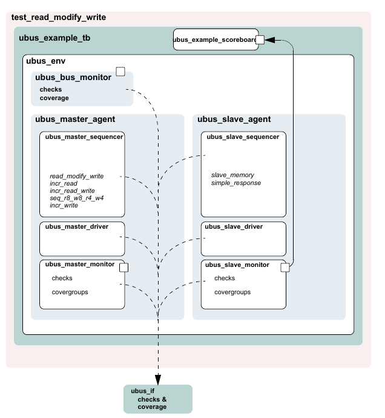

    UBus Example Architecture

7.3 UBus Top Module
###################

The UBus testbench is instantiated in a top-level module to create a
class-based simulation environment. The example below uses an example
DUT with UBus-specific content. The example is intentionally trivial so
the focus is on the UBus verification component environment.

The top module contains the typical HDL constructs and a SystemVerilog
interface. This interface is used to connect the class-based testbench
to the DUT. The UBus environment inside the testbench uses a virtual
interface variable to refer to the SystemVerilog interface. The
following example shows the UBus interface (xi0) and the example DUT
connected together and passed to the components in the testbench via the
resource database (Line 17). The run_test() command used to simulate the
DUT and the testbench is covered in the next section.

*Example: ubus_tb_top.sv*

1 module ubus_tb_top; 2 :sub:`3 import uvm_pkg::*;` 4 import
ubus_pkg::*; 5 \`include "test_lib.sv" 6
:sub:`7 ubus_if vif(); // SystemVerilog interface to the DUT` 8
:sub:`9 dut_dummy dut(` 10 vif.sig_request[0], 11 ... 12 vif.sig_error
13 ); 14 :sub:`15 initial begin` 16 automatic uvm_coreservice_t cs\_ =
uvm_coreservice_t::get(); 17 UVMConfigDb#(virtual
ubus_if)::set(cs_.get_root(),"*", 18 "vif",vif); 19 run_test(); 20 end
21 :sub:`22 initial begin` 23 vif.sig_reset <= 1'b1; 24 vif.sig_clock <=
1'b1; 25 #51 vif.sig_reset = 1'b0; 26 end 27 :sub:`28 //Generate clock.`
29 always 30 #5 vif.sig_clock = ~vif.sig_clock; 31 :sub:`32 endmodule `

The UBus SystemVerilog interface is instantiated in the top-level
testbench module. The interface uses generally-accepted naming
conventions for its signals to allow easy mapping to any naming
conventions employed by other implementations of the UBus protocol. The
DUT pins connect directly to the signal inside the interface instance.
Currently, the signals are simple non-directional variables that are
driven either by the DUT or the class-based testbench environment via a
virtual interface. The UBus interface contains concurrent assertions to
perform physical checks. Refer to Section4.8 and Section7.12 for more
information.

7.4 The Test
############

In UVM, the test is defined in a separate class, test_read_modify_write.
It derives from ubus_example_base_test that, in turn, derives from
UVMTest. The ubus_example_base_test test builds the ubus_example_tb
object and manages the run_phase() phase of the test. Subsequent derived
tests, such as test_read_modify_write, can leverage this functionality
as shown in the example below.

All classes that use the \`uvm_component_utils macros are registered
with a common factory, uvm_factory. When the top module calls
run_test(\ *test_name*), the factory is called upon to create an
instance of a test with type *test_name* and then simulation is started.
When run_test is called without an argument, a
+UVM_TESTNAME=\ *test_name* command-line option is checked and, if it
exists, the test with that type name is created and executed. If neither
are found, all constructed components will be cycled through their
simulation phases. Refer to Section 4.5 for more information.

*Example: test_lib.sv*

1 \`include "ubus_example_tb.sv" 2
:sub:`3 class ubus_example_base_test extends UVMTest;` 4
:sub:`5 ubus_example_tb ubus_example_tb0; // UBus verification environment`
6 uvm_table_printer printer; 7 bit test_pass = 1; 8
:sub:`9 function new(string name = "ubus_example_base_test",` 10
uvm_component parent=null); 11 super.new(name, parent); 12 endfunction
13 // UVM build_phase() phase 14 virtual function void
build_phase(uvm_phase phase); 15 super.build_phase(phase); 16 // Enable
transaction recording for everything. 17 UVMConfigDb.set(this,
"*", "recording_detail", UVM_FULL); 18 // Create the testbench. 19
ubus_example_tb0 =

ubus_example_tb.type_id.create("ubus_example_tb0", this); 20 // Create
specific-depth printer for printing the created topology. 21 printer =
new(); 22 printer.knobs.depth = 3; 23 endfunction: build_phase 24 //
Built-in UVM phase 25 function void end_of_elaboration_phase(uvm_phase
phase); 26 // Set verbosity for the bus monitor for this demo. 27
if(ubus_example_tb0.ubus0.bus_monitor != null) 28
ubus_example_tb0.ubus0.bus_monitor.set_report_verbosity_level

(UVM_FULL); 29 // Print the test topology. 30
\`uvm_info(get_type_name(), 31 $sformatf("Printing the test topology
:\n%s", 32 this.sprint(printer)), UVM_LOW) 33 endfunction :
end_of_elaboration_phase(); 34 // UVM run_phase() phase 35 task
run_phase(uvm_phase phase); 36 //set a drain-time for the environment if
desired 37 phase.phase_done.set_drain_time(this, 50); 38 endtask:
run_phase

39 :sub:`40 function void extract_phase(uvm_phase phase);` 41
if(ubus_example_tb0.scoreboard0.sbd_error) 42 test_pass = 1'b0; 43
endfunction // void 44
:sub:`45 function void report_phase(uvm_phase phase);` 46 if(test_pass)
begin 47 \`uvm_info(get_type_name(), "*\* UVM TEST PASSED \**",
UVM_NONE) 48 end 49 else begin 50 \`uvm_error(get_type_name(), "*\* UVM
TEST FAIL \**") 51 end 52 endfunction 53 endclass :
ubus_example_base_test

Line1 Include the necessary file for the test. The testbench used in
this example is the ubus_example_tb that contains, by default, the bus
monitor, one master, and one slave. See Section 7.5.

Line 3 All tests should derive from the UVMTest class and use the
uvm_component_utils or the uvm_component_utils_begin/uvm_component_utils_end macros.
See the UVM *1.2 Class Reference* for more information.

Line 5 Declare the testbench. It will be constructed by the
build_phase() function of the test.

Line 6 Declare a printer of type uvm_table_printer, which will be used
later to print the topology. This is an optional feature. It is helpful
in viewing the relationship of your topology defined in the
configuration and the physical testbench created for simulation. Refer
to the UVM *1.2 Class Reference* for different types of printers
available.

Line 14 - Line 23 Specify the build_phase() function for the base test.
As required, build first calls the super.build_phase() function in order
to update any overridden fields. Then the ubus_example_tb is created
using the create() function. The build_phase() function of the
ubus_example_tb is executed by the UVM library phasing mechanism during
build_phase(). The user is not required to explicitly call
ubus_example_tb0.build_phase().

Line 25 - Line 33 Specify the end_of_elaboration_phase() function for
the base test. This function is called after all the component’s
build_phase() and connect() phases are executed. At this point, the test
can assume that the complete testbench hierarchy is created and all
testbench connections are made. The test topology is printed.

Line 35 - Line 38 Specify the run_phase() task for the base test. In
this case, we set a drain time of 50 micro-seconds. Once all of the
end-of-test objections were dropped, a 50 micro-second delay is
introduced before the run phase it terminated.

Now that the base test is defined, a derived test will be examined. The
following code is a continuation of the test_lib.sv file::

    class test_read_modify_write(ubus_example_base_test):

        def __init__(self, name="test_read_modify_write", parent=None):
            super().__init__(name, parent)

        def build_phase(self, phase):
            UVMConfigDb.set(self, "ubus_example_tb0.ubus0.masters[0].sequencer.run_phase",
                    "default_sequence", read_modify_write_seq.type_id.get())
            UVMConfigDb.set(self, "ubus_example_tb0.ubus0.slaves[0].sequencer.run_phase",
                    "default_sequence", slave_memory_seq.type_id.get())
            #    // Create the tb
            ubus_example_base_test.build_phase(self, phase)

        
        async def run_phase(self, phase):
            phase.raise_objection(self, "test_read_modify_write OBJECTED")
            master_sqr = self.ubus_example_tb0.ubus0.masters[0].sequencer
            slave_sqr = self.ubus_example_tb0.ubus0.slaves[0].sequencer

            uvm_info("TEST_TOP", "Forking master_proc now", UVM_LOW)
            master_seq = read_modify_write_seq("r_mod_w_seq")
            master_proc = cocotb.fork(master_seq.start(master_sqr))

            slave_seq = slave_memory_seq("mem_seq")
            slave_proc = cocotb.fork(slave_seq.start(slave_sqr))
            #await [slave_proc, master_proc.join()]
            await sv.fork_join_any([slave_proc, master_proc])
            phase.drop_objection(self, "test_read_modify_write drop objection")
            if not master_seq.test_pass:
                self.test_pass = False

The build_phase() function of the derivative test,
test_read_modify_write, is of interest. The build_phase() function uses
the resource database to set the master agent sequencer’s default
sequence for the main() phase to use the read_modify_write_seq sequence
type. Similarly, it defines the slave agent sequencer’s default sequence
for the run_phase() phase to use the slave_memory_seq sequence type.
Once these resources are set, super.build_phase() is called which
creates the ubus_example_tb0 as specified in the ubus_example_base_test
build function.

The run_phase() task implementation is inherited by
test_read_modify_write since this test derives from the
ubus_example_base_test. Since that implementation is sufficient for this
test, no action is required by you. This greatly simplifies this test.

7.5 Testbench Environment
#########################

This section discusses the testbench created in the *Example:
test_lib.sv* in Section 7.4. The code that creates the ubus_example_tb
is repeated here::

    ubus_example_tb0 = ubus_example_tb.type_id.create("ubus_example_tb0", self)

In general, testbenches can contain any number of envs (verification
components) of any type: ubus, pci, ahb, ethernet, and so on. The UBus
example creates a simple testbench consisting of a single UBus
environment (verification component) with one master agent, slave agent,
and bus monitor (see Figure 41).

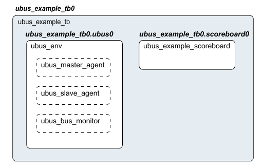

    Testbench derived from UVMEnv

The following code defines a class that specifies this configuration.
The test will create an instance of this class.

*Example: ubus_example_tb.sv*::

    1 function void ubus_example_tb::build_phase();
    2 super.build_phase();
    3 UVMConfigDb.set(this,".ubus0",
    4 "num_masters", 1);
    5 UVMConfigDb.set(this,".ubus0",
    6 "num_slaves", 1);
    7 ubus0 = ubus_env.type_id.create("ubus0", this);
    8 scoreboard0 = ubus_example_scoreboard.type_id.create("scoreboard0", this);
    9 endfunction : build
    10
    11 function void ubus_example_tb::connect_phase(uvm_phase phase);
    12 // Connect the slave0 monitor to scoreboard.
    13 ubus0.slaves[0].monitor.item_collected_port.connect(
    14 scoreboard0.item_collected_export);
    15 endfunction : connect_phase
    16
    17 function void end_of_elaboration_phase();
    18 // Set up slave address map for ubus0 (basic default).
    19 ubus0.set_slave_address_map("slaves[0]", 0, 16'hffff);
    20 endfunction : end_of_elaboration

Line 1 Declare the build_phase() function.

Line 2 Call super.build_phase() in order to update any overridden
fields. This is important because the test, which creates the testbench,
may register overrides for the testbench. Calling super.build_phase()
will ensure that those overrides are updated.

Line3 - Line5 The UVMConfigDb.set calls are adjusting the
num_masters and num_slaves configuration fields of the ubus_env. In this
case, the ubus0 instance of the ubus_env
is being manipulated. Line 3 instructs the ubus0 instance of the
ubus_env to contain one master agent. The num_masters property of the
ubus_env specifies how many master agents should be created. The same is
done for num_slaves.

Line 7 Create the ubus_env instance named ubus0. The create() call
specifies that an object of type ubus_env should be created with the
instance name ubus0.

Line 7 As with ubus0, the scoreboard is created.

Line 11 Declare the connect_phase() function.

Line 12 Make the connections necessary for the ubus0 environment and the
scoreboard0 between the analysis port on the ubus0.slaves[0].monitor and
the analysis export on the scoreboard0 instance.

Line 17 Declare the end_of_elaboration_phase() built-in UVM phase.

Line 19 Assign the slave address map for the slaves[0]. Since all
components in the complete testbench have been created and connected
prior to the start of end_of_elaboration_phase(), the slave instances
are guaranteed to exist at this point.

7.6 UBus Environment
####################

The ubus_env component contains any number of UBus master and slave
agents. In this demo, the ubus_env (shown in Figure 42) is configured to
contain just one master and one slave agent.

NOTE–The bus monitor is created by default.

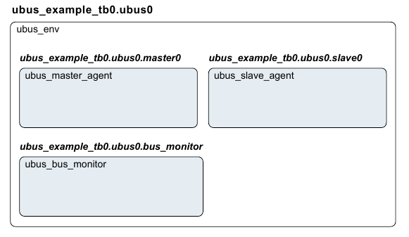

    Instance of ubus_env

The build_phase() function of the ubus_env creates the master agents,
slave agents, and the bus monitor. Three properties control whether
these are created. The source code is shown here:

.. code-block:: python
    :linenos:

    def build_phase(self, phase):
        inst_name = ""
        super().build_phase(phase)

        arr = []
        if UVMConfigDb.get(None, "*", "vif", arr):
            uvm_info("GOT_VIF", "vif was received from configDb", UVM_HIGH)
            self.vif = arr[0]

        if self.vif is None:
            self.uvm_report_fatal("NOVIF","virtual interface must be set for: " +
                    self.get_full_name() + ".vif")

        if self.has_bus_monitor is True:
            self.bus_monitor = ubus_bus_monitor.type_id.create("bus_monitor", self)

        arr = []
        if UVMConfigDb.get(self, "", "num_masters", arr) is True:
            self.num_masters = arr[0]

        for i in range(self.num_masters):
            inst_name = sv.sformatf("masters[%0d]", i)
            master = ubus_master_agent.type_id.create(inst_name, self)
            self.masters.append(master)
            UVMConfigDb.set(self, inst_name + ".monitor", "master_id", i)
            UVMConfigDb.set(self, inst_name + ".driver", "master_id", i)

        arr = []
        if UVMConfigDb.get(self, "", "num_slaves", arr) is True:
            self.num_slaves = arr[0]

        for i in range(self.num_slaves):
            inst_name = sv.sformatf("slaves[%0d]", i)
            self.slaves.append(ubus_slave_agent.type_id.create(inst_name, self))

Line 1 Declare the build_phase() function.

Line 3 Call super.build_phase(). This guarantees that the configuration
fields (num_masters, num_slaves, and has_bus_monitor) are updated per
any resource settings.

Line 14 - Line 15 Create the bus monitor if the has_bus_monitor control
field is set to 1. The create function is used for creation.

Line 17 - Line 26 The master’s dynamic array is sized per the
num_masters control field, which is read from the resource database.
This allows the for loop to populate the dynamic array according to the
num_masters value. The instance name that is used for the master agent
instance is built using `sv.sformatf` so the instance names match the
dynamic-array identifiers exactly. The iterator of the for loop is also
used to set a resource value for the master_id properties of the master
agent and all its children (through the use of the asterisk). This
defines which request-grant pair is driven by the master agent.

Line 28 - Line 34 As in the master-agent creation code above, this code
creates the slave agents using num_slaves but does not set a resource
for the slave agent.

7.7 UBus Master Agent
#####################

The ubus_master_agent (shown in Figure 43) and ubus_slave_agent are
structured identically; the only difference is the protocol-specific
function of its subcomponents.

The UBus master agent contains up to three subcomponents: the sequencer,
driver, and monitor. By default, all three are created. However, the
configuration can specify the agent as passive (is_active=UVM_PASSIVE),
which disables the creation of the sequencer and driver. The
ubus_master_agent is derived from uvm_agent.

.. figure:: fig/43_highly_reusable_verification_component_agent.png
    :align: center
    :alt: alternate text
    :figclass: align-center

    Instance of ubus_master_agent

The build_phase() function of the ubus_master_agent is specified to
create the driver, sequencer, and the monitor. The is_active property
controls whether the driver and sequencer are created.

*Example: ubus_master_agent.sv*

.. code-block:: python
    :linenos:

    def build_phase(self, phase):
        super().build_phase(phase)
        self.monitor = ubus_master_monitor.type_id.create("monitor", self)
        if self.get_is_active() == UVM_ACTIVE:
            self.driver = ubus_master_driver.type_id.create("driver", self)
            self.sequencer = ubus_master_sequencer.type_id.create("sequencer",
                    self)

        arr = []
        if UVMConfigDb.get(self, "*", "master_id", arr) is True:
            self.master_id = arr[0]
        UVMConfigDb.set(self, "", "master_id", self.master_id)

    def connect_phase(self, phase):
        if self.get_is_active() == UVM_ACTIVE:
            self.driver.seq_item_port.connect(self.sequencer.seq_item_export)
            self.sequencer.addr_ph_port.connect(self.monitor.addr_ph_imp)

Line 1 Declare the build_phase() function.

Line 2 Call super.build_phase(). This guarantees that the configuration
field (is_active) is updated per any overrides.

Line 3 Create the monitor. The monitor is always created. Creation is
not conditional on a control field.

Line 4 - Line 7 Create the sequencer and driver if the is_active control
field is set to UVM_ACTIVE. The create() function is used for creation.
Note the use of the base uvm_sequencer.

Line 14 Declare the connect_phase() function.

Line 15 - Line 17 Since the driver expects transactions from the
sequencer, the interfaces in both components should be connected using
the connect() function. The agent (which creates the monitor, sequencer,
and driver) is responsible for connecting the interfaces of its
children.

7.8 UBus Master Sequencer
#########################

This component controls the flow of sequence items to the driver (see
Figure 44).

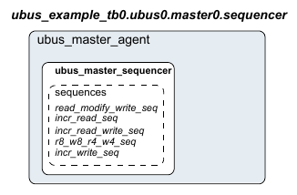

    Instance of ubus_master_sequencer

The sequencer controls which sequence items are provided to the driver.
The uvm_sequencer base class will automatically read the sequence
resource set for each specific run-time phase and start an instance of
that sequence by default.

7.9 UBus Driver
###############

This component drives the UBus bus-signals interface by way of the xmi
virtual interface property (see Figure 45). The ubus_master_driver
fetches ubus_transfer transactions from the sequencer and processes them
based on the physical-protocol definition. In the UBus example, the
seq_item_port methods get_next_item() and item_done() are accessed to
retrieve transactions from the sequencer.

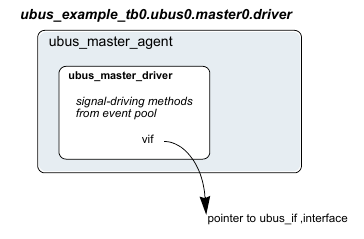

    Instance of ubus_master_driver

The primary role of the driver is to drive (in a master) or respond (in
a slave) on the UBus bus according to the signal-level protocol. This is
done in the run_phase() task that is automatically invoked as part of
UVM’s built-in simulation phasing. For the master driver, the core
routine is summarized as follows:

.. code-block:: python
    :linenos:

    async def get_and_drive(self):
        await RisingEdge(self.vif.sig_reset)
        while True:
            await RisingEdge(self.vif.sig_clock)
            req = []
            await self.seq_item_port.get_next_item(req)
            rsp = req[0].clone()
            rsp.set_id_info(req[0])
            await self.drive_transfer(rsp)
            self.seq_item_port.item_done()
            self.seq_item_port.put_response(rsp)

Once the sig_reset signal is deasserted, the driver’s run task runs
forever until stopped by having all run_phase objections dropped. You
are encouraged to study the UBus driver source code to gain a deeper
understanding of the implementation specific to the UBus protocol.

**7.10 UBus Agent Monitor**

The UBus monitor collects ubus_transfers seen on the UBus signal-level
interface (see Figure 46). If the checks and coverage are present, those
corresponding functions are performed as well.

The primary role of the UBus master monitor is to sample the activity on
the UBus master interface and collect the ubus_transfer transactions
that pertain to its parent master agent only. The transactions that are
collected are provided to the external world by way of a TLM analysis
port. The monitor performs this duty in the run task that is
automatically invoked as part of simulation phasing. The run task may
fork other processes and call other functions or tasks in performance of
its duties. The exact implementation is protocol- and
programmer-dependent, but the entry point, the run task, is the same for
all components.

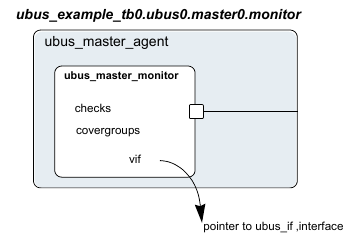

    Instance of ubus_master_monitor**

The monitor’s functionality is contained in an infinite loop defined
with the run_phase() task. Once all of the run_phase objections were
dropped, the run_phase() tasks finish, allowing other simulation phases
to complete, and the simulation itself to end.

The checks are responsible for enforcing protocol-specific checks, and
the coverage is responsible for collecting functional coverage from the
collected ubus_transfers.

**7.11 UBus Bus Monitor**

The UBus bus monitor collects ubus_transfers seen on the UBus
signal-level interface and emits status updates via a state transaction,
indicating different activity on the bus. The UBus bus monitor has class
checks and collects coverage if checks and coverage collection is
enabled. The UBus bus monitor is instantiated within the UBus
environment.

The ubus_env build_phase() function has a control field called
has_bus_monitor, which determines whether the ubus_bus_monitor is
created or not. The bus monitor will be created by default since the
default value for this control field is 1. You can use the UVMConfigDb
interface to override this value::

    UVMConfigDb.set(self, "ubus0", "has_bus_monitor", 0)

Here, the ubus0 instance of ubus_env has its has_bus_monitor control
field overridden to 0. Therefore, the ubus_bus_monitor in ubus0 will not
be present. The build_phase() function for the ubus_env that uses the
has_bus_monitor control field can be found in Section 7.6.

**7.11.1 Collecting Transfers from the Bus**

The UBus bus monitor populates the fields of ubus_transfer, including
the master and slave, which indicate which master and slave are
performing a transfer on the bus. These fields are required to ensure a
slave responds to the appropriate address range when initiated by a
master.

In the UBus protocol, each master on the bus has a dedicated request
signal and a dedicated grant signal defined by the master agent’s ID. To
determine which master is performing a transfer on the bus, the UBus bus
monitor checks which grant line is asserted.

To keep the UBus bus monitor example simple, an assumption has been made
that the nth master connects to the nth request and grant lines.
For example, master[0] is connected to grant0, master[1] is connected to
grant1, and so on. Therefore, when the UBus bus monitor sees grant0 is
asserted, it assumes master[0] is performing the transfer on the bus.

To determine which slave should respond to the transfer on the bus, the
UBus bus monitor needs to know the address range supported by each slave
in the environment. The environment developer has created the user
interface API, ubus_env::set_slave_address_map(), to set the address map
for the slave as well as the bus monitor. The prototype for this
function is::

    set_slave_address_map(self, slave_name, min_addr, max_addr)

For each slave, call set_slave_address_map() with the minimum and
maximum address values to which the slave should respond. This function
sets the address map for the slave and provides information to the bus
monitor about each slave and its address map.

Using the address map information for each slave and the address that is
collected from the bus, the bus monitor determines which slave has
responded to the transfer.

**7.11.2 Number of Transfers**

The bus monitor has a protected field property, num_transactions, which
holds the number of transfers that were monitored on the bus.

**7.11.3 Notifiers Emitted by the UBus Bus Monitor**

The UBus bus monitor contains two analysis ports, which provide
information on the different types of activity occurring on the UBus
signal-level interface

a) state_port–This port provides a ubus_status object which contains an
    enumerated bus_state property. The bus_state property reflects bus-state
    changes. For example, when the bus enters reset, the bus_state property
    is set to RST_START and the ubus_status object is written to the
    analysis port.
b) item_collected_port–This port provides the UBus
    transfer that is collected from the signal interface after a transfer is
    complete. This collected transfer is written to the item_collect-
    ed_port analysis port.

NOTE–Any component provided by the appropriate TLM interfaces can attach
to these TLM ports and listen to the information provided.

**7.11.4 Checks and Coverage**

The UBus bus monitor performs protocol-specific checks using class
checks and collects functional coverage from the collected
ubus_transfers.

The UVM field coverage_enable and checks_enable are used to control
whether coverage and checks, respectively, will be performed or not.
Refer to Section 4.10 for more information.

**7.12 UBus Interface**

The UBus interface is a named bundle of nets and variables such that the
master agents, slave agents, and bus monitor can drive or monitor the
signals in it. Any physical checks to be performed are placed in the
interface. Refer to Section 4.10.

Assertions are added to perform physical checks.The ubus_env field
intf_checks_enable controls whether these checks are performed. Refer to
Section 4.10 for more information.

The code below is an example of a physical check for the UBus interface,
which confirms a valid address is driven during the normal address
phase. A concurrent assertion is added to the interface to perform the
check and is labeled assertAddrUnknown. This assertion evaluates on
every positive edge of sig_clock if has_checks is true. The has_checks
bit is controlled by the intf_checks_enable field. If any bit of the
address is found to be at an unknown value during the normal address
phase, an error message is issued.

always @(posedge sig_clock)

begin

assertAddrUnknown:assert property ( disable iff(!has_checks)

(($onehot(sig_grant) \|-> ! $isunknown(sig_addr)))
else\ :sub:`$error("ERR_ADDR_XZ\n Address went to X or Z during Address Phase");`
end

8. UBus Specification
=====================

8.1 Introduction
################

8.1.1 Motivation
----------------

The motivation for the UBus specification is to provide an example of a
simple bus standard for demonstration purposes and to illustrate the
methodology required for a bus-based verification component. As such,
the UBus specification is designed to demonstrate all of the important
features of a typical modern bus standard while keeping complexity to a
minimum.

8.1.2 Bus Overview
------------------

The UBus is a simple non-multiplexed, synchronous bus with no pipelining
(to ensure simple drivers). The address bus is 16-bits wide and the data
bus is byte-wide (so as to avoid alignment issues). Simple burst
transfers are allowed and slaves are able to throttle data rates by
inserting wait states.

The bus can have any number of masters and slaves (the number of masters
is only limited by the arbitration implementation). Masters and slaves
are collectively known as —bus agents".

The transfer of data is split into three phases: *Arbitration Phase*,
*Address Phase*, and *Data Phase*. Because no pipelining is allowed,
these phases happen sequentially for each burst of data. The Arbitration
and Address Phases each take exactly one clock cycle. The Data Phase may
take one or more clock cycles.

8.2 Bus Description
###################

8.2.1 Bus Signals
-----------------

The list of bus signals (not including arbitration signals) is shown in
Table 15. All control signals are active high.

**Table 15–Bus Signals**

| **Signal name** | **Width (bits)** | **Driven by** | **Purpose**                                                                                 |
| :------         | :------          | :-----        | :------                                                                                     |
| **clock**       | 1                | n/a           | Master clock                                                                                |
| **reset**       | 1                | n/a           | Bus reset                                                                                   |
| **start**       | 1                | arbiter       | This signal is high during the Arbitration Phase and low during the Address and Data Phases |
| **addr**        | 16               | master        | R4C4                                                                                        |
| **size**        | 2                | master        | R5C4                                                                                        |
| **read**        | 1                | master        | R6C4                                                                                        |
| **write**       | 1                | master        | R7C4                                                                                        |
| **bip**         | 1                | master        | R7C4                                                                                        |
| **data**        | 8                | master/slave  | R7C4                                                                                        |
| **wait**        | 1                | slave         | R7C4                                                                                        |
| **error**       | 1                | slave         | R7C4                                                                                        |

**addr** 16 master Address of first byte of a transfer

**size** 2 master Indicates how many bytes will be transfers:

00 => 1 byte 01 => 2 bytes 10 => 4 bytes 11 => 8 bytes

**read** 1 master This signal is high for read transfers (**write** must
be low)

**Table 15–Bus Signals (Continued)**

**Signal Name**

**Width (bits) Driven By Purpose **

**write** 1 master This signal is high for write transfers (**read**
must be low)

**bip** 1 master Burst In Progress–driven high by master during Data
Phase for all bytes, except the last byte of the burst. This signal,
when combined with **wait** and **error**, can be used by the arbiter to
determine if the bus will start a new transfer in the next clock cycle

**data** 8 master/slave Data for **read**\ s and **write**\ s

**wait** 1 slave High if slave needs master to wait for completion of
transfer

**error** 1 slave High if slave error condition applies to this transfer

8.2.2 Clocking
--------------

All bus agents operate synchronous to the rising edge of the *clock*
signal with the exception of *gnt* signals (see Section 8.3).

8.2.3 Reset
-----------

The active high *reset* signal is synchronous to the rising edge of
clock. *reset* shall be asserted during power up and shall remain
asserted for a minimum of five rising edges of clock\* after power and
clock have stabilized. Thereafter, *reset* shall be de-asserted
synchronous to a rising edge of clock.

*reset* may be asserted at any time during operation. In such cases,
*reset* must be asserted for at least three clock cycles and must be
both asserted and de-asserted synchronous to the rising edge of clock.
The assertion of *reset* cancels any pending transfer at the first
rising edge of clock where *reset* is asserted. Any bytes that have been
transferred prior to assertion of *reset* are considered to have
succeeded. Any byte that would have succeeded at the rising edge of
clock where *reset* is first asserted is considered to have failed.

While *reset* is asserted, all agents should ignore all bus and
arbitration signals. While *reset* is asserted, the arbiter should drive
*start* and all *gnt* signals low. At the first rising edge of clock
where *reset* is de-asserted, the arbiter should drive *start* high.
Thereafter, the normal bus operation should occur.

8.3 Arbitration Phase
#####################

Each UBus shall have a single, central arbiter to perform arbitration
and certain other central control functions.

The Arbitration Phase always lasts for one clock cycle. During the
Arbitration Phase, the arbiter shall drive the *start* signal high. At
all other times, the arbiter should drive the *start* signal low. The
*start* signal can therefore be used by slaves to synchronize themselves
with the start of each transfer. The arbiter shall always drive *start*
high in the cycle following the last cycle of each Data Phase or in the
cycle following a —no operation" (NOP) Address Phase (see Section
8.4.1). The last cycle of a Data Phase is defined as a Data Phase cycle
in which the *error* signal is high, or both the *bip* and *wait*
signals are low.

Each master on the bus has a dedicated *req* signal and *gnt* signal.
The arbiter samples all *req* signals at each falling edge of clock
where *start* is asserted and asserts a single *gnt* signal based on an
unspecified priority system. At all falling edges of clock where *start*
is not asserted, the arbiter shall drive all *gnt* signals low.

Thus, a master can see assertion of its *gnt* signal not only as an
indication that it has been granted the bus, but also as an indication
that it must start an Address Phase. It is not necessary for the master
to check the *start* signal before starting its Address Phase.

Once a master is granted the bus, it must drive a transaction onto the
bus immediately. No other master is allowed to drive the bus until the
current master has completed its transaction.

NOTE–Only the arbiter is allowed to drive a NOP transfer. This means a
master must drive a real transfer if it is granted the bus. Therefore,
masters should not request the bus unless they can guarantee they will
be ready to do a real transfer.

Arbitration signals shall be active high and shall be named according to
a convention whereby the first part of the name is the root signal name
(*req\_* for the request signal; *gnt\_* for the grant signal) and the
second part of the name is the logical name or number of the master.
Although the arbitration signals form part of the UBus specification,
they are not considered to be —bus" signals as they are not connected to
all agents on the bus.

It is up to individual implementations to choose an appropriate
arbitration system. Arbiters might allocate different priorities to each
master or might choose randomly with each master having equal priority.

8.4 Address Phase
#################

The Address Phase lasts for a single clock cycle and always immediately
follows the Arbitration Phase.

8.4.1 NOP Cycle
---------------

Where no master has requested the bus and the *start* signal is asserted
at the falling edge of clock, no *gnt* signal is asserted at the start
of the Address Phase and the arbiter itself is responsible for driving
the bus to a —no operation" (NOP) state. It does this by driving the
*addr* and *size* signals to all zeroes and both the *read* and *write*
signals low. A NOP address phase has no associated data phase so the
arbiter shall assert the *start* signal in the following clock cycle.

NOTE–This means the arbiter is connected to certain bus signals in
addition to the arbitration signals and behaves as a —default master".

8.4.2 Normal Address Phase
--------------------------

If, at the rising edge of clock, a master sees its *gnt* signal
asserted, then it must drive a valid Address Phase in the following
cycle. The master should also de-assert its *req* signal at this clock
edge unless it has a further transfer pending.

During the Address Phase, the granted master should drive the *addr* and
*size* signals to valid values and should drive either *read* or *write*
(but not both) high.The address driven on *addr* represents the address
of the first byte of a burst transfer. It is up to the slave to generate
subsequent addresses during burst transfers.

The master shall only drive the *addr*, *size, read,* and *write*
signals during the Address Phase. During the subsequent Data Phase, the
master should not drive these signals.

8.5 Data Phase
##############

The Data Phase may last for one or more clock cycles. The Data Phase
follows immediately after the Address Phase (and is immediately followed
by the Arbitration Phase).

8.5.1 Write Transfer
--------------------

The master shall drive the first byte of data onto the bus on the clock
cycle after driving a write Address Phase. If, at the end of this clock
cycle, the slave has asserted the *wait* signal, then the master shall
continue to drive the same data byte for a further clock cycle. The
*data* signal may only change at the end of a cycle where *wait* is not
asserted. Thus, the slave can insert as many wait states as it requires.
The master shall drive the *bip* signal high throughout the Data Phase
until the point where the final byte of the transfer is driven onto the
bus, at which point it shall be driven low.

At the end of the transfer (the end of the cycle where both *bip* and
*wait* are low) the master shall cease to drive all bus signals.

8.5.2 Error during Write Transfer
---------------------------------

The slave shall drive the *error* throughout the Data Phase. If a slave
encounters an error condition at any point during the Data Phase of a
write transfer, it may signal this by asserting the *error* signal. To
signal an error condition, the slave must drive the *error* signal high
while driving the *wait* signal low. This indicates to the master that
the associated byte of the transfer failed–any previous bytes in the
burst are considered to have succeeded; any subsequent bytes in the
burst are abandoned. The assertion of *error* always terminates the Data
Phase even if *bip* is asserted simultaneously.

8.5.3 Read Transfer
-------------------

On the clock cycle after the master drives a read Address Phase, the
slave can take one of two actions: drive the first byte of data onto the
bus while driving the *wait* signal low or drive the *wait* signal high
to indicate it is not yet ready to drive data. Each byte of data is
latched only by the master at the end of a cycle where *wait* is
low–thus the slave can insert as many wait states as is required. The
master shall drive the *bip* signal high throughout the Data Phase until
the point where the master is ready to receive the final byte of the
transfer, at which point it shall be driven low.

At the end of the transfer (the end of the cycle where both *bip* and
*wait* are low) the master shall cease to drive all bus signals.

8.5.4 Error during Read Transfer
--------------------------------

The slave shall drive the *error* throughout the Data Phase. If a slave
encounters an error condition at any point during a read transfer, it
may signal this by asserting the *error* signal. To signal an error
condition, the slave must drive the *error* signal high while driving
the *wait* signal low. This indicates to the master that the associated
byte of the transfer failed–any previous bytes in the burst are
considered to have succeeded; any subsequent bytes in the burst are
abandoned. The assertion of *error* always terminates the Data Phase
even if *bip* is asserted simultaneously.

8.6 How Data is Driven
######################

Table 16 specifies how data is driven in the UBus specification.

   **Table 16–What Drives What When**

**Signal Name Arbitration Phase Address Phase Data Phase **

**start** Driven to 1 by arbiter Driven to 0 by arbiter Driven to 0 by
arbiter

**addr** Not driven Driven by master (or to 0 by arbiter for NOP)

8.7 Optional Pipelining Scheme
##############################

Not driven

As previously stated, the UBus standard does not normally support
pipelining. However, pipelining can optionally be implemented.

NOTE–All agents (including arbitration) on a bus must agree either to
pipeline or not to pipeline. Mixing pipelined and non-pipelined agents
on the same bus is not supported.

Because pipelining overlaps the Arbitration, Address, and Data Phases,
two levels of pipelining are provided; i.e., there are a total of three
transfers in progress at any one time.

NOTE–Pipelining results in different bus agents driving the same signals
in consecutive clock cycles. As such, there is no period where the
signal is not driven as part of a change of sequencers. As a result,
care is necessary in the physical design of the bus to ensure that bus
contention does not occur. A multiplexed approach will be required (in
the form of either a ring or a star).

8.7.1 Pipelined Arbitration Phase
---------------------------------

In a pipelined system, the Arbitration Phase is performed in parallel
with the Address and Data Phases. Arbitration is carried out in every
clock cycle regardless of whether this is necessary or not. This is
because the arbiter cannot predict whether the next clock cycle will
mark the start of a new Address Phase.

**size** Not driven Driven by master (or to 0 by arbiter

for NOP)

Not driven

**read** Not driven Driven by master (or to 0 by arbiter

for NOP)

Not driven

**write** Not driven Driven by master (or to 0 by arbiter

for NOP)

Not driven

**bip** Not driven Not driven Driven to 1 by master for all but

   last byte of transfer

**data** Not driven Not driven Driven by master during **write**\ s.
Driven by slave during **read**\ s in cycles where **wait** is low;
other- wise, don’t care (may be driven to unknown state or not driven at
all)

**wait** Not driven Not driven Driven by slave

**error** Not driven Not driven Driven by slave

The Arbiter asserts the *start* signal in the clock cycle after the end
of each Data Phase as in the non-pipelined system. However, this *start*
signal marks the start of all three Phases in parallel.

The end of a Data Phase can be recognized by either assertion of *error*
or de-assertion of both *bip* and *wait*.

8.7.2 Pipelined Address Phase
-----------------------------

A master that has its *gnt* signal asserted at the clock edge where a
Data Phase completes is granted the Address Phase of the bus. It must
immediately start driving an Address Phase. Unlike in the non-pipelined
bus, where the Address Phase lasts a single clock cycle, the Address
Phase in a pipelined bus lasts until the end of the next Data Phase.

Where no master requests the bus and, therefore, no master is granted
the bus, the arbiter is responsible for driving NOP until the end of the
next Data Phase.

8.7.3 Pipelined Data Phase
--------------------------

The Data Phase of a pipelined bus is similar to that of a non-pipelined
bus. Where the arbiter drives a NOP for the preceding Address Phase, the
master must drive *error*, *bip*, and *wait* low during the Data Phase
(which will last for a single clock cycle in this case).

8.8 Example Timing Diagrams
###########################

Figure 47 and Figure 48 show sample timing diagrams.

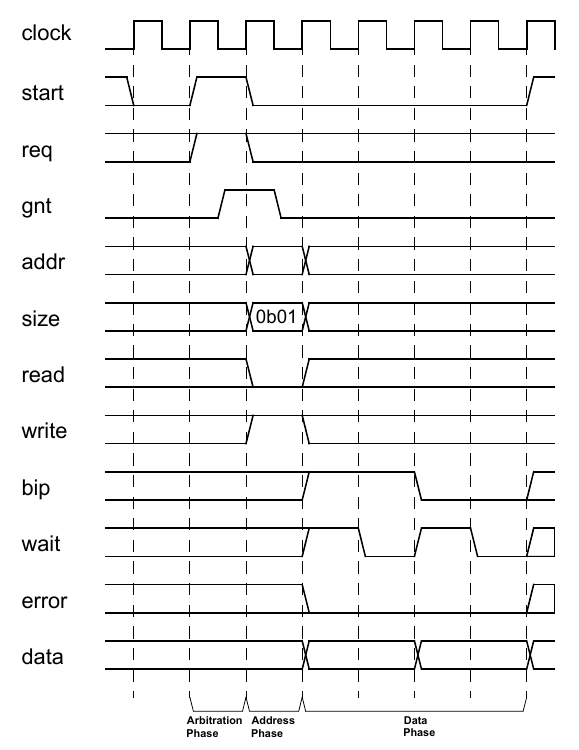

    Example Write Waveform

.. figure:: fig/48_example_read_waveform.png
    :align: center
    :alt: Timing diagram for ubus read operation.
    :figclass: align-center

    Example Read Waveform

